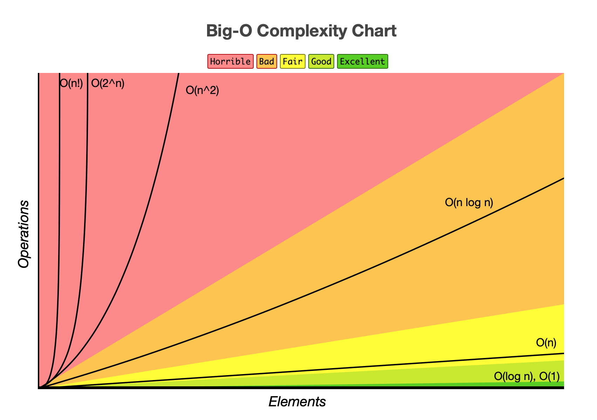
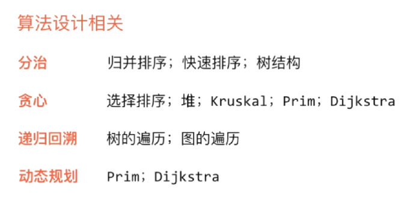
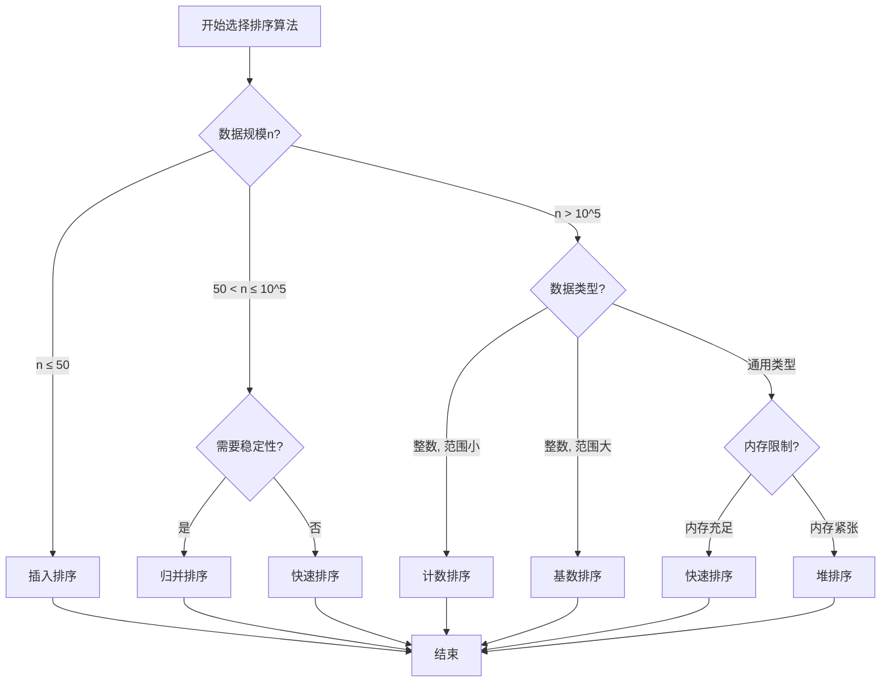

# Algorithms-and-Data-Structures
c++算法与数据结构

算法时间复杂度的量级差异，也许在小规模的问题下，表现差别不大。但是时间复杂度高的算法，对问题规模的变化更加敏感，因而当问题的规模变得很大的时候，靠拥有高阶时间复杂度的算法来求解并不可靠！



https://replit.com/@invi1998

所学的这些算法涉及到的算法设计思想



# 算法设计思想

### 一.分治法

**1.概念：**
将一个难以直接解决的大问题，分割成一些规模较小的相同问题，以便各个击破，分而治之。

**2.思想策略：**
对于一个规模为n的问题，若该问题可以容易地解决（比如说规模n较小）则直接解决，否则将其分解为k个规模较小的子问题，这些子问题互相独立且与原问题形式相同，递归地解这些子问题，然后将各子问题的解合并得到原问题的解。

**3.特征：**

1. 该问题的规模缩小到一定的程度就可以容易地解决
2. 该问题可以分解为若干个规模较小的相同问题，即该问题具有最优子结构性质。
3. 利用该问题分解出的子问题的解可以合并为该问题的解；
4. 该问题所分解出的各个子问题是相互独立的，即子问题之间不包含公共的子子问题。

第一条特征是绝大多数问题都可以满足的，因为问题的计算复杂性一般是随着问题规模的增加而增加；
第二条特征是应用分治法的前提它也是大多数问题可以满足的，此特征反映了递归思想的应用；、
第三条特征是关键，能否利用分治法完全取决于问题是否具有第三条特征，如果具备了第一条和第二条特征，而不具备第三条特征，则可以考虑用贪心法或动态规划法。
第四条特征涉及到分治法的效率，如果各子问题是不独立的则分治法要做许多不必要的工作，重复地解公共的子问题，此时虽然可用分治法，但一般用动态规划法较好。

**4.基本步骤：**
1 分解：将原问题分解为若干个规模较小，相互独立，与原问题形式相同的子问题；
2 解决：若子问题规模较小而容易被解决则直接解，否则递归地解各个子问题
3 合并：将各个子问题的解合并为原问题的解。

**5.适用分治法求解的经典问题：**

- 1）二分搜索
- 2）大整数乘法
- 3）Strassen矩阵乘法
- 4）棋盘覆盖
- 5）合并排序
- 6）快速排序
- 7）线性时间选择
- 8）最接近点对问题
- 9）循环赛日程表
- 10）汉诺塔

### 二.动态规划

**1.概念：**
每次决策依赖于当前状态，又随即引起状态的转移。一个决策序列就是在变化的状态中产生出来的，所以，这种多阶段最优化决策解决问题的过程就称为动态规划。

**2.思想策略：**
将待求解的问题分解为若干个子问题（阶段），按顺序求解子阶段，前一子问题的解，为后一子问题的求解提供了有用的信息。在求解任一子问题时，列出各种可能的局部解，通过决策保留那些有可能达到最优的局部解，丢弃其他局部解。依次解决各子问题，最后一个子问题就是初始问题的解。

**3.特征：**
能采用动态规划求解的问题的一般要具有3个性质：
(1) 最优化原理：如果问题的最优解所包含的子问题的解也是最优的，就称该问题具有最优子结构，即满足最优化原理。
(2) 无后效性：即某阶段状态一旦确定，就不受这个状态以后决策的影响。也就是说，某状态以后的过程不会影响以前的状态，只与当前状态有关。
(3) 有重叠子问题：即子问题之间是不独立的，一个子问题在下一阶段决策中可能被多次使用到。（该性质并不是动态规划适用的必要条件，但是如果没有这条性质，动态规划算法同其他算法相比就不具备优势）

**4.基本步骤：**
（1）分析最优解的性质，并刻画其结构特征。
（2）递归的定义最优解。
（3）以自底向上或自顶向下的记忆化方式（备忘录法）计算出最优值
（4）根据计算最优值时得到的信息，构造问题的最优解

**5.适用动态规划求解的经典问题：**

- 矩阵连乘，
- 走金字塔
- 最长公共子序列(LCS) ，
- 最长递增子序列(LIS) ，
- 凸多边形最优三角剖分 ，
- 背包问题 ，
- 双调欧几里得旅行商问题

### 三.贪心法

**1.概念：**
在对问题求解时，总是做出在当前看来是最好的选择。也就是说，不从整体最优上加以考虑，他所做出的仅是在某种意义上的局部最优解。

**2.思想策略：**
贪心算法没有固定的算法框架，算法设计的关键是贪心策略的选择。必须注意的是，贪心算法不是对所有问题都能得到整体最优解，选择的贪心策略必须具备无后效性，即某个状态以后的过程不会影响以前的状态，只与当前状态有关。所以对所采用的贪心策略一定要仔细分析其是否满足无后效性。

**3.基本步骤：**
1.建立数学模型来描述问题。
2.把求解的问题分成若干个子问题。
3.对每一子问题求解，得到子问题的局部最优解。
4.把子问题的解局部最优解合成原来解问题的一个解。

**4.适用贪心法求解的经典问题：**

- 活动选择问题，
- 钱币找零问题，
- 再论背包问题，
- 小船过河问题，
- 区间覆盖问题，
- 销售比赛，
- Huffman编码，
- Dijkstra算法（求解最短路径），
- 最小生成树算法

### 四.回溯法

**1.概念：**
回溯算法实际上一个类似枚举的搜索尝试过程，主要是在搜索尝试过程中寻找问题的解，当发现已不满足求解条件时，就“回溯”返回，尝试别的路径。
回溯法是一种选优搜索法，按选优条件向前搜索，以达到目标。但当探索到某一步时，发现原先选择并不优或达不到目标，就退回一步重新选择，这种走不通就退回再走的技术为回溯法，而满足回溯条件的某个状态的点称为“回溯点”。
许多复杂的，规模较大的问题都可以使用回溯法，有“通用解题方法”的美称。

**2.思想策略：**
在包含问题的所有解的解空间树中，按照深度优先搜索的策略，从根结点出发深度探索解空间树。当探索到某一结点时，要先判断该结点是否包含问题的解，如果包含，就从该结点出发继续探索下去，如果该结点不包含问题的解，则逐层向其祖先结点回溯。（其实回溯法就是对隐式图的深度优先搜索算法）。
若用回溯法求问题的所有解时，要回溯到根，且根结点的所有可行的子树都要已被搜索遍才结束。

**3.特征：**
（1）针对所给问题，确定问题的解空间：首先应明确定义问题的解空间，问题的解空间应至少包含问题的一个（最优）解。
（2）确定结点的扩展搜索规则
（3）以深度优先方式搜索解空间，并在搜索过程中用剪枝函数避免无效搜索。

**4.适用回溯法求解的经典问题：**

- 八皇后问题，
- 图的着色问题，
- 装载问题，
- 批处理作业调度问题，
- 再再论背包问题，
- 最大团问题，
- 连续邮资问题，
- 符号三角形问题，

### 五.分支限界法

**1.概述：**
类似于回溯法，也是一种在问题的解空间树T上搜索问题解的算法。但在一般情况下，分支限界法与回溯法的求解目标不同。回溯法的求解目标是找出T中满足约束条件的所有解，而分支限界法的求解目标则是找出满足约束条件的一个解，或是在满足约束条件的解中找出使某一目标函数值达到极大或极小的解，即在某种意义下的最优解。

**2.策略：**
在扩展结点处，先生成其所有的儿子结点（分支），然后再从当前的活结点表中选择下一个扩展对点。为了有效地选择下一扩展结点，以加速搜索的进程，在每一活结点处，计算一个函数值（限界），并根据这些已计算出的函数值，从当前活结点表中选择一个最有利的结点作为扩展结点，使搜索朝着解空间树上有最优解的分支推进，以便尽快地找出一个最优解。

**3.与回溯法的区别：**
回溯法：【方式不同】深度优先搜索堆栈活结点的所有可行子结点被遍历后才被从栈中弹出找出满足约束条件的所有解【目标不同】。
分支限界法：【方式不同】广度优先或最小消耗优先搜索队列、优先队列每个结点只有一次成为活结点的机会找出满足约束条件的一个解或特定意义下的最优解【目标不同】。


# 排序算法效率对比及使用指南

## 一、排序算法性能对比总表

| 排序算法     | 平均时间复杂度 | 最好情况    | 最坏情况    | 空间复杂度    | 稳定性 | 适用场景                           |
| ------------ | -------------- | ----------- | ----------- | ------------- | ------ | ---------------------------------- |
| **冒泡排序** | O(n²)          | O(n)        | O(n²)       | O(1)          | 稳定   | 教学演示，小规模数据，基本有序数据 |
| **选择排序** | O(n²)          | O(n²)       | O(n²)       | O(1)          | 不稳定 | 小规模数据，对稳定性不敏感         |
| **插入排序** | O(n²)          | O(n)        | O(n²)       | O(1)          | 稳定   | 小规模数据，基本有序数据，在线排序 |
| **希尔排序** | O(n¹·³)        | O(n log²n)  | O(n²)       | O(1)          | 不稳定 | 中等规模数据，对稳定性不敏感       |
| **归并排序** | O(n log n)     | O(n log n)  | O(n log n)  | O(n)          | 稳定   | 大数据量，需要稳定性，外部排序     |
| **快速排序** | O(n log n)     | O(n log n)  | O(n²)       | O(log n)~O(n) | 不稳定 | 大数据量，随机分布，内存排序       |
| **堆排序**   | O(n log n)     | O(n log n)  | O(n log n)  | O(1)          | 不稳定 | 大数据量，内存受限，需要原地排序   |
| **计数排序** | O(n + k)       | O(n + k)    | O(n + k)    | O(k)          | 稳定   | 整数排序，值范围小(k相对n较小)     |
| **桶排序**   | O(n + k)       | O(n + k)    | O(n²)       | O(n + k)      | 稳定   | 数据均匀分布，范围已知             |
| **基数排序** | O(d(n + k))    | O(d(n + k)) | O(d(n + k)) | O(n + k)      | 稳定   | 多关键字排序，整数/字符串排序      |

**注**：
- k：数据范围或桶的数量
- d：关键字的位数
- n：数据量

## 二、详细场景使用建议

### 1. 按数据量选择

| 数据规模            | 推荐算法          | 理由                                           |
| ------------------- | ----------------- | ---------------------------------------------- |
| **n ≤ 10**          | 插入排序          | 简单实现，常数因子小，对基本有序数据表现好     |
| **10 < n ≤ 50**     | 插入排序/希尔排序 | 插入排序对小数据高效，希尔排序提供更好平均性能 |
| **50 < n ≤ 1000**   | 希尔排序/快速排序 | 希尔排序实现简单，快速排序对随机数据效率高     |
| **1000 < n ≤ 10^6** | 快速排序/归并排序 | 快速排序通常最快，归并排序稳定且最坏情况好     |
| **n > 10^6**        | 快速排序/外部排序 | 快速排序在内存中高效，超大数考虑外部归并排序   |
| **内存受限**        | 堆排序            | 原地排序，空间复杂度O(1)                       |
| **外部数据**        | 外部归并排序      | 适合无法全部放入内存的数据                     |

### 2. 按数据特征选择

#### (1) 数据基本有序情况
| 有序程度     | 推荐算法          | 理由                 |
| ------------ | ----------------- | -------------------- |
| **完全有序** | 插入排序          | O(n)时间完成         |
| **部分有序** | 插入排序/希尔排序 | 对部分有序数据效率高 |
| **基本无序** | 快速排序/堆排序   | 随机化快速排序表现好 |

#### (2) 重复元素情况
| 重复度       | 推荐算法          | 理由                                 |
| ------------ | ----------------- | ------------------------------------ |
| **重复很少** | 快速排序          | 随机化版本表现良好                   |
| **大量重复** | 三路快排/计数排序 | 三路快排处理重复好，计数排序适合整数 |
| **全部相同** | 任意算法          | 所有算法都会很快，插入排序O(n)       |

#### (3) 数据分布情况
| 分布特征     | 推荐算法          | 理由                     |
| ------------ | ----------------- | ------------------------ |
| **均匀分布** | 桶排序            | 每个桶大小均衡，效率O(n) |
| **正态分布** | 快速排序          | 对典型分布表现良好       |
| **极端倾斜** | 计数排序/基数排序 | 对特定范围数据高效       |
| **随机分布** | 快速排序          | 随机化快速排序平均性能好 |

### 3. 按数据类型选择

#### (1) 整数排序
| 整数范围        | 推荐算法        | 理由                   |
| --------------- | --------------- | ---------------------- |
| **范围小(k小)** | 计数排序        | O(n+k)时间，极快       |
| **范围中等**    | 基数排序        | 按位排序，效率高       |
| **范围大**      | 快速排序/堆排序 | 比较排序，适合任意范围 |
| **多位整数**    | 基数排序        | 按位排序效率高         |

#### (2) 字符串排序
| 场景           | 推荐算法       | 理由               |
| -------------- | -------------- | ------------------ |
| **短字符串**   | 快速排序       | 比较成本低，效率高 |
| **长字符串**   | MSD基数排序    | 避免重复比较前缀   |
| **变长字符串** | 三路字符串快排 | 处理公共前缀高效   |

#### (3) 浮点数排序
| 场景            | 推荐算法         | 理由                 |
| --------------- | ---------------- | -------------------- |
| **常规浮点数**  | 快速排序         | 标准比较排序         |
| **范围有限**    | 计数排序(需转换) | 转换为整数后计数排序 |
| **特殊值(NaN)** | 需特殊处理       | 排序前分离特殊值     |

### 4. 按需求特性选择

#### (1) 稳定性要求
| 要求         | 推荐算法 | 可选算法                                       |
| ------------ | -------- | ---------------------------------------------- |
| **必须稳定** | 归并排序 | 插入排序、冒泡排序、计数排序、桶排序、基数排序 |
| **不需稳定** | 快速排序 | 堆排序、选择排序、希尔排序                     |

#### (2) 内存限制
| 内存情况     | 推荐算法     | 理由                   |
| ------------ | ------------ | ---------------------- |
| **内存充足** | 快速排序     | 缓存友好，效率高       |
| **内存紧张** | 堆排序       | 原地排序，O(1)额外空间 |
| **外部存储** | 外部归并排序 | 分块处理，适合大文件   |

#### (3) 并行化需求
| 并行级别    | 推荐算法             | 理由                     |
| ----------- | -------------------- | ------------------------ |
| **多线程**  | 归并排序             | 天然可分，合并阶段并行   |
| **多核CPU** | 快速排序             | 分区操作可并行           |
| **GPU并行** | 归并排序/基数排序    | 适合大规模并行处理       |
| **分布式**  | 桶排序/MapReduce排序 | 数据分片，局部排序后合并 |

## 三、实际应用场景示例

### 1. 编程语言内置排序
| 语言                 | 默认排序算法                          | 选择理由                           |
| -------------------- | ------------------------------------- | ---------------------------------- |
| **C++ std::sort**    | IntroSort（快速排序+堆排序）          | 快速排序平均快，堆排序保证最坏情况 |
| **Java Arrays.sort** | TimSort（归并排序+插入排序）          | 稳定，对部分有序数据高效           |
| **Python sorted**    | TimSort（归并排序+插入排序）          | 稳定，实际数据通常部分有序         |
| **C# Array.Sort**    | IntroSort（快速排序+堆排序+插入排序） | 平衡各种情况                       |

### 2. 数据库排序
| 场景         | 使用算法          | 理由                      |
| ------------ | ----------------- | ------------------------- |
| **内存排序** | 快速排序/归并排序 | 效率与稳定性的平衡        |
| **外部排序** | 多路归并排序      | 适合大表排序，减少磁盘I/O |
| **索引构建** | 外部归并排序      | 创建B+树等索引结构        |

### 3. 大数据处理
| 框架                 | 排序策略         | 理由                                |
| -------------------- | ---------------- | ----------------------------------- |
| **Hadoop MapReduce** | 外部归并排序     | 分片排序，适合分布式存储            |
| **Spark**            | TimSort/基数排序 | 内存充足时用TimSort，整数用基数排序 |
| **数据库大规模排序** | 多阶段归并排序   | 逐步合并，控制内存使用              |

## 四、算法选择决策树



## 五、性能优化技巧

### 1. 混合排序策略
```cpp
// Introsort: 快速排序 + 堆排序 + 插入排序
void introsort(vector<int>& arr, int depth_limit) {
    if (arr.size() <= 16) {
        insertionSort(arr);          // 小数据用插入排序
    } else if (depth_limit == 0) {
        heapSort(arr);               // 递归太深转堆排序
    } else {
        quickSort(arr);              // 主要用快速排序
    }
}
```

### 2. 缓存优化
- **快速排序**：对缓存友好，访问模式局部性好
- **归并排序**：需要额外空间，可能引起缓存未命中
- **堆排序**：访问模式不规则，缓存性能差

### 3. 避免最坏情况
- **快速排序**：随机化选择枢轴，三数取中法
- **归并排序**：对小数组使用插入排序
- **堆排序**：已是最坏情况O(n log n)

## 六、测试与验证建议

### 1. 测试数据集
| 测试类型     | 数据特征      | 测试目的          |
| ------------ | ------------- | ----------------- |
| **随机数据** | 均匀分布      | 测试平均性能      |
| **有序数据** | 升序/降序     | 测试最好/最坏情况 |
| **重复数据** | 大量重复值    | 测试重复处理能力  |
| **边缘数据** | 空数组/单元素 | 测试边界条件      |

### 2. 性能测量指标
- **时间复杂度**：不同规模下的时间增长趋势
- **空间复杂度**：内存使用情况
- **稳定性**：相等元素的相对位置
- **适应性**：对不同数据分布的敏感度

## 七、总结与建议

### 1. 通用推荐
1. **默认选择**：快速排序（随机化版本）
2. **需要稳定**：归并排序
3. **小规模数据**：插入排序
4. **整数排序**：考虑计数排序或基数排序
5. **内存受限**：堆排序

### 2. 黄金法则
1. **n ≤ 50**：插入排序
2. **50 < n ≤ 10^6**：快速排序
3. **n > 10^6**：考虑外部排序
4. **需要稳定**：归并排序
5. **整数小范围**：计数排序

### 3. 实际应用原则
1. **了解数据特征**：先分析数据分布、重复度、有序度
2. **明确需求**：稳定性、内存限制、并行需求
3. **测试验证**：用实际数据测试不同算法
4. **混合使用**：结合多种算法优势（如Introsort、Timsort）

记住：**没有绝对最好的排序算法，只有最适合当前场景的算法**。在实际应用中，经常需要根据具体数据和需求进行调整和优化。
