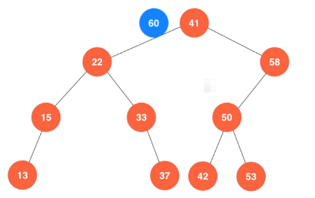
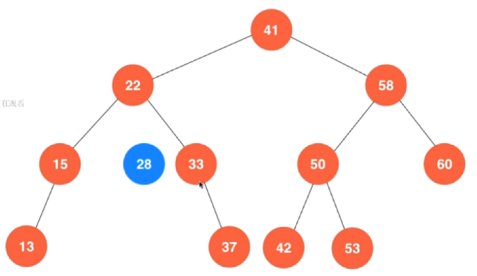

# 二叉搜索树 Binary Search Tree

之前介绍的堆这种数据结构他的本质也是一个二叉搜索树。通过堆这个例子也可以看出来，二叉树在计算机中是一种非常常见的数据结构。

二分搜索树（英语：Binary Search Tree），也称为 二叉查找树 、二叉搜索树 、有序二叉树或排序二叉树。满足以下几个条件：

- 若它的左子树不为空，左子树上所有节点的值都小于它的根节点。
- 若它的右子树不为空，右子树上所有的节点的值都大于它的根节点。

它的左、右子树也都是二分搜索树。

## 查找问题 Searching Problem

查找问题是计算机中非常重要的基础问题。

## 二分查找法 Binary Search

二分查找法是一种非常常见的查找方式，对于有序数列才能使用二分查找法（这也就体现了之前学习排序算法的作用）

如果我们要查找一元素，先看数组中间的值V和所需查找数据的大小关系，分三种情况：

- 1、等于所要查找的数据，直接找到
- 2、若小于 V，在小于 V 部分分组继续查询
- 2、若大于 V，在大于 V 部分分组继续查询


c++代码实现

```c++
// 二分查找法，在有序数组中查找target
// 如果找到target，返回相对应的索引index
// 如果没有找到target，返回-1
template<typename T>
int binarySearch(T arr[], int n, T target)
{
    // 首先申明两个变量,表示我需要在arr[l, r]这个前闭后闭区间内查找target
    int l = 0, r = n-1;
    
    while(l<=r)
    {
        // int mid = (l+r)/2;
        // 注意这里，因为l和r都是int型，如果两个很大的int型相加，是很有可能超过int型的表达范围
        // int型溢出，这个程序就会产生bug
        // 怎么解决这个问题呢？那就不要使用加法，转而使用减法来求这个mid
        int mid = l + (r-l)/2;
        
        if(arr[mid] == target)
        {
            return mid;
        }
        
        // 如果 中间值大于target，就在arr[l, mid-1]范围内继续查找
        if(arr[mid] > target)
        {
            r = mid-1;
        }
        else    // 如果 中间值小于target，就在arr[mid+1, r]范围内继续查找
        {
            l = mid+1;
        }
    }
    
    return -1;
}
```

这里有个很经典的问题就是求中间值的时候int型溢出问题

> `int mid = (l+r)/2;`
> 注意这里，因为l和r都是int型，如果两个很大的int型相加，是很有可能超过int型的表达范围
> int型溢出，这个程序就会产生bug
> 怎么解决这个问题呢？那就不要使用加法，转而使用减法来求这个mid
> `int mid = l + (r-l)/2;

当然也可以实现一个递归版本的二分查找，只不过递归版本的性能一般来说，都会差于迭代版本。

```c++
template<typename T>
int __binarySearch2(T arr[], int l, int r, T target)
{
    if(l>r)
    {
        return -1;
    }
    
    int mid = l + (r-l)/2;
    
    if(arr[mid] == target)
    {
        return mid;
    }
    else if (arr[mid] > target)
    {
        __binarySearch2(arr, l, mid-1, target);
    }
    else
    {
        __binarySearch2(arr, mid+1, r, target);
    }
}


// 递归版本的二分查找法
template<typename T>
int binarySearch2(T arr[], int n, T target)
{
    return __binarySearch2(arr, 0, n-1, target);
}
```

## 二分查找法的变种

### floor 和 ceil 

我们之前的二分查找算法通常来说，都是假设在这个数组中是没有重复元素的，当然我们上面那个二分查找算法对于有重复元素的数组也能找到其索引，只不过这个元素可能会在数组中出现很多次。我们之前的二分查找并不能保证查找到的索引具体的是哪个索引，但是相对应的floor和ceil这两个函数，他们应该能够保证，对于floor来说，找到的是这个元素在数组中第一次出现的位置索引，而如果是调用ceil，那么应该找到的是这个重复元素在数组中最后一次出现的位置


这两个函数还有一个优势，就是单我们在查找一个不存在的元素的时候，我们之前的实现是直接返回-1，但是我们定义的floor和ceil这两个函数，他们的返回值应该是这样的一个情况，比如在如下这个有序数组中我们要查找42的话，可以看到42在这个数组中是不存在的，那么floor这个函数返回的就应该是最后一个41的元素位置，ceil返回的就应该是第一个43元素出现的位置。


```c++
// 二分查找法, 在有序数组arr中, 查找target
// 如果找到target, 返回第一个target相应的索引index
// 如果没有找到target, 返回比target小的最大值相应的索引, 如果这个最大值有多个, 返回最大索引
// 如果这个target比整个数组的最小元素值还要小, 则不存在这个target的floor值, 返回-1
template<typename T>
int floor(T arr[], int n, T target){

    assert( n >= 0 );

    // 寻找比target小的最大索引
    int l = -1, r = n-1;
    while( l < r ){
        // 使用向上取整避免死循环
        int mid = l + (r-l+1)/2;
        if( arr[mid] >= target )
            r = mid - 1;
        else
            l = mid;
    }

    assert( l == r );

    // 如果该索引+1就是target本身, 该索引+1即为返回值
    if( l + 1 < n && arr[l+1] == target )
        return l + 1;

    // 否则, 该索引即为返回值
    return l;
}


// 二分查找法, 在有序数组arr中, 查找target
// 如果找到target, 返回最后一个target相应的索引index
// 如果没有找到target, 返回比target大的最小值相应的索引, 如果这个最小值有多个, 返回最小的索引
// 如果这个target比整个数组的最大元素值还要大, 则不存在这个target的ceil值, 返回整个数组元素个数n
template<typename T>
int ceil(T arr[], int n, T target){

    assert( n >= 0 );

    // 寻找比target大的最小索引值
    int l = 0, r = n;
    while( l < r ){
        // 使用普通的向下取整即可避免死循环
        int mid = l + (r-l)/2;
        if( arr[mid] <= target )
            l = mid + 1;
        else // arr[mid] > target
            r = mid;
    }

    assert( l == r );

    // 如果该索引-1就是target本身, 该索引+1即为返回值
    if( r - 1 >= 0 && arr[r-1] == target )
        return r-1;

    // 否则, 该索引即为返回值
    return r;
}
```

# 二分搜索树 Binary Search Tree

首先我们先来看看为什么要使用二分搜索树。通常来说，二分搜索树这种结构一般都是用于实现一种叫做 查找表 的数据结构。有些地方也将这种数据结构称为 字典 。对于这些数据而言，都是一个一个这种键值对的形式（key-value）数据对。给定一个键值就有与之对应的value值，这样大量的数据对集合在一起就形成了一张表，这个表就被称为查找表。现在通过一个键，就能查找到与这个键对应的值。


这里也很容易看出来，如果我们的这些key的值都是整数，而且他们的范围比较小，那么我们使用数组就可以直接很轻松的使用索引来找到相应的value值，可是实际在我们的业务逻辑中，很多时候不能用整数来表达这样的键值，或者他这个键的值相对比较稀疏，我们使用数组在空间上并不比较经济，或者我们的key的值就不能使用整数来表示等等诸多限制。在这个时候我们就不能使用数组而需要实现一个查找表。

**实现查找表最基本的一个方式就是实现一个二分搜索树**


当然，我们要想实现一个查找表也可以使用一个简单的数组或者顺序数组来进行实现，不过通过上面的图例也可以看到，如果我们使用普通数组或者顺序数组来实现查找表的话，使用普通数组，查找一个元素或者插入一个元素，或者删除一个元素就都需要从头到尾遍历一遍。而对于顺序数组实现查找表，查找元素我们可以使用上面的二分查找法，使用O(log n)的时间复杂度完成，但是对于插入和删除元素，依旧需要从头到尾遍历一遍元素。

而相对而言，使用二分搜索树实现查找表就高效很多，他能保证查找，插入，删除这三个元素他们的时间复杂度都近乎是O(log n)。


## 二分搜索树定义

首先，二分搜索树它依旧是一棵二叉树，除了它是一棵二叉树之外，它还满足如下两个条件

它的每个节点的键值都大于左孩子，同时每个节点的键值都小于右孩子。使用整体上来说，对于每一个节点来说，这个节点的值将会大于它左子树上所有节点的值，同时也会小于它右子树上所有节点的值。（这是二分搜索树一个非常重要的性质）

以左右孩子为根的子树任然为二分搜索树。

> 比如图例中，对于根节点28，它大于左孩子16，小于右孩子30，对于16这个节点，它大于左孩子13，小于右孩子22，等等。。。


对于他的每一个节点来说，以他的左孩子为根的左子树和以右孩子为根的右子树这两个子树也是两个二分搜索树。从二分搜索树的定义中可以看出来，二分搜索树的定义中，天然的就包含了递归结构。

之前将堆的时候，提到堆中的二叉树是一个完全二叉树，但是对于二分搜索树来说，是没有这个限制的。换句话说，如下的一棵二叉树，也是一个二分搜索树。也就是说，二分搜索树不一定是一棵完全二叉树。


我们之前在实现堆的时候，就是因为完全堆是一个完全二叉树，所以能够用数组来进行实现，但是由于我们的二分搜索树不一定是一个完全二叉树，所以用数组表示并不方便。所以对于二分搜索树来说，通常是设立node节点来表示key，value这样的一个数据对。这些节点之间的联系我们使用指针或者引用的形式来表示。（c++中通常也就是使用指针来表示）。同时这里有一个点需要注意，在观察我们上面提供的这些图可以看到，二分搜索树中，每一个节点上都只显示了一个值，这个值通常是表示键这个值。对于每一个键相对应的按个value信息，由于这个信息是查找的时候使用的，所以在表征这棵树的节点的时候，不把它表征出来。这些细节在具体的代码实现中注意体会。

### 插入新节点 insert

假设我们有这么一个二分搜索树，现在要将蓝色这个节点，他的键值为60插入到我们的这个二分搜索树中



该怎么做呢？注意看这里这个过程，在这个过程中，充分运用了二分搜索树的性质。我们首先要做的就是将60和这个根元素进行比较，这个根元素是41，要插入的这个新节点60比41要大，说明这个60需要往41的右子树上插入，为此我们再去看41的右子树的这个根节点58.


在这里我们需要注意这里的一个递归关系，相当于我们是先把60插入到以41为根的这个二分搜索树中，经过比较之后，我们尝试将60插入到以58 为根的这个二分搜索树中。现在我们看，60比58也要大，所以这里60应该插入到58的右子树中。而此时58的右子树为空，所以这个时候我们就知道，60就应该插入到这里。


至此，60这个新元素就插入完成了。

接下来我们继续看一组新的数据，比如这个时候我们继续往这棵二叉搜索树中插入一个新的元素28，


28比他的根要小，所以我们需要尝试将这28插入到41的左子树中，然后我们继续和41的左子树的跟22进行比较


现在28要比22大，所以这里28就应该考虑插入到22的右子树这个二分搜索树中，然后我们继续将待插入元素28和22的右子树的根节点33进行比较。



28比33要小，所以尝试将28插入到33的左子树中，然后发现33的左子树为空，所以这个时候我们就把可以确定，33的左子树这个位置就是我们这个28应该插入的位置。我们这次插入就完成。


最后我们再来看，对于二分搜索树来说，插入节点有一个特殊的情况，那就是我们这个待插入的元素的键值在二分搜索树中已经存在了，这个时候通常来讲对于二分搜索树的定义来说，这次插入动作就相当于找到这个键的值，然后将它相应的信息根据新插入的这个元素进行一个更改。


比如现在需要插入键42这个元素，我们就找42和根节点41比较，他比41大，往41的右子树插入，然后42和41的右子树的根节点58进行比较。


42比58小，我们考虑将42插入到58的这个左子树中，然后将42和58的左子树的根节点50进行比较。


42比50小，所以我们考虑将42插入到50的左子树中，将42和50的左子树的根节点42进行比较


这个时候，我们发现42和42他们键值相等，那么这个时候我们要做的事情就是把原先42这个数据用新插入的这个42节点里的数据进行覆盖掉。


这就是二分搜索树插入新的节点这样一个过程。

insert c++代码实现

```c++
private:
    
    // 往二叉搜索树中插入一个新的键值对
    void insert(Key key, Value value)
    {
        // 在这个函数这里调用一个insert的重载版本(写法随意，看自己习惯)
        // 这里调用这个函数传入的参数，
        // root节点，表示这个insert动作从root这个根节点那开始插入这个key-value
        // 然后这个insert函数它也有返回值，返回的就是我们插入这个到的这个二叉搜索树的根
        root = insert(root, key, value);
    }
    
private:
    // 向以node为根节点的二叉搜索树中，插入节点（key,value）
    // 返回的是插入新节点后的二叉搜索树的根（返回回去的目的就是为了做上一级的左子树或者右子树的根）
    Node* insert(Node* node, Key key, Value value)
    {
        if(node == nullptr) {
            // 传入的这个node节点为kong，就表示这个位置就是我们需要插入的这个新节点的位置
            // 这个时候我们的节点计数器count++
            count++;
            return new Node(key, value);
            // 这个时候我们就可以理解成，对于插入完成后要返回的这个二叉搜索树的根，就是我们新创建的这个Node节点
        }
        
        // 之后我们要做的要么是修改node节点的value，要么是给node添加新的左子树或者新的右子树
        
        if(key == node->key)
        {
            node->value = value;
        }
        else if(key < node->key)
        {
            // 往node的左子树插入
            // 插入节点之后，返回的这个节点的根，就应该重新赋值给这个node节点的左孩子节点
            node->left = insert(node->left, key, value);
        }
        else
        {
            // 往node节点的右子树插入
            node->right = insert(node->right, key, value);
        }
        
        // 最后我们返回的任然是这个处理过的node
        return node;
        
    }
```

> 注意这里要体会这个insert递归代码，我们是如何将向整个二叉搜索树中插入一个新元素，转换成了向一个子二叉搜索树中插入一个元素，直到我们最后这个子树为空的时候，那么我们就新建一个节点，这个新建的节点就是一棵新的子树(也就是我们新插入的元素应该在的节点位置)，只不过它只有一个节点，将它直接返回回去。这样就通过递归的方式将向二叉搜索树中插入了一个新的元素。

### 二分查找树的查找 （contain 和 search）

实际上查找操作和插入操作是差不多的，只不过查找操作专注于去找到那个元素，如果最终找到一个空节点说明查找失败了


比如现在需要查找键42这个元素，我们就找42和根节点41比较，他比41大，往41的右子树中继续查找，然后42和41的右子树的根节点58进行比较。


42比58小，继续到58的这个左子树中取查找，然后将42和58的左子树的根节点50进行比较。


42比50小，所以我们继续到50的左子树中取查找，将42和50的左子树的根节点42进行比较


这个时候，我们发现42和42他们键值相等，那么就在二分搜索树中找到了这个42这个键


查找失败的情况，就是直到查找到最后节点为空了，还是没有找到匹配的节点，就表示该二叉搜索树中没有该节点，查找失败。

这就是在二叉搜索树中的查找过程，当然这个是找到键值key的对应的value值，有时候我们不需要这个value值，而是仅仅需要查看这个二叉搜索树中，是否包含某个键key这样的元素（contain），这个contain操作和search操作基本上是一样的，只不过contain操作返回bool类型，search函数返回Value类型

测试我们当前实现的这个二分搜索树，来看看他的性能到底有何提升。这里测试用例是一个圣经文本，在main函数的程序里将这个bible的全文读进来，同时将圣经中的每一个词都提取出来，存放在一个 容器vector中，提取过程放在一个FileOps.h的文件中，总之这个FileOps程序就是能够将这个文本文件中的所有词存进容器。存完以后，下一步就是需要来测试我们的BST（二叉搜索树）。

测试过程是这样，从头到尾访问在圣经中出现的每一个词，然后对于这些每一个词，我们来计算它的词频。然后这里看"god"这个词在圣经中出现了多少次，最终将结果打印出来。整个过程进行了计时操作，来看这个过程花了多少时间。

为了对比二叉搜索树的效率，这里额外编写了一个顺序查找表（SST)，对于顺序查找表，在public函数中对外暴露的接口和我们的BST也是一样的，都是insert，search...。不同之处就是在这个顺序查找表中使用的是一个链表的数据结构，在insert函数中是向链表中插入一个节点，在contain和search中实际上是遍历一遍链表看有没有这个节点。所以对于顺序查找表来说，这样的数据结构导致的操作都是O(n)级别的。为此我们使用这样的一个顺序查找表也来实现一个一模一样的功能，来看圣经全本中到底存在多少个“god”

程序运行结果如下：


这里BST（二叉搜索树）花了1s左右就完成了（可实际上可以更快，0.5s左右吧，这里测试结果是在网页上测试的）。而对于顺序查找表花费的时间更多，两者之间的性能差距不言而喻。

## 二分搜索树的遍历（深度优先遍历）

二分搜索树遍历分为两大类，深度优先遍历和层序遍历。

深度优先遍历分为三种：先序遍历（preorder tree walk）、中序遍历（inorder tree walk）、后序遍历（postorder tree walk），分别为：

- **1、前序遍历：**先访问当前节点，再依次递归访问左右子树。
- **2、中序遍历**：先递归访问左子树，再访问自身，再递归访问右子树。
- **3、后序遍历**：先递归访问左右子树，再访问自身节点。

总结归纳下来就是，对于 前 中 后 这三个遍历顺序，其实就是指遍历过程中对单前节点的访问顺序，是在前面访问还是在中间访问还是在最后访问。


对于每一个节点来说，它都是有左右两颗子树，我们这里虚拟的给每个节点标记上3个点，在每次递归访问整棵树的时候，都要分别访问这3个点的位置。这里可以想象一下，一开始我们访问红色节点的时候，就是在访问1这个节点，之后去访问他的左子树，访问完左子树返回回来的时候，访问的就是中间这个2这个点，然后去访问它的右子树，访问完右子树返回回来的时候，访问的就是3这个点。而这里1,2,3这3个节点的访问就对应了 上面的 前 中 后 序。而前中后序遍历，就对应，在节点哪个的那个位置进行访问。（注意这里1,2,3不是实际存在的点，只是用这3个点表示该节点的访问时机）

### 前序遍历

这里我们要前序遍历这样一颗二叉树，并且在遍历到每一个节点的时候都相应的把这个节点打印出来，


首先我们访问28这个根节点，因为是前序遍历，所以28这个节点就被打印出来，之后我们就要访问28的左孩子，那么16这个位置就被访问到，16打印出来。下一步我们继续访问16的左子树，相应的13这个位置被访问到，打印13


之后我们访问13的左孩子，发现没有，下一步就到了13的中间位置，注意这里因为是前序遍历，所以这里不做任何事情（在哪里做事情是取决于你是哪个序遍历），然后我访问右孩子，右孩子为空，就返回到了13的右侧（后面）这个位置，注意，也是一样的，因为是前序遍历，所以这里也不对13这个节点做任何事情。

之后我们继续返回访问16的中间的位置，不做事，然后访问16右子树22，因为是访问到前序的位置，所以这里将22打印输出做事，之后22左孩子为空，访问中间，右孩子为空访问最后，然后返回访问16的后序的位置，然后返回访问28中序的位置，然后访问30前序的位置，打印30，然后访问他的左子树29前序的位置，打印29，然后29左子树为空，访问中序位置，接着访问29的右子树为空，访问29后序的位置，然后返回访问30中序的位置，访问30的右子树42前序位置，打印42访问42的左子树为空，访问中序，访问右子树为空，访问后序返回30的后序，返回28的后序。


至此，整个二叉树前序遍历结束，打印出来的结果就是这样。从这个遍历过程我们可以看到，对于二分搜索树中的么一个节点，在遍历过程中都被访问了 前 中 后 3次。在前序遍历的时候，我们只有在访问到前序的时候，才做事情（这里做的事情就是把这个节点的数值打印出来）。

### 中序遍历

通常在我们对每一个节点遍历做事情的时候，使用前序遍历就已经足够了，不过中序遍历和后序遍历也有他们存在的意义


这里过程描述就略过。实际上就是我们访问每个节点到达中间这个位置的时候，才做事情，这就是二叉搜索树的中序遍历过程。另外可以观察一下中序遍历的输出结果可以发现，他的所有元素是从小到大进行排序的。这也是中序遍历对于我们的二分搜索树的一个实际的应用。如果我们想要给二分搜索树中的元素进行排序，只需要进行一次中序遍历就可以。这背后的原因是和二叉搜索树的定义相关的，二分搜索树要求左边的子树都小于自身，右边的子树都大于自身，所以在中序遍历中，我递归的先遍历左边在遍历自己，在遍历右边就恰好是从小到大的排列结果。

### 后续遍历


对于后续遍历来说，他有一个特点就是已经将单前节点的左右两个子树都遍历完成了，才会回去做它要做的事情，这样的一个性质在进行某些操作的时候，是非常方便的时候，最典型的一个应用就是在我们释放整个二叉树的时候，我们需要将每一个节点它的左右两颗子树上的节点都释放完成以后，才会去释放当前自身节点。所以这个过程就应该使用后续遍历。

### 代码实现

```c++
public:
	// 析构函数
  ~BST()
  {
    destroy(root);
  }
	// 前序遍历
  void preOrder()
  {
    // 这里依旧调用私有的preorder函数，传入一个根节点root表示从根节点进行前序遍历
    preOrder(root);
  }

  // 中序遍历
  void inOrder()
  {
    inOrder(root);
  }

  // 后续遍历
  void postOrder()
  {
    postOrder(root);
  }
private:
// 前序遍历
  // 对以node为根的二叉搜索树进行前序遍历
  void preOrder(Node* node)
  {
    if(node != nullptr)
    {
      std::cout << node->key << std::endl;
      preOrder(node->left);
      preOrder(node->right);
    }
    
  }

  // 中序遍历
  // 对以node为根的二叉搜索树进行中序遍历
  void inOrder(Node* node)
  {
    if(node != nullptr)
    {
      inOrder(node->left);
      std::cout << node->key << std::endl;
      inOrder(node->right);
    }
    
  }

  // 后续遍历
  // 对以node为根的二叉搜索树进行后序遍历
  void postOrder(Node* node)
  {
    if(node != nullptr)
    {
      postOrder(node->left);
      postOrder(node->right);
      std::cout << node->key << std::endl;
    }
    
  }

  // 采用后续遍历的方式对二叉搜索树的所有节点进行释放
  void destroy(Node* node)
  {
    if(node != nullptr)
    {
      destroy(node->left);
      destroy(node->right);
      
      delete node;
      count--;
    }
  }
```

注意这里前序遍历和中序遍历以及后续遍历代码，他们的代码结构基本都是相同的，只不过，前序遍历是在两次递归之前做打印操作，而中序遍历是在两次递归之间做打印操作，而后续遍历是在两次递归之后进行打印操作。

这里这个二叉搜索树类的析构操作，就应该使用后续遍历的方式，来将每一个节点的内存空间进行释放。

## 二分搜索树的层序遍历（广度优先遍历）

我们之前所采用的二叉树的遍历，不管是前序还是中序还是后续，我们整个访问这些节点的过程，都是顺序一样的。只不过区别在于遍历过程中处理节点的位置时机不同。这样的一种遍历模式通常称呼为深度优先遍历。也就是我们一开始就尝试走到最深，走不通了以后，才会用回溯的方式返回，这样将整棵树遍历结束。


和这个思路与之对应的，在二叉树中也存在广度优先遍历（层序遍历），对应到二叉树上，就是层序的遍历。以上图为例。我们在看完28这个节点以后，马上看的就是16和30这两个节点，这两个节点是在一层上，紧接着看的就是13， 22， 29， 42这一层的节点。如果这棵树更大的话，以此类推。一层一层的看。

可以想象，对于这种方式来说，我们没有优先从这棵树的根节点一条道走到黑（一直走到最深，走到某个叶子节点），而是更加关注广度，将每一层的所有节点优先遍历完毕。所以这就叫做广度优先遍历。

具体广度优先遍历怎么实现呢？通常来说，实现广度优先遍历，需要引入一个队列（队列就是先进先出，后进后出这样的一种数据结构）


首先我们能很容易拿到我们二叉树的根，所以我们先把我们的二叉树的根推进我们的队列。之后我们进行一次循环，在每次循环中只要我们的队列不为空，比如现在这种情况我们的队列就是不为空的，虽然他只有一个元素，那么我们就把这个元素拿出来。我们把元素拿出来这个动作就是遍历到了这个元素，我们就可以做相应的操作，比如打印这个元素等等。。


在这之后我们还要将这个元素的左右两个孩子拿到并且入队。比如例子中的28来说，他的左右两个孩子分别是16和30，所以我们就要将16和30这两个元素分别入队


现在我们的队列就是这个样子，接下来我们就可以进行这次循环，我们下一步的操作就是要把队首的16给拿出来，做相应的操作，比如打印等等..，然后接下里就是将16的左右两个孩子13和22入队，我们的队列就变成这个样子。


下一步，队首是30，我们将30 出队进行操作，然后将30的左右两个孩子29和42进行入队。我们的队列就变成这个样子。


之后将队首的13拿出队列进行操作，然后将13的左右孩子入队，13没有孩子，那么就不能入队，那就过去了，继续将队首22拿出队列进行操作，将22的左右孩子加入队列，以此类推，直到最后我们的队列中没有元素，那么我们的这次广度优先遍历就完成了。

