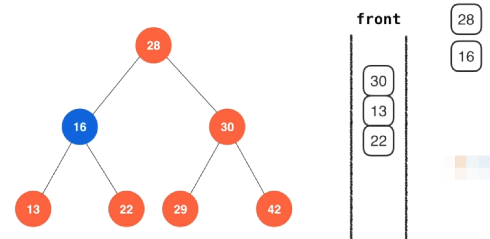
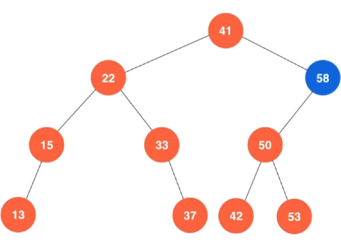
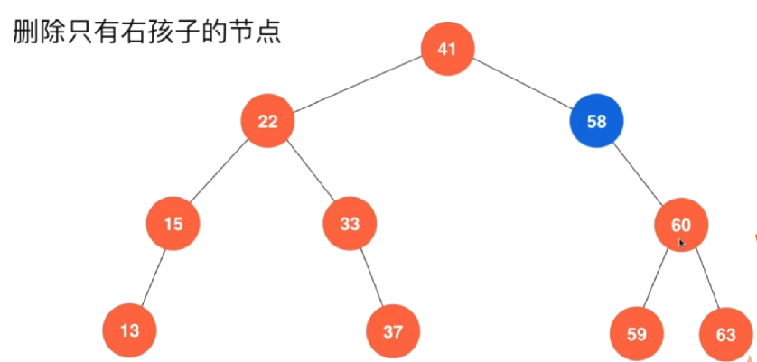

# 二叉搜索树 Binary Search Tree

之前介绍的堆这种数据结构他的本质也是一个二叉搜索树。通过堆这个例子也可以看出来，二叉树在计算机中是一种非常常见的数据结构。

二分搜索树（英语：Binary Search Tree），也称为 二叉查找树 、二叉搜索树 、有序二叉树或排序二叉树。满足以下几个条件：

- 若它的左子树不为空，左子树上所有节点的值都小于它的根节点。
- 若它的右子树不为空，右子树上所有的节点的值都大于它的根节点。

它的左、右子树也都是二分搜索树。

## 查找问题 Searching Problem

查找问题是计算机中非常重要的基础问题。

## 二分查找法 Binary Search

二分查找法是一种非常常见的查找方式，对于有序数列才能使用二分查找法（这也就体现了之前学习排序算法的作用）

如果我们要查找一元素，先看数组中间的值V和所需查找数据的大小关系，分三种情况：

- 1、等于所要查找的数据，直接找到
- 2、若小于 V，在小于 V 部分分组继续查询
- 2、若大于 V，在大于 V 部分分组继续查询


c++代码实现

```c++
// 二分查找法，在有序数组中查找target
// 如果找到target，返回相对应的索引index
// 如果没有找到target，返回-1
template<typename T>
int binarySearch(T arr[], int n, T target)
{
    // 首先申明两个变量,表示我需要在arr[l, r]这个前闭后闭区间内查找target
    int l = 0, r = n-1;
    
    while(l<=r)
    {
        // int mid = (l+r)/2;
        // 注意这里，因为l和r都是int型，如果两个很大的int型相加，是很有可能超过int型的表达范围
        // int型溢出，这个程序就会产生bug
        // 怎么解决这个问题呢？那就不要使用加法，转而使用减法来求这个mid
        int mid = l + (r-l)/2;
        
        if(arr[mid] == target)
        {
            return mid;
        }
        
        // 如果 中间值大于target，就在arr[l, mid-1]范围内继续查找
        if(arr[mid] > target)
        {
            r = mid-1;
        }
        else    // 如果 中间值小于target，就在arr[mid+1, r]范围内继续查找
        {
            l = mid+1;
        }
    }
    
    return -1;
}
```

这里有个很经典的问题就是求中间值的时候int型溢出问题

> `int mid = (l+r)/2;`
> 注意这里，因为l和r都是int型，如果两个很大的int型相加，是很有可能超过int型的表达范围
> int型溢出，这个程序就会产生bug
> 怎么解决这个问题呢？那就不要使用加法，转而使用减法来求这个mid
> `int mid = l + (r-l)/2;

当然也可以实现一个递归版本的二分查找，只不过递归版本的性能一般来说，都会差于迭代版本。

```c++
template<typename T>
int __binarySearch2(T arr[], int l, int r, T target)
{
    if(l>r)
    {
        return -1;
    }
    
    int mid = l + (r-l)/2;
    
    if(arr[mid] == target)
    {
        return mid;
    }
    else if (arr[mid] > target)
    {
        __binarySearch2(arr, l, mid-1, target);
    }
    else
    {
        __binarySearch2(arr, mid+1, r, target);
    }
}


// 递归版本的二分查找法
template<typename T>
int binarySearch2(T arr[], int n, T target)
{
    return __binarySearch2(arr, 0, n-1, target);
}
```

## 二分查找法的变种

### floor 和 ceil 

我们之前的二分查找算法通常来说，都是假设在这个数组中是没有重复元素的，当然我们上面那个二分查找算法对于有重复元素的数组也能找到其索引，只不过这个元素可能会在数组中出现很多次。我们之前的二分查找并不能保证查找到的索引具体的是哪个索引，但是相对应的floor和ceil这两个函数，他们应该能够保证，对于floor来说，找到的是这个元素在数组中第一次出现的位置索引，而如果是调用ceil，那么应该找到的是这个重复元素在数组中最后一次出现的位置


这两个函数还有一个优势，就是单我们在查找一个不存在的元素的时候，我们之前的实现是直接返回-1，但是我们定义的floor和ceil这两个函数，他们的返回值应该是这样的一个情况，比如在如下这个有序数组中我们要查找42的话，可以看到42在这个数组中是不存在的，那么floor这个函数返回的就应该是最后一个41的元素位置，ceil返回的就应该是第一个43元素出现的位置。


```c++
// 二分查找法, 在有序数组arr中, 查找target
// 如果找到target, 返回第一个target相应的索引index
// 如果没有找到target, 返回比target小的最大值相应的索引, 如果这个最大值有多个, 返回最大索引
// 如果这个target比整个数组的最小元素值还要小, 则不存在这个target的floor值, 返回-1
template<typename T>
int floor(T arr[], int n, T target){

    assert( n >= 0 );

    // 寻找比target小的最大索引
    int l = -1, r = n-1;
    while( l < r ){
        // 使用向上取整避免死循环
        int mid = l + (r-l+1)/2;
        if( arr[mid] >= target )
            r = mid - 1;
        else
            l = mid;
    }

    assert( l == r );

    // 如果该索引+1就是target本身, 该索引+1即为返回值
    if( l + 1 < n && arr[l+1] == target )
        return l + 1;

    // 否则, 该索引即为返回值
    return l;
}


// 二分查找法, 在有序数组arr中, 查找target
// 如果找到target, 返回最后一个target相应的索引index
// 如果没有找到target, 返回比target大的最小值相应的索引, 如果这个最小值有多个, 返回最小的索引
// 如果这个target比整个数组的最大元素值还要大, 则不存在这个target的ceil值, 返回整个数组元素个数n
template<typename T>
int ceil(T arr[], int n, T target){

    assert( n >= 0 );

    // 寻找比target大的最小索引值
    int l = 0, r = n;
    while( l < r ){
        // 使用普通的向下取整即可避免死循环
        int mid = l + (r-l)/2;
        if( arr[mid] <= target )
            l = mid + 1;
        else // arr[mid] > target
            r = mid;
    }

    assert( l == r );

    // 如果该索引-1就是target本身, 该索引+1即为返回值
    if( r - 1 >= 0 && arr[r-1] == target )
        return r-1;

    // 否则, 该索引即为返回值
    return r;
}
```

# 二分搜索树 Binary Search Tree

首先我们先来看看为什么要使用二分搜索树。通常来说，二分搜索树这种结构一般都是用于实现一种叫做 查找表 的数据结构。有些地方也将这种数据结构称为 字典 。对于这些数据而言，都是一个一个这种键值对的形式（key-value）数据对。给定一个键值就有与之对应的value值，这样大量的数据对集合在一起就形成了一张表，这个表就被称为查找表。现在通过一个键，就能查找到与这个键对应的值。


这里也很容易看出来，如果我们的这些key的值都是整数，而且他们的范围比较小，那么我们使用数组就可以直接很轻松的使用索引来找到相应的value值，可是实际在我们的业务逻辑中，很多时候不能用整数来表达这样的键值，或者他这个键的值相对比较稀疏，我们使用数组在空间上并不比较经济，或者我们的key的值就不能使用整数来表示等等诸多限制。在这个时候我们就不能使用数组而需要实现一个查找表。

**实现查找表最基本的一个方式就是实现一个二分搜索树**


当然，我们要想实现一个查找表也可以使用一个简单的数组或者顺序数组来进行实现，不过通过上面的图例也可以看到，如果我们使用普通数组或者顺序数组来实现查找表的话，使用普通数组，查找一个元素或者插入一个元素，或者删除一个元素就都需要从头到尾遍历一遍。而对于顺序数组实现查找表，查找元素我们可以使用上面的二分查找法，使用O(log n)的时间复杂度完成，但是对于插入和删除元素，依旧需要从头到尾遍历一遍元素。

而相对而言，使用二分搜索树实现查找表就高效很多，他能保证查找，插入，删除这三个元素他们的时间复杂度都近乎是O(log n)。


## 二分搜索树定义

首先，二分搜索树它依旧是一棵二叉树，除了它是一棵二叉树之外，它还满足如下两个条件

它的每个节点的键值都大于左孩子，同时每个节点的键值都小于右孩子。使用整体上来说，对于每一个节点来说，这个节点的值将会大于它左子树上所有节点的值，同时也会小于它右子树上所有节点的值。（这是二分搜索树一个非常重要的性质）

以左右孩子为根的子树任然为二分搜索树。

> 比如图例中，对于根节点28，它大于左孩子16，小于右孩子30，对于16这个节点，它大于左孩子13，小于右孩子22，等等。。。


对于他的每一个节点来说，以他的左孩子为根的左子树和以右孩子为根的右子树这两个子树也是两个二分搜索树。从二分搜索树的定义中可以看出来，二分搜索树的定义中，天然的就包含了递归结构。

之前将堆的时候，提到堆中的二叉树是一个完全二叉树，但是对于二分搜索树来说，是没有这个限制的。换句话说，如下的一棵二叉树，也是一个二分搜索树。也就是说，二分搜索树不一定是一棵完全二叉树。


我们之前在实现堆的时候，就是因为完全堆是一个完全二叉树，所以能够用数组来进行实现，但是由于我们的二分搜索树不一定是一个完全二叉树，所以用数组表示并不方便。所以对于二分搜索树来说，通常是设立node节点来表示key，value这样的一个数据对。这些节点之间的联系我们使用指针或者引用的形式来表示。（c++中通常也就是使用指针来表示）。同时这里有一个点需要注意，在观察我们上面提供的这些图可以看到，二分搜索树中，每一个节点上都只显示了一个值，这个值通常是表示键这个值。对于每一个键相对应的按个value信息，由于这个信息是查找的时候使用的，所以在表征这棵树的节点的时候，不把它表征出来。这些细节在具体的代码实现中注意体会。

### 插入新节点 insert

假设我们有这么一个二分搜索树，现在要将蓝色这个节点，他的键值为60插入到我们的这个二分搜索树中


该怎么做呢？注意看这里这个过程，在这个过程中，充分运用了二分搜索树的性质。我们首先要做的就是将60和这个根元素进行比较，这个根元素是41，要插入的这个新节点60比41要大，说明这个60需要往41的右子树上插入，为此我们再去看41的右子树的这个根节点58.


在这里我们需要注意这里的一个递归关系，相当于我们是先把60插入到以41为根的这个二分搜索树中，经过比较之后，我们尝试将60插入到以58 为根的这个二分搜索树中。现在我们看，60比58也要大，所以这里60应该插入到58的右子树中。而此时58的右子树为空，所以这个时候我们就知道，60就应该插入到这里。


至此，60这个新元素就插入完成了。

接下来我们继续看一组新的数据，比如这个时候我们继续往这棵二叉搜索树中插入一个新的元素28，


28比他的根要小，所以我们需要尝试将这28插入到41的左子树中，然后我们继续和41的左子树的跟22进行比较


现在28要比22大，所以这里28就应该考虑插入到22的右子树这个二分搜索树中，然后我们继续将待插入元素28和22的右子树的根节点33进行比较。


28比33要小，所以尝试将28插入到33的左子树中，然后发现33的左子树为空，所以这个时候我们就把可以确定，33的左子树这个位置就是我们这个28应该插入的位置。我们这次插入就完成。


最后我们再来看，对于二分搜索树来说，插入节点有一个特殊的情况，那就是我们这个待插入的元素的键值在二分搜索树中已经存在了，这个时候通常来讲对于二分搜索树的定义来说，这次插入动作就相当于找到这个键的值，然后将它相应的信息根据新插入的这个元素进行一个更改。


比如现在需要插入键42这个元素，我们就找42和根节点41比较，他比41大，往41的右子树插入，然后42和41的右子树的根节点58进行比较。


42比58小，我们考虑将42插入到58的这个左子树中，然后将42和58的左子树的根节点50进行比较。


42比50小，所以我们考虑将42插入到50的左子树中，将42和50的左子树的根节点42进行比较


这个时候，我们发现42和42他们键值相等，那么这个时候我们要做的事情就是把原先42这个数据用新插入的这个42节点里的数据进行覆盖掉。


这就是二分搜索树插入新的节点这样一个过程。

insert c++代码实现

```c++
private:
    
    // 往二叉搜索树中插入一个新的键值对
    void insert(Key key, Value value)
    {
        // 在这个函数这里调用一个insert的重载版本(写法随意，看自己习惯)
        // 这里调用这个函数传入的参数，
        // root节点，表示这个insert动作从root这个根节点那开始插入这个key-value
        // 然后这个insert函数它也有返回值，返回的就是我们插入这个到的这个二叉搜索树的根
        root = insert(root, key, value);
    }
    
private:
    // 向以node为根节点的二叉搜索树中，插入节点（key,value）
    // 返回的是插入新节点后的二叉搜索树的根（返回回去的目的就是为了做上一级的左子树或者右子树的根）
    Node* insert(Node* node, Key key, Value value)
    {
        if(node == nullptr) {
            // 传入的这个node节点为kong，就表示这个位置就是我们需要插入的这个新节点的位置
            // 这个时候我们的节点计数器count++
            count++;
            return new Node(key, value);
            // 这个时候我们就可以理解成，对于插入完成后要返回的这个二叉搜索树的根，就是我们新创建的这个Node节点
        }
        
        // 之后我们要做的要么是修改node节点的value，要么是给node添加新的左子树或者新的右子树
        
        if(key == node->key)
        {
            node->value = value;
        }
        else if(key < node->key)
        {
            // 往node的左子树插入
            // 插入节点之后，返回的这个节点的根，就应该重新赋值给这个node节点的左孩子节点
            node->left = insert(node->left, key, value);
        }
        else
        {
            // 往node节点的右子树插入
            node->right = insert(node->right, key, value);
        }
        
        // 最后我们返回的任然是这个处理过的node
        return node;
        
    }
```

> 注意这里要体会这个insert递归代码，我们是如何将向整个二叉搜索树中插入一个新元素，转换成了向一个子二叉搜索树中插入一个元素，直到我们最后这个子树为空的时候，那么我们就新建一个节点，这个新建的节点就是一棵新的子树(也就是我们新插入的元素应该在的节点位置)，只不过它只有一个节点，将它直接返回回去。这样就通过递归的方式将向二叉搜索树中插入了一个新的元素。

### 二分查找树的查找 （contain 和 search）

实际上查找操作和插入操作是差不多的，只不过查找操作专注于去找到那个元素，如果最终找到一个空节点说明查找失败了


比如现在需要查找键42这个元素，我们就找42和根节点41比较，他比41大，往41的右子树中继续查找，然后42和41的右子树的根节点58进行比较。


42比58小，继续到58的这个左子树中取查找，然后将42和58的左子树的根节点50进行比较。


42比50小，所以我们继续到50的左子树中取查找，将42和50的左子树的根节点42进行比较


这个时候，我们发现42和42他们键值相等，那么就在二分搜索树中找到了这个42这个键


查找失败的情况，就是直到查找到最后节点为空了，还是没有找到匹配的节点，就表示该二叉搜索树中没有该节点，查找失败。

这就是在二叉搜索树中的查找过程，当然这个是找到键值key的对应的value值，有时候我们不需要这个value值，而是仅仅需要查看这个二叉搜索树中，是否包含某个键key这样的元素（contain），这个contain操作和search操作基本上是一样的，只不过contain操作返回bool类型，search函数返回Value类型

测试我们当前实现的这个二分搜索树，来看看他的性能到底有何提升。这里测试用例是一个圣经文本，在main函数的程序里将这个bible的全文读进来，同时将圣经中的每一个词都提取出来，存放在一个 容器vector中，提取过程放在一个FileOps.h的文件中，总之这个FileOps程序就是能够将这个文本文件中的所有词存进容器。存完以后，下一步就是需要来测试我们的BST（二叉搜索树）。

测试过程是这样，从头到尾访问在圣经中出现的每一个词，然后对于这些每一个词，我们来计算它的词频。然后这里看"god"这个词在圣经中出现了多少次，最终将结果打印出来。整个过程进行了计时操作，来看这个过程花了多少时间。

为了对比二叉搜索树的效率，这里额外编写了一个顺序查找表（SST)，对于顺序查找表，在public函数中对外暴露的接口和我们的BST也是一样的，都是insert，search...。不同之处就是在这个顺序查找表中使用的是一个链表的数据结构，在insert函数中是向链表中插入一个节点，在contain和search中实际上是遍历一遍链表看有没有这个节点。所以对于顺序查找表来说，这样的数据结构导致的操作都是O(n)级别的。为此我们使用这样的一个顺序查找表也来实现一个一模一样的功能，来看圣经全本中到底存在多少个“god”

程序运行结果如下：


这里BST（二叉搜索树）花了1s左右就完成了（可实际上可以更快，0.5s左右吧，这里测试结果是在网页上测试的）。而对于顺序查找表花费的时间更多，两者之间的性能差距不言而喻。

## 二分搜索树的遍历（深度优先遍历）

二分搜索树遍历分为两大类，深度优先遍历和层序遍历。

深度优先遍历分为三种：先序遍历（preorder tree walk）、中序遍历（inorder tree walk）、后序遍历（postorder tree walk），分别为：

- **1、前序遍历：**先访问当前节点，再依次递归访问左右子树。
- **2、中序遍历**：先递归访问左子树，再访问自身，再递归访问右子树。
- **3、后序遍历**：先递归访问左右子树，再访问自身节点。

总结归纳下来就是，对于 前 中 后 这三个遍历顺序，其实就是指遍历过程中对单前节点的访问顺序，是在前面访问还是在中间访问还是在最后访问。


对于每一个节点来说，它都是有左右两颗子树，我们这里虚拟的给每个节点标记上3个点，在每次递归访问整棵树的时候，都要分别访问这3个点的位置。这里可以想象一下，一开始我们访问红色节点的时候，就是在访问1这个节点，之后去访问他的左子树，访问完左子树返回回来的时候，访问的就是中间这个2这个点，然后去访问它的右子树，访问完右子树返回回来的时候，访问的就是3这个点。而这里1,2,3这3个节点的访问就对应了 上面的 前 中 后 序。而前中后序遍历，就对应，在节点哪个的那个位置进行访问。（注意这里1,2,3不是实际存在的点，只是用这3个点表示该节点的访问时机）

### 前序遍历

这里我们要前序遍历这样一颗二叉树，并且在遍历到每一个节点的时候都相应的把这个节点打印出来，


首先我们访问28这个根节点，因为是前序遍历，所以28这个节点就被打印出来，之后我们就要访问28的左孩子，那么16这个位置就被访问到，16打印出来。下一步我们继续访问16的左子树，相应的13这个位置被访问到，打印13


之后我们访问13的左孩子，发现没有，下一步就到了13的中间位置，注意这里因为是前序遍历，所以这里不做任何事情（在哪里做事情是取决于你是哪个序遍历），然后我访问右孩子，右孩子为空，就返回到了13的右侧（后面）这个位置，注意，也是一样的，因为是前序遍历，所以这里也不对13这个节点做任何事情。

之后我们继续返回访问16的中间的位置，不做事，然后访问16右子树22，因为是访问到前序的位置，所以这里将22打印输出做事，之后22左孩子为空，访问中间，右孩子为空访问最后，然后返回访问16的后序的位置，然后返回访问28中序的位置，然后访问30前序的位置，打印30，然后访问他的左子树29前序的位置，打印29，然后29左子树为空，访问中序位置，接着访问29的右子树为空，访问29后序的位置，然后返回访问30中序的位置，访问30的右子树42前序位置，打印42访问42的左子树为空，访问中序，访问右子树为空，访问后序返回30的后序，返回28的后序。


至此，整个二叉树前序遍历结束，打印出来的结果就是这样。从这个遍历过程我们可以看到，对于二分搜索树中的么一个节点，在遍历过程中都被访问了 前 中 后 3次。在前序遍历的时候，我们只有在访问到前序的时候，才做事情（这里做的事情就是把这个节点的数值打印出来）。

### 中序遍历

通常在我们对每一个节点遍历做事情的时候，使用前序遍历就已经足够了，不过中序遍历和后序遍历也有他们存在的意义


这里过程描述就略过。实际上就是我们访问每个节点到达中间这个位置的时候，才做事情，这就是二叉搜索树的中序遍历过程。另外可以观察一下中序遍历的输出结果可以发现，他的所有元素是从小到大进行排序的。这也是中序遍历对于我们的二分搜索树的一个实际的应用。如果我们想要给二分搜索树中的元素进行排序，只需要进行一次中序遍历就可以。这背后的原因是和二叉搜索树的定义相关的，二分搜索树要求左边的子树都小于自身，右边的子树都大于自身，所以在中序遍历中，我递归的先遍历左边在遍历自己，在遍历右边就恰好是从小到大的排列结果。

### 后续遍历


对于后续遍历来说，他有一个特点就是已经将单前节点的左右两个子树都遍历完成了，才会回去做它要做的事情，这样的一个性质在进行某些操作的时候，是非常方便的时候，最典型的一个应用就是在我们释放整个二叉树的时候，我们需要将每一个节点它的左右两颗子树上的节点都释放完成以后，才会去释放当前自身节点。所以这个过程就应该使用后续遍历。

### 代码实现

```c++
public:
	// 析构函数
  ~BST()
  {
    destroy(root);
  }
	// 前序遍历
  void preOrder()
  {
    // 这里依旧调用私有的preorder函数，传入一个根节点root表示从根节点进行前序遍历
    preOrder(root);
  }

  // 中序遍历
  void inOrder()
  {
    inOrder(root);
  }

  // 后续遍历
  void postOrder()
  {
    postOrder(root);
  }
private:
// 前序遍历
  // 对以node为根的二叉搜索树进行前序遍历
  void preOrder(Node* node)
  {
    if(node != nullptr)
    {
      std::cout << node->key << std::endl;
      preOrder(node->left);
      preOrder(node->right);
    }
    
  }

  // 中序遍历
  // 对以node为根的二叉搜索树进行中序遍历
  void inOrder(Node* node)
  {
    if(node != nullptr)
    {
      inOrder(node->left);
      std::cout << node->key << std::endl;
      inOrder(node->right);
    }
    
  }

  // 后续遍历
  // 对以node为根的二叉搜索树进行后序遍历
  void postOrder(Node* node)
  {
    if(node != nullptr)
    {
      postOrder(node->left);
      postOrder(node->right);
      std::cout << node->key << std::endl;
    }
    
  }

  // 采用后续遍历的方式对二叉搜索树的所有节点进行释放
  void destroy(Node* node)
  {
    if(node != nullptr)
    {
      destroy(node->left);
      destroy(node->right);
      
      delete node;
      count--;
    }
  }
```

注意这里前序遍历和中序遍历以及后续遍历代码，他们的代码结构基本都是相同的，只不过，前序遍历是在两次递归之前做打印操作，而中序遍历是在两次递归之间做打印操作，而后续遍历是在两次递归之后进行打印操作。

这里这个二叉搜索树类的析构操作，就应该使用后续遍历的方式，来将每一个节点的内存空间进行释放。

## 二分搜索树的层序遍历（广度优先遍历）

我们之前所采用的二叉树的遍历，不管是前序还是中序还是后续，我们整个访问这些节点的过程，都是顺序一样的。只不过区别在于遍历过程中处理节点的位置时机不同。这样的一种遍历模式通常称呼为深度优先遍历。也就是我们一开始就尝试走到最深，走不通了以后，才会用回溯的方式返回，这样将整棵树遍历结束。


和这个思路与之对应的，在二叉树中也存在广度优先遍历（层序遍历），对应到二叉树上，就是层序的遍历。以上图为例。我们在看完28这个节点以后，马上看的就是16和30这两个节点，这两个节点是在一层上，紧接着看的就是13， 22， 29， 42这一层的节点。如果这棵树更大的话，以此类推。一层一层的看。

可以想象，对于这种方式来说，我们没有优先从这棵树的根节点一条道走到黑（一直走到最深，走到某个叶子节点），而是更加关注广度，将每一层的所有节点优先遍历完毕。所以这就叫做广度优先遍历。

具体广度优先遍历怎么实现呢？通常来说，实现广度优先遍历，需要引入一个队列（队列就是先进先出，后进后出这样的一种数据结构）


首先我们能很容易拿到我们二叉树的根，所以我们先把我们的二叉树的根推进我们的队列。之后我们进行一次循环，在每次循环中只要我们的队列不为空，比如现在这种情况我们的队列就是不为空的，虽然他只有一个元素，那么我们就把这个元素拿出来。我们把元素拿出来这个动作就是遍历到了这个元素，我们就可以做相应的操作，比如打印这个元素等等。。


在这之后我们还要将这个元素的左右两个孩子拿到并且入队。比如例子中的28来说，他的左右两个孩子分别是16和30，所以我们就要将16和30这两个元素分别入队


现在我们的队列就是这个样子，接下来我们就可以进行这次循环，我们下一步的操作就是要把队首的16给拿出来，做相应的操作，比如打印等等..，然后接下里就是将16的左右两个孩子13和22入队，我们的队列就变成这个样子。



下一步，队首是30，我们将30 出队进行操作，然后将30的左右两个孩子29和42进行入队。我们的队列就变成这个样子。


之后将队首的13拿出队列进行操作，然后将13的左右孩子入队，13没有孩子，那么就不能入队，那就过去了，继续将队首22拿出队列进行操作，将22的左右孩子加入队列，以此类推，直到最后我们的队列中没有元素，那么我们的这次广度优先遍历就完成了。


```c++
// 广度优先遍历(层序遍历)
  void levelOrder()
  {
    // 广度优先遍历需要一个队列进行辅助，这里声明一个队列q，它存储的是Node*
    std::queue<Node*> q;
    // 然后将我们的根节点入队
    q.push(root);
    // 在我们的队列q不为空的时候进行循环
    while(!q.empty())
      {
        // 每次循环首先需要取出队首的元素
        Node* node = q.front();
        // 之后就可以让这个队首的元素出队（从队列中删除）
        q.pop();

        // 接下来要做的事情就是对我们刚刚拿出来的node节点进行操作
        std::cout << node->key << std::endl;      

        // 然后，看node是否有左右孩子，如果有，那就将左右孩子入队
        if(node->left != nullptr)
        {
          q.push(node->left);
        }
        if(node->right != nullptr)
        {
          q.push(node->right);
        }

        // 之后这个循环继续进行，直到我们的队列为空
      }
    
  }
```

至此，就将二叉搜索树的广度优先（层序遍历）也给实现了。这里值得说的一点是，对于我们二叉搜索树的遍历（广度优先和深度优先）他们的遍历都是非常高效的，他们的时间复杂度都是O(n)，这个n是二叉树中的节点数量

## 二叉搜索树 删除节点

删除一个节点是二叉搜索树中最难的一个操作。试想，我们要删除一个节点，找到这个节点很容易，把它删除也很容易，关键是把它删去以后，如何来操纵与这个节点相关联的部分（也就是他的左孩子和右孩子），使得最终整棵树依旧要保持二叉搜索树的性质。这是他的一个难点。

要解决这个问题，我们先来从一个最简单的问题开始讲起。这里我们先来看看如果我们想要删除的这个节点，他是二叉搜索树中的最大值或者最小值，情况应该是怎么样的。


首先我们先确定，如何在二分搜索树中找到最大值或者最小值。利用二分搜索树的性质就很容易想到，他的左孩子比他小，他的右孩子比他大，所以最小值就是直接从根节点开始，不停地沿着他的左孩子方向找，直到有一个节点再也没有左孩子了，那么个节点就一定是整棵二分搜索树的最小值。比如这里的13就是这个二叉搜索树的最下值。我们从根节点28开始往他的左边找，16,16的左孩子13,13再也没有左孩子了，那么13就是那个最小值。

相对应的，最大值也是类似的，因为右孩子比他大，所以我们从根节点的右孩子开始向下寻找，从节点28开始，他的右节点是30，继续找30的右节点42，继续找42的右节点，没有，那么42就是整棵树的最大值。

```c++
public:
	
  // 寻找最小键值
  Key minimum()
  {
    // 找二叉树的最小值，那么首先我们得保证二叉树不为空
    assert(count != 0);
    // 依然使用递归的方式来寻找最小值
    // 传入根节点开始寻找key最小的值，返回的是哪个最小key值的node节点
    Node* minNode = minimum(root);
    return minNode->key;
  }

  // 寻找最大键值
  Key maxmum()
  {
    // 找二叉树的最大值，那么首先我们得保证二叉树不为空
    assert(count != 0);
    // 依然使用递归的方式来寻找最大值
    // 传入根节点开始寻找key最大的值，返回的是哪个最大key值的node节点
    Node* maxNode = maxmum(root);
    return maxNode->key;
  }

private:
	// 以node为根的二叉搜索树中，返回最小键值的节点
  Node* minimum(Node* node)
  {
    // 首先判断传入的这个node节点他的左孩子是否为空，如果是空，表示它没有左孩子，那么他就是这个最小节点，直接返回node
    if(node->left == nullptr)
    {
      return node;
    }

    // 否者就递归的传入他的左孩子，去向以node左孩子为根的这个树去找它的最小节点
    return minimun(node->left);
  }

  // 以node为根的二叉搜索树中，返回最大键值的节点
  Node* maxmum(Node* node)
  {
    // 首先判断传入的这个node节点他的右孩子是否为空，如果是空，表示它没有右孩子，那么他就是这个最大节点，直接返回node
    if(node->right == nullptr)
    {
      return node;
    }

    // 否者就递归的传入他的右孩子，去向以node右孩子为根的这个树去找它的最大节点
    return maxmum(node->right);
  }
```

### 删除二分搜索树的最小值


比如对于这样一颗二分搜索树来说，我们要删除他的最下值，也即是13，因为13没有左孩子也没有右孩子，所以这里直接将其删除节课，可是复杂的问题在于这里，比如我们的二分搜索树长这样。


此时22是这棵树的最小值，我们也能很轻易的删除掉它，但是对于22这个节点来说，他是有右孩子的，我们要如何处理他的右孩子这个节点呢？其实这个处理方法也很简单，我们要删除的这个节点的右孩子虽然要比这个节点本身要大，但是它也一定是要比这个删除节点的父亲节点要小的。所以在这种情况下，我们只需要简单的将这个删除节点的右孩子挪过来代替掉这个已经删除的节点，让他成为这个已经删除节点的父亲节点的左孩子，那么整个树在删除这个最小值后，依旧保持了二叉搜索树的性质。这也是由于二分搜索树的递归定义。

### 删除二分搜索树的最大值

然后相同的思路，我们来看如何删除二分搜索树的最大值。在这个二分搜索树中，很显然63是最大值。


此时63没有左孩子，那么直接删除即可。可是问依旧是，如果我们的二分搜索树下面这个样子，58是他的最大值，现在将58删除以后，怎么处理58的左孩子？这里要注意，58的左子树依旧是一个二叉搜索树，与此同时他的左孩子节点50一定也会比41要大，所以我们很简单的，只要将删除节点的左孩子50 替换掉删除元素58，让他成为删除元素58的父节点的新的右孩子即可。这样，整个二分搜索树的性质就依旧是满足的。



```c++
public:
// 从二叉搜索树中删除最小键值所在的节点
  void removeMin()
  {
      // 首先，这个函数只在根不为空的情况下才做具体的事情
      if(root)
        root = removeMin(root);
    // 同样的，这里调用一个递归函数，这个函数将删除以root节点为根的这个二叉树中最小的那个key的节点
    // 之后将新的根传回来
  }

  // 从二叉搜索树中删除最大键值所在的节点
  void removeMax()
  {
      // 首先，这个函数只在根不为空的情况下才做具体的事情
      if(root)
        root = removeMax(root);
    // 同样的，这里调用一个递归函数，这个函数将删除以root节点为根的这个二叉树中最大的那个key的节点
    // 之后将新的根传回来
  }

private:
// 删除掉以node节点为根的二叉搜索树中最小的节点
  // 返回删除节点后新的二分搜索树的根
  Node* removeMin(Node* node)
  {
    // 首先我们要来看单前这个节点他的左孩子是否已经为空了。如果为空，表示它就是那个最小节点
    if(node->left == nullptr)
    {
      // 这个时候就需要看单前节点是否存在右节点
      // 其实存不存在这里我们的操作都一样，都是将他的右节点作为根节点返回回去
      Node* rightNode = node->right;
      delete node;
      count--;
      return rightNode;
    }

    // 否者就表示单前节点不是最小节点，继续递归进单前这个node的左孩子去找树的最小节点并删除
    // 然后将删除的那个节点返回的新的左孩子赋回给这个node的左孩子
    node->left = removeMin(node->left);
    return node;
  }

  // 删除掉以node节点为根的二叉搜索树中最大的节点
  // 返回删除节点后新的二分搜索树的根
  Node* removeMax(Node* node)
  {
    // 首先我们要来看单前这个节点他的右孩子是否已经为空了。如果为空，表示它就是那个最大节点
    if(node->right == nullptr)
    {
      // 这个时候就需要看单前节点是否存在左节点
      // 其实存不存在这里我们的操作都一样，都是将他的左节点作为根节点返回回去
      // 不存在就返回空
      Node* leftNode = node->left;
      delete node;
      count--;
      return leftNode;
    }

    // 否者就表示单前节点不是最大节点，继续递归进单前这个node的左孩子去找树的最大节点并删除
    // 然后将删除的那个节点返回的新的右孩子赋回给这个node的右孩子
    node->right = removeMax(node->right);
    return node;
  }
```

### 二分搜索树删除任意节点（Hubbard Deletion）

上面我们已经实现了删除二分搜索树中的最大值和最小值节点，而且也很容易观察到，最大值它只有左孩子节点，最小值它只有右孩子节点因此我们这种删除最大值和最小值这种方式放在删除只有一个孩子的节点也都是适用的。



比如说下面这里，要删除58这个节点，58在这里只有右孩子，那么我们就可以直接删除这个58节点，然后将他的孩子节点60代替它成为他的父节点新的右孩子节点。所以，注意这里，虽然58不是最大值所在的节点，也不是最小值所在的节点，可是我们依然可以直接利用删除最大值和最小值那个方式来对待这类只有一个孩子节点的删除。

如下所示，我们要删除的这个节点58，它既有左孩子又有右孩子，对于这种删除应该如何处理呢？

这里就需要引入一个新的算法，1962年，Hibbard提出 - Hubbard Deletion


下面我们来详细的看一下这个删除的过程。这里将41的左孩子给掩藏起来（为了演示，因为删除41的右孩子58和他的左孩子没关系）。


这里将要删除的这个节点58叫做d，这里注意，在之前有说过，如果在删除的过程中，删除节点只有左孩子的话，那么这个左孩子就会代替这个待删除节点58，同样的，如果删除节点只有右孩子的话，那么这个右孩子就会代替这个删除节点58，可是现在待删除节点既有左孩子，又有右孩子，这里我们要做的事情依然是需要找一个节点来代替这个被删除的节点。那么这个节点是谁呢？它既不是左孩子也不该是右孩子，Hibbard告诉我们，这个替代的节点应该是这个删除元素的右子树中的最小值。

在这个例子中，也就是58的右子树中的最小值，也就是59这个节点来替换58这个删除元素。为什么是这个59呢？要明白，58所在的这个位置，它满足的性质应该是大于他的左孩子，同时要小于他的右孩子，在这里58的右子树中所有的元素都满足大于他的左子树，所以从58的右子树中寻找那个替换58的值没毛病，但是我们需要同时满足另外一个条件，该节点要小于他的右子树，我们要做做的事情就应该是去找58的右子树中最小的那个值。那么这个最小值也就一定满足小于58的右孩子。


换句话说，我们要找的代替58这个删除节点的节点，其实是我们要删除的这个d节点的右子树的最小值。在这里我们用s来表示。

> s = min(d->right)

这个s是successor（后继）的意思，也就是说，我们找的这个元素其实是d的后继节点，其实也就是说，是比d大的下一个节点。这个后继节点s在d被删除以后，就应该可以代替d的位置。

我们找到代替d的这个节点s后，下一步要做的事情就是将s这个节点（删除节点的后继节点）从原来的子树上删除掉，这里就可以直接调用上面讲到的，删除一个二分搜索树中的最下值函数，将d的右子树中的最小值也就是s从右子树中删除掉。删除之后我们将s节点的右节点指向原来删除元素d的右子树。这段描述可以用下面这一句话来表示，我们之前的实现中，删除一个最小值元素removeMin他会返回该删除元素的子树的根节点。在这个例子中，返回的就是60这个节点。60这个节点返回回来以后就成为59这个节点它的右孩子。

> s->right = remove(d->right);

s这个节点的左孩子就更简单了，就是我们要删除节点d的左孩子。


到这里一切就准备就绪了，下一步要做的事情就是将d彻底删除掉，在删除掉以后，我们将s这个节点（59）就会成为新的子树的根，赋值回去成为41的新的右孩子。


至此，我们就完成了删除一个左右都有孩子的节点d，这个过程就叫做 **Hubbard 删除法**

```c++
public:
  // 从二叉搜索树中删除键值为key的节点
  void remoce(Key key)
  {
    // 调用一个递归函数，该函数首先尝试从root中删除键值为key的节点
    // 最终将删除的结果再返回给root
    root = remove(root, key);
  }

private: 
  // 删除掉以node为根的二分搜索树中键值为key的节点
  // 返回删除节点后新的二分搜索树的根
  Node* remove(Node* node, Key key)
  {
    // 首先在这个函数中，首先包含了寻找这个键值为key的节点的过程
    if(node == nullptr)
    {
      // 表示在这颗树中没有找到键值为key的节点
      return nullptr;
    }

    // 我们要找到的这个key和单前它这个node中的key做一个比较
    if(key < node->key)
    {
      // 如果小于单前node的key，那么就需要递归的进一步在node的左孩子中去查找和这个key节点并且将它删除
      // 将删除后的节点赋值回来给单前node的左孩子
      node->left = remove(node->left, key);
      // 这样一来我们就成功的删除了这个node节点，将这个node节点返回回去
      return node;      
    }
    else if(key > node->key)
    {
      // 我们发现key大于单前node的key，那么就需要递归的进一步在node的右孩子中去查找和这个key节点并且安静他删除
      // 将删除返回的根节点赋值给单前node的右孩子
      node->right = remove(node->right, key);
      return node;
    }
    else  // key == node->key
    {
      // 否者的haul就是找到了这个等于key的节点
      // 首先我们先看一下node到底有几个孩子？
      // 如果node只有右孩子
      if(node->left == nullptr)
      {
        Node* rightNode = node->right;
        delete node;
        count--;
        return rightNode;
      }
      if(node->right == nullptr)
      {
        Node* leftNode = node->left;
        delete node;
        count--;
        return leftNode;
      }
      
      // 走到这里，表示node它左右孩子都是存在的
      // node->left != nullptr && node->right != nullptr
      // 接着就在这个待删除节点node的右子树中找那个最小值,作为要删除节点node的后继节点（替代节点）
      // Node* successor = minmum(node->right);
      // 根据node的右子树的最小值拷贝构造一个node节点，赋值给我们的后继节点
      // 这里为什么不直接用返回的那个最小值节点，而需要拷贝构造一个新的Node节点？见下
      Node* successor = new Node(minmum(node->right));
      // 这里我们新建立了这个node节点，放入二叉树中，所以count++
      count++;  // 这里不用担心count值不对，因为下面removeMin里面会把那个最小节点给抹除，计数会减一
      // 这里加1，那里减1，正好维持了正确的计数

      // 接下来做的事情就是为我们要删除节点的后继节点的左右节点进行赋值
      // 其中右孩子就是我们removeMin移除最小值之后返回回来的这个节点指针
      // 这里需要注意使用c++写这个的一个陷阱，我们的successor在上面那句代码中，指向了node的右子树的最小值
      // 而我们下面这句代码（removeMin）又将node右子树的最小值给删除了，
      // 这里需要注意，单这个节点给删除了以后，我们这个 successor 指向也就相对应的失败了。
      // 怎么解决这个问题呢？
      // 就是在上面那个代码里，将node右子树里最小值复制一份，（为了完成这个赋值，需要Node结构体提供一个拷贝构造函数）
      successor->right = removeMin(node->right);

      // 相应的后继节点的左孩子赋值就很简单了，直接就是我的删除节点的左孩子
      successor->left = node->left;

      // 当我们这样做好之后，就可以放心的删除我们的那个节点了
      delete node;
      count--;

      // 同时将 后继节点successor返回回去作为删除节点后，这个新的二叉搜索树的根节点返回给原来node节点他的父节点
      return successor;
    }
    
  }
```


我们在这里讲的，Hubbard deletion ，是使用删除元素d的后继节点来作为替换（d的右子树的最小值），其实这里不仅仅可以找它的后继节点，还可以找d的前驱节点（也就是d的左子树的最大值）来替换删除元素d。它的前驱也是同样满足大于d的左子树，小于d的右子树。也就是下图中的节点p也可以代替节点d。


删除二分搜索树的任意一个节点的时间复杂度是O(log n)级别的。无论是删除最大值，还是最小值，还是任意一个节点，主要的时间都在于找到我们想要删除的这个节点上，一旦找到了，这个删除的过程虽然很复杂，但其实都是指针之间的交换，他是常数级别的，效率是很快的，而和整棵树有多少节点是没有关系的。也正因为如此，在一个二分搜索树中删除一个节点，是非常高效的。

## 二分搜索树的顺序性

在上面我们详细的讲解了二分搜索树的各种操作，这些操作在大多数情况下，我们还是把二分搜索树单做查找表的一种实现来进行的。换句话说我们主要关注的任务在于，我们使用二分搜索树，如何查找一个key，他相对应的value的值，当然围绕这个查找，我们还需要能够向这个二分搜索树中插入一个元素，删除一个元素，遍历所有的元素等等这些操作。但是二分搜索树还有一个重要的额外的好处，就是二分搜索树具有一定的顺序性，也就是说我们使用二分搜索树不仅可以定位一个元素，还可以回答很多和这些元素之间顺序相关的问题。

具体二分搜索树还能回答哪些问题？下面展开说说。

**minimum， maximum**

最简单的情况，我们之前也实现了，就是通过一个二分搜索树，可以非常容易的找到一组数据中最下的元素是谁，最大的元素是谁。

**successor，predecessor**

另外我们能回答的一个问题，在之前讲Hubbard deletion的时候，也已经涉及到了，就是可以很轻易的通过二分搜索树来找到一个元素它的前驱节点（predecessor）和后继节点（successor）是谁。只不过我们在代码里没有吧这个封装成一个函数。

**floor，ceil**

对于这两个问题，稍微难一些，我们使用二分搜索树还能找到一个元素，它的 floor 值是谁，它的 ceil 值是谁。对于这两个函数的定义，在讲二分查找法的时候就已经说过了。很多人可能会觉得floor和ceil和上面的前驱和后继是差不多的，但其实这两个是有区别，最大的一个不同就是，如果我们想找到一个元素的前驱和后继，就必须保证这个元素真的存在。比如在下面这个图例中，41这个节点，他的前驱就是37，后继就是42。但是对于45这个元素，因为我们这个例子中不存在45，所以自然也就不存在45的前驱和后继。


但是在floor和ceil的定义下，45这个元素是存在floor和ceil的。所谓的floor就是指最接近45的那个小于45的值，在这里就是42，也就是42就是45的floor。同理ceil就是最接近45的那个大于45的值。在这里50就是45的ceil。


当然，如果我们找的这个元素本身是存在在二叉搜索树中的，比如要找41的floor和ceil，那么就是41自身。当然也有些情况，存在这么些元素，它没有floor和ceil，比如想找64的ceil就没有了，找11的floor就没有了

**rank（排名），select**

我们使用二分搜索树能够回答的另外两个和顺序相关的问题，就是rank和select。

首先rank是回答这样的一个问题，我们的某一个键值，比如58它是排名第几的元素？对于回答这样的一个问题，事实上，我们在上面的实现的二分搜索树中，是不足以回答这个问题的。要想回答这个问题，我们可以做点小小的改动。这里要注意，我们在上面实现的二分搜索树，二分搜索树具体有多少个节点，是保存在整个二分搜索树这个类下面的（也就是不是存在Node这个节点下面的），如果我们对于每一个节点下面（Node结构体新增一个属性）多存一个字段，这个字段表示的是，以这个节点为根的二分搜索树一共有几个节点，


对于图中的问题，经过上面rank的计算，我们知道排名第10的元素是58，依然通过每一个节点我们新增的这个域，可以很容易实现这个函数。

> 这里需要注意的是，给Node节点添加这个域后，实现rank和select并不难，难的是在之前讲的insert和remove这两个函数里同步要维护这阈值，使得用户在调用rank和select函数的时候能够拿到正确的值。

这里需要提醒的一个点是，我们在上面实现的二分搜索树，是不支持整棵树中存在重复元素的（也就是键值是唯一的，不能有两个或以上相同的键），我们的insert函数在发现key值已经存在了的话，就会更新该key的value值，insert就变成了更新操作。

不过在有些情况下，需要我们支持重复元素的二分搜索树，这种情况下怎么做呢？最简单的一个方法，就是直接让棵树可以存在重复元素，在这种情况下，我们完全可以把一个节点的左孩子定义成小于等于这个节点的元素，右孩子是大于这个节点的元素。这是一个可行的思路。


不过当有大量重复元素的时候，这样做空间不够节省，为此我们可以通过更改Node这个结构来完成这个任务，更改的方式就是为这个Node添加一个新的域，也就是说每一个node都有一个count值，表示在这棵二分搜索树中，这个node表示的元素存在多少个，我们在上面实现的二分搜索树其实就是每一个节点都只有一个的二分搜索树。


不过，我们完全也可以创建出这样一个二分搜索树，它依然是这些节点，但是count值发生了变化。这个二分搜索树表示的就是一共有5个22，2个15，3个42， 7个63，其他的元素都只有1个这样的一个二分搜索树。

## 二分搜索树的局限性

对于同样的问题，可以对应不同的二分搜索树，比如1, 2， 3， 4， 5， 6这组数据，我们理想状态下，想象的应该是左边这种结构，但是如果我们采用之前实现的inert函数将这些数组挨个顺序插入，发现最后生成的二分搜索树是右边这种样子的。那么此时整棵二分搜索树就退化成了一个链表。相对应的，我们在二分搜索树上的查找操作是和这棵树的高度相关的，如果树退化成了链表，那么此时这棵树的高度就是这棵树的节点树n，此时二分搜索树的相应的算法就全都退化成了O(n)这个级别。


这也告诉我们，我们之前所讲的二分搜索树，插入，删除和查找这些操作都是logn级别的，这些都是一些大概的估算。具体的要和这棵二分搜索树的形状相关。二分搜索树并不能和堆那样保证所有操作都一定是logn这个级别的。

这里做一个测试，同样是统计文本中的中词频，看看普通的乱序插入二叉树，顺序查找表，以及排序后插入二叉查找树这3个的查找效率，测试结果如下：


这里再额外说一下，第三个BST（二分查找树）和第一个的区别，第三个BST，我们在向这棵二分查找树添加节点之前，我们对原数组进行了一次排序，使得我们之后按照整个数组从小到大这个顺序逐一的将词汇放入到这个二叉查找树中。我们要完成的任务都是一样的，都是需要统计这个and的词频。

从程序运行结果上看出来，对这10000个单词（size）的数据量来说，BST的性能非常优秀，只用来0.04s左右就统计出了它的词频，而顺序查找表(SST)相对会慢一些，速率差了50倍左右。而到我们的第三个二叉搜索树这里，性能更差了，花费了近4s的时间才完成统计。这里第三个BST它里面统计的单词其实和我们第一个BST统计的单词是完全一样的，只不过插入这个二分搜索树的顺序不一样，在BST2中事先进行了一次排序，最终的结果却使用了近4s才完成，是第一种的时间的100多倍，因此通过这个例子也能看出来，二分搜索树的平衡度对数的性能损失是非常巨大的。

这里可能有人会问，我们的BST2为什么也会比普通的顺序查找表也慢这么多，这背后的原因就是因为，首先顺序查找表他是一个链表结构，它只用处理一个指针，而我们的BST2虽然退化成了一个链表，但是在实现的每一步中，还是有左孩子这个概念，也就是说，在search数据的时候，还是需要不停的判断左孩子是否为空，这个判断就消耗了一定的性能。这是第一点，对于第二点，我们的BST是采用递归的方式来实现的，递归本身也会比再链表中用迭代的方式实现的性能会差一些。这两点累积起来就有了这样的时间差距。

---

## 平衡二叉树：红黑树

在大多数的情况下，BST(二分搜索树)的性能是非常好的，出现这种极端的退化情况，他的概率是很小的，尽管如此，他也还是会出现这样的情况，那或许受到快速排序的思想引导，有人就会说，是不是也可以像快速排序一样，在建树之前（往二叉搜索树中插入元素之前），先将原始数据随机化打乱？这个确实可以解决，但是要考虑到这个解决方案需要我们在一开始的时候就能够拿到所有数据，但是有些情况下，这些数据是慢慢的流入我们的系统的，而如果在这个过程中我们的数据是近乎有序的，那么我们BST的效率就值得令人担忧了。

为此，我们引入一个新的数据结构，平衡二叉树：红黑树。我们可以改造我们的二叉树的实现，使得我们的二叉树无法退化成一个链表。这样的一种二叉树被称为 平衡二叉树。严格来讲，平衡二叉树的意思是，他有两棵子树，并且它的左右两棵子树的高度差不会超过1，在这样的一种情况下，就可以保证整个二叉树它的总的高度，一定是log n这个级别的。


平衡二叉树有很多种实现方式，其中最著名的一种实现，叫做 红黑树 。红黑树非常创新的将节点分为两类节点，一类叫做红色节点，一类叫做黑色节点。在插入或者删除等这些操作中，将考虑这个节点的颜色进行一系列的改变。

### 其他平衡二叉树

2-3 tree, AVLtree，Splay Tree（伸展树）

### 平衡二叉树和堆的结合：Treap

这种数据结构，既保持了二叉树的数据结构性质，同时又能非常快的进行堆的这种和优先级相关的操作。这种数据结构就叫做Treap

### trie

Trie，又经常叫前缀树，字典树等等。它有很多变种，如后缀树，Radix Tree/Trie，PATRICIA tree，以及bitwise版本的crit-bit tree。当然很多名字的意义其实有交叉。

在计算机科学中，trie，又称前缀树或字典树，是一种有序树，用于保存关联数组，其中的键通常是字符串。与二叉查找树不同，键不是直接保存在节点中，而是由节点在树中的位置决定。一个节点的所有子孙都有相同的前缀，也就是这个节点对应的字符串，而根节点对应空字符串。一般情况下，不是所有的节点都有对应的值，只有叶子节点和部分内部节点所对应的键才有相关的值。

trie中的键通常是字符串，但也可以是其它的结构。trie的算法可以很容易地修改为处理其它结构的有序序列，比如一串数字或者形状的排列。比如，bitwise trie中的键是一串位元，可以用于表示整数或者内存地址


我们在上面的范例中讲过，二叉搜索树有一个经典的用途就是字典，上面的测试用例来统计词频，从某种意义上来说，就是实现了一个字典，只不过对于每个单词来说，他的定义是该单词的词频数。对于字典这样的实现有一个问题，我们假设收录的单词非常的多，几千万这样的级别，即使是logn这样的查找效率，相对应的也是非常慢的。而trie做到了查找一个单词的定义他的时间复杂度是和这个单词本身的长度相关的，而和我们在这个字典中存了多少单词是无关的。换句话说不管我们的字典里有多少个单词，我们要想查找 某一个单词 ，假设查找 good 这个单词，它只有4个字母，我们只需要找4个节点就可以。具体他是怎么实现的？其实很简单，在trie中，每一个节点中会存1个字母，而一个单词则是从根节点开始，依次向下，到他的某一个孩子节点的这样一个路径，比如上面图例中，最左边这条路径就是 are 这个单词，然后是 as，然后是 dot，然后是news，然后是not，然后是zen这些单词。对于这样的一个实现，每一个节点除了要存某一个字母外，它相对的还要存26个孩子的指针。当然还有一些细节需要处理，这是因为对于某一些单词来说，它有可能是其他单词的子集，所以并不是所有的单词都需要遍历到叶子节点。比如这里的 new 和 news就是两个不同的单词。

## 树形问题

