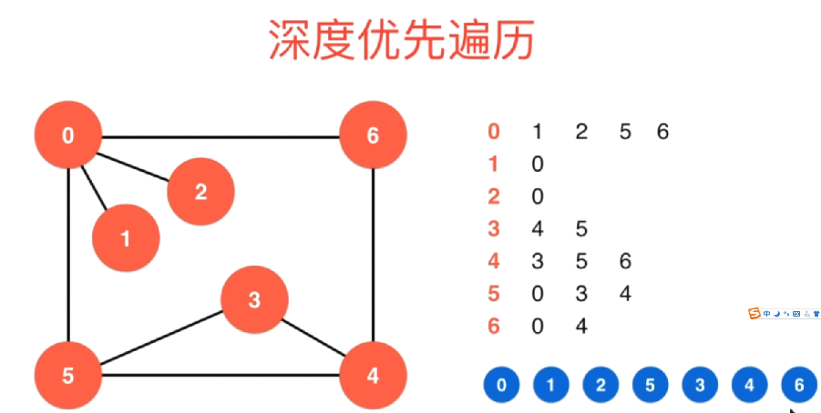
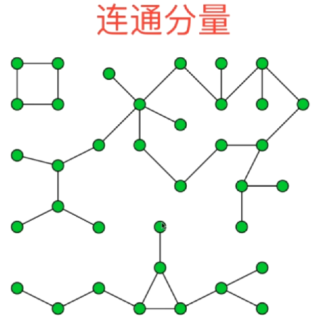
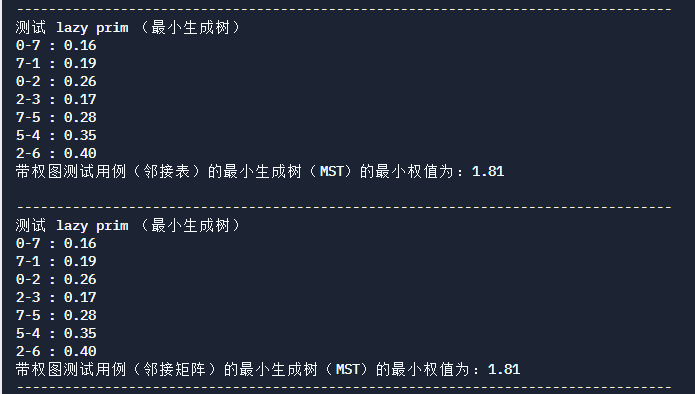

# 图论 Graph Theory

**图论**是对图的研究，图是用来模拟物体之间两两关系的数学结构。图由顶点、节点或由边、弧或线连接的点组成。

一个图可能是无向的，这意味着与每条边相关的两个顶点之间没有区别，或者它的边可能从一个顶点指向另一个顶点;参见图(离散数学)了解更多详细的定义，以及通常考虑的图类型的其他变化。


在最普遍的意义上的术语,图是一个有序对G = (V, E)由一组顶点V或节点或边缘点的一组E或弧行,这是2-element V的子集(即一条边与两个顶点相关联,这协会的无序对由两个顶点)。

在一个更广义的概念中，V是一个集合，它与每条边与两个顶点的关联的关联关系。

在另一个广义的概念中，E是一个由无序的(不一定是不同的)顶点组成的多对集合。

V和E通常被认为是有限的，对于无限图，许多众所周知的结果都是不正确的(或者是相当不同的)，因为许多参数在无限情况下失败了。

图的顺序是|V|，它的顶点数。

图的大小是|E|，它的边的数目。

一个顶点的度或价是连接到它的边的数量，其中连接一个顶点到它自身的边(循环)被计数两次。


在计算机科学中，图被用来表示通信网络、数据组织、计算设备、计算流程等。例如，一个网站的链接结构可以用一个有向图表示，其中顶点表示网页，有向边表示从一个页面到另一个页面的链接。

类似的方法可以应用到社交媒体、旅游、生物、计算机芯片设计和许多其他领域。因此，开发处理图形的算法是计算机科学的主要兴趣所在。

## 图的简单分类


一个简单的自动机


无向图可以看成是一种特殊的有向图


## 图的连通性


## 简单图


## 邻接矩阵（Adjacency Matrix）

邻接[矩阵](https://baike.baidu.com/item/矩阵)（Adjacency Matrix）是表示顶点之间相邻关系的矩阵。设G=(V,E)是一个图，其中V={v1,v2,…,vn} [1] 。G的邻接矩阵是一个具有下列性质的n阶方阵：

①对 **无向图** 而言，邻接矩阵一定是对称的，而且主对角线一定为零（在此仅讨论无向简单图），副对角线不一定为0，**有向图** 则不一定如此。

②在无向图中，任一顶点i的度为第i列（或第i行）所有非零元素的个数，在有向图中顶点i的出度为第i行所有非零元素的个数，而入度为第i列所有非零元素的个数。

③用邻接矩阵法表示图共需要n^2个空间，由于无向图的邻接矩阵一定具有[对称关系](https://baike.baidu.com/item/对称关系)，所以扣除对角线为零外，仅需要存储上三角形或下三角形的数据即可，因此仅需要n（n-1）/2个空间。

​    **邻接矩阵适合表示一个稠密的图（Dense Graph）,边相对较多**


邻接矩阵表示无向图

   

```c++
// 稠密图

#ifndef GRAPH_DENSEGRAPH_H
#define GRAPH_DENSEGRAPH_H

#include <iostream>
#include <vector>
#include <cassert>

using namespace std;

// 稠密图-邻接矩阵
class DenseGraph
{

private:
    int n, m;      //  n 和 m 分别存放该图的点数和边数
    bool directed; // 该bool变量用于表示是有向图还是无向图
    vector<vector<bool>> g;
    // 采用一个二维矩阵（该二维矩阵使用一个vector套vector的结构来实现）来保存。
    // 每一个位置我们存储的数据类型为 bool 型， true代表有这一条边，false代表没有这条边

public:
    // 构造函数
    DenseGraph(int n, bool directed) : n(n), m(0), directed(directed)
    {
        // 在初始化这个图的时候，他的顶点数就是他传进来的n，边数都设置为0，
        // 后面会提供函数 添加边，来逐步完善这个图的边
        for (int i = 0; i < n; i++)
        {
            g.push_back(vector<bool>(n, false));
            // 这个for循环，在它的循环过程中，g里面它要push_back一个新的vector，
            // 这个vector中保存的是 n 个 元素，每一个元素都是false；
            // 这样一来我们就创建了一个 n * n 的矩阵，矩阵中每个元素都是false
        }
    }

    ~DenseGraph()
    {
    }

    int V() { return n; } // 该函数返回图中有多少个顶点
    int E() { return m; } // 该函数返回图中有多少条边

    // 给该图添加一条边
    // 对于这个方法，我们传入 v 和 w 分别代表该要设置这条边时相对应的 顶点索引
    // 其实这里也可以观察到,对于我们一个图来说,我们的顶点使用整形来表示, 为 0 到 n-1；
    // 我们调用 addEdge(v, w) 就表示我们要在顶点 v 和 顶点 w之间添加一条边。
    void addEdge(int v, int w)
    {
        // 对于这个方法，我们首先严谨一点，
        // 利用断言来考察 v 和 w 这两个索引值都不越界
        assert(v >= 0 && v < n);
        assert(w >= 0 && w < n);

        // 先判断 g[v][w]之间是否已经有边了
        // 有边那就直接返回，没边再继续添加
        if (hasEdge(v, w))
        {
            return;
        }

        // 然后我们就可以很安全的在 g[v][w]上让它的值为true，从而完成  v -> w 的这条边的添加
        g[v][w] = true;

        // 然后我们判断这个图是不是无向图，如果是无向图，这里我们还要添加一条 w -> v 的边
        if (directed == false)
        {
            g[w][v] = true;
        }

        // 这里隐含一个潜在的bug，那就如果此前我们已经给这两个顶点之间添加过边了
        // 虽然上面的操作不会影响，但是下面这个 m++; 边的数量加1就不合理了，
        // 所以这里我们再添加一个函数，用来判断这两个节点之间是否已经添加过边了
        m++;
    }

    // 这里可能会有疑惑，说破案是否有边，直接 g[v][w] 判断不行吗？为什么还要封装一个函数？
    // 这是因为封装函数是为了考虑到可能外部用户会希望进行两个点之间是否有边的判断，如果不提供这个函数
    // 外部用户将很难判断
    bool hasEdge(int v, int w)
    {
        assert(v >= 0 && v < n);
        assert(w >= 0 && w < n);

        return g[v][w];

        // 该函数的时间复杂度为O(1)，也正是因为如此，在addEdge添加边的时候，
        // 调用该函数进行平行边的取消，
        // addEdge的时间复杂度也就是O(1)，
        // 所以，从这里可以看出，邻接矩阵对于处理平行边是有着天然的优势（基本不会付出额外的代价）
    }

public:
    void show()
    {
        for (int i = 0; i < n; i++)
        {
            for (int j = 0; j < n; j++)
            {
                std::cout << g[i][j] << "\t";
            }
            std::cout << std::endl;
        }
    }

public:
    // 实现稠密图的邻边迭代器
    class adjIterator
    {
    private:
        DenseGraph &G; // 保存要迭代的图
        int V;         // 保存要迭代的顶点
        int index;     // 迭代到哪里了

    public:
        adjIterator(DenseGraph &graph, int v) : G(graph), V(v), index(-1)
        {
        }

        int begin()
        {
            // 在稠密图中我们应该遍历的是 v 所在的这一行中的所有元素
            // 如果这个元素时false，就说明没有这个边
            // 如果这个元素是true，说明有这个边
            // 也就是说，在begin这里，对于稠密图来说，不见得是取第0个元素
            // 而是应该去找这一行中第一个值为true的元素
            // 所以这里初始化的时候将 index设置为 -1 (这也是上面构造函数中为什么要将这个index这是为 -1的原因)
            index = -1;
            // 然后我们直接通过 next 去找第一个元素
            return next();
        }

        int next()
        {
            // next 这个函数做的事情就是从当前这个 index 开始，
            // 去找之后第一个为 true 的这个元素
            // 遍历V个顶点
            for (index += 1; index < G.V(); index++)
            {
                // g[V][index] 表示 g[V] 这一行，他的第 index个元素是否为 true
                // 一旦为true ，那么当前的index就能返回回去
                if (G.g[V][index])
                {
                    return index;
                }
            }
            // 如果经过这轮循环没有找到一个为 true的元素，那么就说明所有的邻边都已经遍历完了
            return -1;
        }

        bool end()
        {
            return index >= G.V();
            // 判断是否迭代完，直接用index的值来和当前顶点的个数做比较
            // 如果大于等于 顶点个数，就说明这一行中所有的顶点的都已经遍历完了
        }
    };
};

#endif
```

邻接矩阵表示有向图


## 邻接表（Adjacency Lists）

**邻接表适合表示稀疏的图（Sparse Graph），边相对较少**


单纯从边的多少来判断它是一个稀疏图还是稠密图有点抽象，
如果一个节点和它连接的边远远小于能够与它连接的边的个数，就是稀疏图
稠密图和完全图，完全图就是只所有节点都和其他节点都相互连接

图的邻接表存储方法跟树的孩子链表示法相类似，是一种顺序分配和链式分配相结合的[存储结构](https://baike.baidu.com/item/存储结构)。如这个表头结点所对应的顶点存在相邻顶点，则把相邻顶点依次存放于表头结点所指向的单向链表中。如词条概念图所示，表结点存放的是邻接顶点在数组中的索引。对于无向图来说，使用邻接表进行存储也会出现数据冗余，表头结点A所指链表中存在一个指向C的表结点的同时，表头结点C所指链表也会存在一个指向A的表结点。 [1] 

邻接表是图的一种最主要存储结构,用来描述图上的每一个点。对图的每个顶点建立一个容器（n个顶点建立n个容器），第i个容器中的结点包含顶点Vi的所有邻接顶点。实际上我们常用的邻接矩阵就是一种未离散化每个点的边集的邻接表。

在[有向图](https://baike.baidu.com/item/有向图)中，描述每个点向别的节点连的边（点a->点b这种情况）。

在[无向图](https://baike.baidu.com/item/无向图)中，描述每个点所有的边(点a-点b这种情况)

与邻接表相对应的存图方式叫做边集表，这种方法用一个容器存储所有的边。

工业上有很多非常好的图库的实现,例如C++的boost graph库.如果可以，尽量用这些库，这样可以大大提高你的效率。

邻接表表示无向图


邻接表表示有向图


```c++
// 稀疏图

#ifndef GRAPH_SPARSEGRAPH_H
#define GRAPH_SPARSEGRAPH_H

using namespace std;

// 稀疏图-邻接表
class SparseGraph
{
private:
  int n, m;      // 点数 和 边数
  bool directed; // 表示有向图还是无向图
  vector<vector<int>> g;
  // 这里同样用一个二维容器来存储图中的边
  // 只不过这里元素的种类是 int 型，是因为邻接表g[i] 里面存储的就是和i这个顶点相邻的所有顶点编号

public:
  SparseGraph(int n, bool directed) : n(n), m(0), directed(directed)
  {
    for (int i = 0; i < n; i++)
    {
      g.push_back(vector<int>());
      // 初始化的时候，遍历这n个点，然后把每个点都push一个空int型vector
      // 表示初始化的时候，每一个顶点都没有与之相邻的顶点
    }
  }

  ~SparseGraph() {}

  int V() { return n; } // 该函数返回图中有多少个顶点
  int E() { return m; } // 该函数返回图中有多少条边

  void addEdge(int v, int w)
  {
    // 确保 v, w 不越界
    assert(v >= 0 && v < n);
    assert(w >= 0 && w < n);

    // 将 顶点 w push进g[v]中，表示 节点 v 与 w相连
    g[v].push_back(w);

    // 同样的判断该图是不是一个无向图，如果是无向图，那么还需要再添加一个 由 w 指向 v的节点连接
    // 同时这里还要注意一点，如果这条边时一个自环边（也就是自己和自己连接，v == w）
    // 那么就只需要执行上面那一条边添加就可以了
    if (v != w && !directed)
    {
      g[w].push_back(v);
    }

    m++;
  }

  bool hasEdge(int v, int w)
  {
    assert(v >= 0 && v < n);
    assert(w >= 0 && w < n);

    // 对于邻接表，我们怎么判断它是否存在一条由 V -> w 的边呢？
    // 这里对比与邻接矩阵，就会显得稍微复杂
    // 这里我们必须循环边里 节点 v的所有相邻的节点
    for (int i = 0; i < g[v].size(); i++)
    {
      // 然后依次判断个相邻节点，如果该节点 == w，就说明 v -> w相连
      if (g[v][i] == w)
      {
        return true;
      }
      return false;
    }

    // 所以从这里可以看到，这个邻接表的函数对比于邻接矩阵，他的时间复杂度在最差的情况下是O(n)级别的
    // 而邻接矩阵他的时间复杂度 是 O(1)；

    // 同样的如果我们在addEdge的时候如果要取消掉平行边（两条或者多条指向相同的边），
    // 那么就需要调用这个函数,那么添加边的函数他的时间复杂度也就变成了 O(n),
    // 所以，如果我们需要在 邻接表中取消平行边，是需要付出很大代价的

    // 所以，一般我们在绘制邻接表的时候，就不去管平行边问题了（也就是我们默认允许平行边存在）

    // 或者我们也可以在邻接表绘制完成后，在对这个图进行整体的遍历，然后将平行边处理掉（练习--）
    // todo
  }

public:
  // 打印图
  void show()
  {
    for (int i = 0; i < n; i++)
    {
      std::cout << "vertex" << i << ":\t";
      for (int j = 0; j < g[i].size(); j++)
      {
        std::cout << g[i][j] << "\t";
      }
      std::cout << std::endl;
    }
  }

public:
  // 在稀疏图这个类中实现一个新的类，表示一个相邻边的迭代器
  class adjIterator
  {
  private:
    SparseGraph &G; // 保存要迭代的图
    int V;          // 保存要迭代的顶点
    int index;      // 该变量用于指示迭代到哪里了

  public:
    // 对于构造函数，这里我希望用户高数迭代器两个内容
    // graph 表示我们要迭代的是那张图
    // v 表示用户要迭代的是哪一个顶点 他相邻的边
    adjIterator(SparseGraph &graph, int v) : G(graph), V(v), index(0)
    {
    }

    // 返回要迭代的第一个元素
    int begin()
    {
      int index = 0;
      // 对于begin这个函数，我们首先要检查对于G这个图
      // 他里面g[V]这个分量的size是否为0
      // 如果不为 0 ，那么我们就返回这个g[V]分量的第一个元素即可
      // 否者返回 -1 就行
      if (G.g[V].size())
      {
        return G.g[V][index];
      }
      return -1;

      // 这样我们就找到了v这个节点在这个图中的第一个相邻节点，如果没有的话返回的就是-1
    }

    // 从当前迭代的元素向下偏移找下一个元素
    int next()
    {
      index++;

      // 判断当前index值是否越界
      if (index < G.g[V].size())
      {
        return G.g[V][index];
      }
      return -1;
    }

    // 用于指示我们的迭代终止没有
    bool end()
    {
      return index >= G.g[V].size();
      // 如果迭代指示器 index 大于等于 单前向量g[v]的size，表示已经越界（对于g[v]这个分量来说已经迭代完成了）
    }
  };
};

#endif
```


## 遍历邻边


邻边遍历代码见上方

## 图的遍历

### 深度优先遍历



所谓深度优先，就是从一个点开始，不断的往下试，直到试不下去为止。但是图和树不一样，树因为有根和叶，所以从根玩下走，一定有走不通的时候，但是图不一样，图可能存在上面中的环结构。所以这里对于图，我们就需要记录图中的每一个点是否被遍历过了。如果被遍历过了，我们在后面的遍历中就不需要继续走了。

遍历过程描述：

首先我们从0开始遍历，从左侧邻接表中可以看到，和0相邻的第一个节点是1，所以我们遍历到1

0 - 1

然后看1，和1相邻的只有0，但是0我们已经遍历过了，所以1没有没有遍历过的点，退回到0

然后继续，和0相邻的下一个点是2，我们就遍历到了2，

0 - 1 -2

然后看2，和2相邻的点只有0，零遍历过了，退回到0,继续遍历，和0相邻的下一个点是5, 5没有遍历过，

0 - 1 - 2 - 5

然后看5，和5相邻的 第一个点是0，不遍历，然后继续看还有没有和5相邻的点，有，下一个相邻的是 3, 3没有遍历过

0 - 1 - 2 - 5 - 3

然后继续，看3，和3向邻的第一个点是4,4没有遍历过

0 -1 - 2 - 5 - 3 - 4

然后看4， 和4 相邻的第一个点是3,3遍历过了，跳过，继续看还有没有和4相邻的点，有，5，但是5也遍历过了，继续找，找到6,6没有遍历过

0 -1 - 2 - 5 - 3 - 4 - 6

然后看 6 ，和6相邻的第一点是 0 ，0 遍历过了，继续找，4,4也遍历过了，继续找。没有了，那就回退到4, 看和4相邻的点中还有没有没遍历过的，没有，那就继续回退到3，看和3相邻的还有没有没遍历过的，没有，那就继续回退到5，看和5相邻的点有没有没有遍历过的，没有，继续回退到2，看2有没相邻的点没有被遍历过的，没有，继续回退，回退到1，没有，回退到0.看有没有。没有。至此，一个从 0 开始的深度优先遍历过程就完成了

至此一个连通图一次深度优先就遍历完所有节点了。这种深度优先遍历还有一个作用是求一个图的**连通分量**（如下就是有3个连通分量）



无向图 G 的一个极大连通子图称为 G 的一个连通分量（或连通分支）。连通图只有一个连通分量，即其自身；非连通的无向图有多个连通分量。连通分量与连通分量之间没有任何边相连。深度优先遍历可以用来求连通分量。因为一次深度优先只能遍历一个连通，遍历完整个连通，继续随机选择下一个没有遍历过的点，进行深度优先遍历，如此继续，直到整个图中不存在没有遍历过的点，那么我们就可以确定整个图遍历结束，遍历了几次深度优先，就说明有几个连通分量

#### 获得两点间的一条路径


回顾上面的深度优先遍历，其实我们在遍历的过程中也形成了上图中红线表示的一条一条的路径。如果我们想获得两点之间的一条路径，其实在遍历过程中文我们都可以通过这个红色的线条找到。比如：

0 - 2 ： 0 2

0 - 5 ： 0 5

5 - 6 ：5 3 4 6

可以看到我们采用深度优先的遍历并不一定能找到最短路径（对于无权图的最短路径问题，下面会进行探讨）本节的目的就是通过深度优先的算法获得一条路径。

我们要做的就是在遍历的过程中存储这条路径，怎么做？很简单，我们只需要在遍历到一个节点的时候，存储我们是从哪个节点遍历到这个节点的即可


根据我们图的实现方式的不同，我们深度优先遍历的复杂度也会有所不同。

如果我们的图是使用邻接表实现的，那么他的时间复杂度就是O(V+E)，通常情况下E会比V大，所以一帮也会说它是O(E)这个级别的。如果是使用邻接矩阵实现的话，那么它的时间复杂度就是O(V^2)这个级别的。

对于邻接矩阵他的时间复杂度为什么是O(V^2)，是因为当我们要想获得一个节点他的所有相邻的节点的时候，我们需要将这个图中所有的节点都扫一遍，而在邻接表的实现中，对于每一个节点我们首先要访问，而每一个节点他所有相邻的节点就构成了了这张图中总共的边数，也就是说我们将所有的边都访问了一次，没有进行其他多于的访问。

也正是因为如此，如果我们的是一个稀疏图的话，通常是使用邻接表这样的表达方式他的效率会高一些


### 广度优先遍历

对于广度优先遍历，我们需要有一个队列进行辅助遍历。


对于上面这个图，我们使用广度优先遍历的方式，进行遍历的过程描述

首先在遍历之前，我们要将**0**这个初始节点推入到我们的辅助队列**q**中，之后开始我们的遍历过程。

> 辅助队列：q ：0
>
> 遍历结果队列：

在遍历过程中，我们每次都将辅助队列首的元素取出来作为我们的遍历对象。所以这里我们将 **0**取出来进行遍历，这里也就相当于我们遍历了 0 这个节点

> 辅助队列：q ：
>
> 遍历结果队列：0

之后我们要做的就是 将 0 这个节点他所有相邻的节点进行遍历，如果他这些相邻的节点还没有加入过队列（这里加入过队列是指加入到辅助队列和遍历结果队列这两个任意一个），就将这个节点加入到 辅助队列q里

> 辅助队列：q ：1  2  5  6
>
> 遍历结果队列：0

这个时候1， 2， 5， 6这4个和 0 相邻的未遍历过的节点都加入到了这个辅助队列中，然后下一步依旧是取辅助队列中的首个元素，加入到遍历结果队列，作为遍历对象对其进行相邻未加入过的节点进行遍历。

> 辅助队列：q ：2   5  6
>
> 遍历结果队列：0  1

然后1的遍历结果就是没有为添加过队列的节点，那就继续去辅助队列取首个元素 2 ，将2作为遍历对象对其进行遍历。

> 辅助队列：q ：5  6
>
> 遍历结果队列：0  1  2

2的遍历结果和1也是一样的，没有未加入过队列的节点，继续取辅助队列中的下一个首元素 5 ，对5进行遍历， 0加入过了，3没有， 4也没有。把3， 4加入到辅助队列

> 辅助队列：q ：6  3  4
>
> 遍历结果队列：0  1  2  5

然后5遍历完，继续取下一个辅助队列的元素 6，将其作为遍历对象，6的相邻元素 0 已经加入过队列了，跳过，然后是4, 4虽然没在遍历结果队列中，但是4也加入过队列（辅助队列），所以4也不能算，跳过。那至此，6的相邻节点就没有没加入过队列的节点了。（所以这我们在进行编码实现的时候要主要，我们在进行visited标记的时候，应该是对加入过队列进行标记，而不是是否遍历过进行标记，这里要重点注意，因为它只要加入到辅助队列了，早晚都要被处理到）

> 辅助队列：q ：3  4
>
> 遍历结果队列：0  1  2  5  6

然后继续取辅助队列中的首个元素 3，遍历3的相邻节点，发现 4 在队列中，跳过，然后是 5,5遍历过，也跳过。

> 辅助队列：q ：4
>
> 遍历结果队列：0  1  2  5  6  3

然后继续取辅助队列中的首个元素 4,遍历4中的相邻节点，3， 5， 6都已经遍历过了，跳过

> 辅助队列：q ：
>
> 遍历结果队列：0  1  2  5  6  3  4

然后继续取辅助队列中的首元素，发现没有，至此一个广度优先遍历就结束了。遍历结果就是 **0  1  2  5  6  3  4**

可以感受一下这个整个广度优先遍历的过程，对于这张图而言，实际上是以距离我们遍历的起始点 0 的距离为顺序进行遍历的。首先0这个节点自己到自己的距离最短，所以0优先被遍历到，之后0所有相邻的节点都被推了进去，也就是 1 2 5 6这4个节点。他们距离0的距离都是1。接下来我们在遍历5的时候将3， 4这两个节点进行了遍历，而3 4这两个节点他们距离0的距离是2。所以从这个角度看，广度优先遍历又被称为层序的优先遍历。就是从遍历的起始点开始，一层一层的往下遍历，先遍历到的点距离起始点会近一些，而后遍历到的点会距离起始点会远一些。但是这里也需要注意，所谓的先后也是存在并列关系的，比如1， 和 6，它们距离0的距离都是1，所以更严谨的说法就是先遍历到的点距离起始点的距离一定是小于等于后遍历到的点

我们在程序中遍历的时候，其实也可以记录这个距离。当我们记录这个距离之后，我们就求出了在这个无权图中，每一个节点距离我们起始节点它的最短距离。不仅如此，如果我们像深度优先遍历一样，使用一个from数组来记录每一个节点是从哪一个节点遍历过来的，我们还能将最短距离背后的这个最短路径求出来。其实这也是图使用广度优先遍历最重要的一个应用。


这个作用于有向图和无向图的无权图。对于有权图，后面会探讨。


```c++
//
// 寻路算法
//

#ifndef PATH_H
#define PATH_H

#include <iostream>
#include <cassert>
#include <vector>
#include <stack>

using namespace std;

template <typename Graph>
class Path
{
private:
  Graph &G;
  int s; // 本类的原点
  bool *visited;
  int *from;
  // from这个数组存储的就是我们每访问到一个节点，就需要存储一下我们所访问到的这个节点是从哪个节点遍历过来的
  // 根据from这个数组我们就能倒推出两个节点之间相应的路径

private:
  void dfs(int v)
  {
    visited[v] = true;
    typename Graph::adjIterator adj(G, v);
    for (int i = adj.begin(); !adj.end(); i = adj.next())
    {
      // 这里深度优先遍历的算法和之前的大致都是一样的
      // 唯一不同的是我们这里要在遍历过程中维护一个from路径数组

      // 我们遍历V这个节点它所有相邻的节点，一旦发现它相邻的节点没有被访问过
      // 我们就将去 dfs 遍历这个相邻的i节点
      if (!visited[i])
      {
        // 在真正的进入i节点之前，那么就把这个 from[i]的值设置为 v
        from[i] = v;
        // 这样也就是说，我们访问的i这个节点是从v这个节点过来的
        dfs(i);
      }
    }
    // 至此，我们就通过一次dfs的过程，就将和s相邻接的所有的点相应的from的值给设置完成了
  }

public:
  Path(Graph &graph, int s) : G(graph)
  {
    // 算法初始化
    assert(s >= 0 && s < G.V());

    visited = new bool[G.V()];
    from = new int[G.V()];

    for (int i = 0; i < G.V(); i++)
    {
      visited[i] = false;
      from[i] = -1;
    }

    this->s = s;

    // 寻路算法
    dfs(s);
  }

  ~Path()
  {
    delete[] visited;
    delete[] from;
  }

  // 对于这个类，我们可以设置3个函数

  // 首先我们可以判断这个类的原点s到我们给定的一个节点w是否有路径？
  bool hasPath(int w)
  {
    // 回答这个问题，只需要返回visted[w]是否为true就可，
    // 因为只要w被遍历到，就说明从s到w有路径
    return visited[w];
  }

  // 原点s到w的具体路径是怎样的？将路径存储到一个vector容器向量中中
  void path(int w, std::vector<int> &vec)
  {
    // 如何获取从s到w的路径？
    // 其实有了from这个数组，我们只需要在from数组中从w这个点倒着推回去就可以
    // 然后由于这个过程是一个倒推的过程，所以我们将这个倒推的节点放在一个 stack 中
    // 最后再从这个stack取回到我们的vector中

    std::stack<int> ss; // 声明一个stack容器

    // 从 w 开始推，将w赋给一个新的变量 p
    int p = w;

    while (p != -1)
    {
      // while 循环，只要每次我们的p不等于 -1,那么就把这个 p 入栈到 ss中
      ss.push(p);
      // 然后p等于from[p]
      // 这里很好理解，比如from里存的是 2  3  6  1
      // 代表的就是 0 -> 2 ,1 -> 3, 2 -> 6
      // 其实也就是from这个数组里存的信息就是他每个下标代表的节点是从哪个节点（这个下标保存的那个数节点）过来的
      p = from[p];
    }
    // 这里就是我们从 w开始往回推，直到推到原节点（s），因为我们从来没有给源节点sfrom赋值过
    // 他都是原节点 from 的值一直都是 -1
    // 这样一来我们的从 s->w的路径就以倒叙的方式存到了stack中

    // 然后下面要做的事就是将stack中的数据取出来放到vector中
    // 为了安全起见，这里先对vector进行清空
    vec.clear();

    while (!ss.empty())
    {
      vec.push_back(ss.top()); // 将栈顶元素放入容器中
      ss.pop();                // 将栈顶元素出栈
    }
  }

  // 将路径进行打印输出
  void showPath(int w)
  {
    // 路径打印只需要遍历这个容器即可
    vector<int> vec;

    path(w, vec);
    for (auto iter = vec.begin(); iter != vec.end(); ++iter)
    {
      std::cout << *iter;

      // 平淡单前是否是容器的最后一个元素
      if (iter == vec.end() - 1)
      {
        // 最后一个元素打印一个回车
        std::cout << std::endl;
      }
      else
      {
        // 不是最后一个元素打印一个 ->
        std::cout << " -> ";
      }
    }
  }
};

#endif
```


---

# 带权图（Weighted Graph）


## 邻接矩阵表示一个有权图


对于邻接矩阵，之前我们表示无权图的时候，矩阵的值是使用0-1表示节点之间是否存在边，现在只需要将这个这些边改为保存权值就可以了

## 邻接表表示一个有权图


对于邻接表来说，会有所不同，因为之前我们用邻接表存的是节点到与它相邻的节点的索引，但是现在因为有了权值，所以此时我们每个节点后面应该存储两个信息，一个是与它相邻的节点索引to，一个是到该节点边的权重w。这样一表达，我们很容易看出来，这里我们不能用一个简单的数据类型。为此我们应该给他封装成一个类，这里就叫他 Edge （边）。

那这里如果我们的邻接表这样存的话，那么为了保证邻接表和邻接矩阵这二者具有统一的接口，为此最好的情况就是，邻接矩阵中`a[i][j]`中每一个元素的位置我们都给他存为一个 Edge 。也就是我们邻接矩阵中，每一个边用一个类Edge来表达，对于没有边的 0 来说，就可以用NULL来表达

---

# 最小生成树问题（Minimum Span Tree）

我们要研究的第一个有权图算法就是最小生成树问题


对于这样一个完全连通的带权图来说，我们可不可以找到一个这个图所属的生成树（如上红线部分），一张图如果有V个节点的话，那么相对应的就应该使用v-1条边，这V-1条边连接了V个节点，我们就说它是这个图的生成树。而这棵生成树不但连接了图中的所有节点，与此同时这棵生成树上所有边的权值之和也是所有生成树中最小的。我们如何找到这样一颗生成树就是最小生成树的问题。

> 最小生成树问题通常是针对 带权无向图，针对连通图 而言的。
>
> 而对于一个不连通的图来说，我们也可以求出每个连通分量的最小生成树，这样的一个最小生成树集合也被称为最小生成森林

下面会介绍两个最小生成树的算法，这两个算法都不约而同的都应用了这样一个定理（切分定理）这里先介绍什么是切分定理，后续会介绍如何利用切分定理求最小生成树的两个思路。

### 切分定理（Cut Property）

在介绍切分定理之前，首先要先明白什么是切分。如果我们把图中的节点分为两个部分，这样分我们就说这个图形参了一个切分。比如下图中的蓝色部分和红色部分就形成了一个切分。


在我们定义了一个图的切分之后，我们就可以定义一个新的概念 - 横切边。横切边是什么意思？如果一个边他的两个端点属于切分的不同的两边，（比如在下面这个图中，如果一个边它的一端是这种蓝色的节点，另一端是这种红色的节点）这样的边就被称为横切边。


有了这些前置补充，我们就能描述切分定理了，**切分定理：描述的是这样一个事实，在一张图中，我们给定任意的一个切分，在这些横切边中，权值最小的边必然属于这张图中的最小生成树中的某一个边。**


有了这个定理，我们就可以从一个顶点，利用切分定理，逐步向其他节点扩散，逐步求出一个完整的最小生成树。

## Lazy Prim

根据切分定理设计第一个最小生成树算法。


如上所示，有一个带权连通图。我们首先将一个起始节点，这里将 0 作为起始节点，将它作为切分的一部分，而剩下的作为切分的另外一部分。这样一来我就画出了一个切分，根据这个切分，我们就得到了如下的横切边。每一次我们要做的事情就是找到这些横切边中最短的哪边。这里我们就可以使用一个数据结构啦非常快速的做这个事情 - 最小堆。也就是我们将这些蓝色的边放入到最小堆中作为最小生成树的包含的边的候选


接下来只需要拿出这些候选边中的最短边就可以，这个时候在蓝色的候选边中，权值最小的边是 0 -7 边


然后这个时候我们确定0 - 7这个边是最小生成树的边，而7这个节点没有被访问过，那么我们就把7加入到我们的红色切分中来。然后这个时候就形成了一个新的切分。形成了一个新的切分就加入了新的顶点，那么这个时候这个新的顶点7就和其他顶点之间形成了新的横切边。这个时候我们把这些横切边加入到候选边（蓝色 最小堆）中来


然后从这个最小堆中（蓝色）选出权值最小的边。这个时候最小的边是 1 - 7 的边，根据切分定理，这条边一定属于最小生成树，所以我们把 1-  7标红，同时1没有被访问过，所以把1也加入到红色切分中来。


因为1加入到红色切分中，所以我们又形成了新的横切边。我们把这些横切边加入到最小堆（蓝色）中来


然后我们继续看在我们这些候选边中，最短的边是 0 - 2 这条边，根据切分定理，这条边一定属于最小生成树，把 0 -2 标红，同时2没有被访问过，把2加入到红色切分中来。同时这个时候因为2加入切分，所以又有了新的横切边，我们把它加入到最小堆中（蓝色）


这里我们注意到，当我们把2这个节点加入到红色切分后，现在我们这些蓝色的最小堆（边）中，连接2 - 7的和连接1-2的这两条边实际上已经不是横切边了。所以从道理上讲，这两条边就已经不应该成为我们最小生成树的边的候选了。在这里也就体现出来我们这个算法（Lazy Prim）中的lazy低效率的地方了。当前这个实现中，虽然这两条边已经不可能是最小生成树的候选，但是我们并不急着把它剔除出我们的候选边，换句话说就是我们的最小堆中依然保持着这两条边。当我们拿出这两条边的时候，发现这他们的两个顶点都在同一个切分（也就是他本身已经不是一个横切边的时候），那个时候我们再直接把这个边扔掉就好了。

然后下面我们继续从最小堆中取出我们的最小边，此时最小的是2-3的这条边，根据切分定理，这个边就是最小生成树的一条边，那么相应的3这个节点就可以加入到我们的红色切分中。


这时候和3相邻的这条3-6边也可以加入到我们的最小堆中（横切边）。


然后这个时候我们再继续查看我们的最小堆，找最小边，发现5 - 7这个边权值最小，根据最小生成树原理，这条边一定是最小生成树的边，加入标红。同时与5相邻的5-4也就可以加入到候选边（最小堆）中来。


然后我们在最小堆中继续找最小边，发现 0.29是最小边，但是这个时候注意，这条边他的两个顶点1 3都已经访问过了，换句话说，这条边其实并不是一个横切边，所以这条边抛弃跳过。继续寻找，同样的1- 5 ， 2 -7这两条最短边也都不是横切边，所以都跳过，继续找 4 - 5这条边，4没有被访问过，4-5是横切边，所以加入到红色切分中，


同样的，将4 - 6加入到最小堆中，遍历查找最小边，然后判断是否是横切边，不是就跳过继续，直到找到2-6这条最小横切边，将2-6标红，同时6加入到红色切分。


其实，到此为止，我们的最小参数以及找到了，但是如果我们是以最小堆是否为空为终止条件，那么我们就还需要继续遍历查找最小堆中的数据，只不过我们此时拿出来的边肯定都不会是横切边了。所以都是拿出来判断一下，然后扔掉。此时我们的算法就算是正真结束了，我们就获得了这个连通图的最小生成树。

```c++
template<typename Graph, typename Weight>
class LazyPrimMST
{

private:
  Graph &G;
  MinHeap<Edge<Weight>> pq;  // 这个最小堆充当一个优先队列，在这个优先队列中，存储的是这个图中的边（确切的说是最小生成树的候选边）
  // 首先，我们在划分切分的时候，需要将我们的顶点一个一个的划分到另一边去，marked[i]表示这个点是否被标记了
  // 如果被标记了，就表示被划分到另外一个切分区去了（相当于文档中节点一个一个从蓝色变成了红色）
  bool* marked;
  // 除此之外，我们求出来的最下生成树就是就是一个一个边，我们将这些边放入到一个容器中
  // 在这个容器中，每一个元素都是Edge<Weight>这样的边类型
  std::vector<Edge<Weight>> mst;
  // 最后对于我们最小生成树的相应权值，我们用mstWeight来存储
  Weight mstWeight;

  void visit(int v)
  {
    // 我们访问v这个节点，首先我们得保证，v这个节点他是一个对应在文档里的蓝色节点
    // 也就是marked这个标记里没标记过这个节点
    assert(!marked[v]);
    // 之后访问到了这个节点，就把它的marked设置为true
    marked[v] = true;
    // 之后要做的就是遍历这个红色的节点他的所有临边（也就是v节点的所有邻边）
    typename Graph::adjIterator adj(G, v);
    for(Edge<Weight>* e = adj.begin(); !adj.end(); e = adj.next())
      {
        // 我们依次访问v这个节点的所有邻边，一旦我们发现，v这个节点他的邻边对应的另外一个节点，没有被marked标记上，那么这条邻边就是一个 横切边 
        if(!marked[e->other(v)])
        {
          // 找到了一条横切边，那么就意味着我们可以将这条边放入我们的堆中，作为我们的最小生成树的候选边
          pq.insert(*e);
        }
      }
  }

public:
  // 注意这里这个最小堆的初始化，这里给最小堆数组开的空间大小是这个图的边数这么大的空间（也就是说，在最差的情况下，我们的这个图中所有的边都会放进这个最小堆中）
  LazyPrimMST(Graph &graph):G(graph), pq(MinHeap<Edge<Weight>>(graph.E()))
  {
    // 为marked开空间，空间大小是顶点个数
    marked = new bool[G.V()];

      // 给marked开辟好空间以后，我们给这个marked赋予初值
    for(int i = 0; i<G.V(); i++)
      {
        marked[i] = false;
      }
    mst.clear();

    // lazy prim
    // 首先我们visit(0)这个节点，也就是把0先marked，将其作为最小生成树的起始点
    // 将0这个节点的所有邻边（横切边）加入到最小生成树的候选堆中
    visit(0);
    // 然后以最小生成树的候选堆是否为空为判断依据，换句话说，如果我们的优先队列它还不为空的话，
    // 我们就继续遍历
    while(!pq.isEmpty())
      {
        // 每次我们从最小堆中取出一个最小的元素（边）
        Edge<Weight> e = pq.extractMin();

        // 因为我们是lazyPrim，所以有可能我们取出来的这个边，它根本就不是横切边， 所以我们需要判断这条边它是否是一个横切边
        if(marked[e.w()] == marked[e.v()])
        {
          // 如果我们取出来的这条边它相应的两个顶点的marked标记相同的话，说明这条边的两个顶点都被访问过了
          // 那么这条边就不是一个横切边,那么我们就继续while循环，跳过这个边，不用管这个e
          continue;
        }
        else
        {
          // 否者的话，我们取出来的这条边就是一条最小生成树的边
          mst.push_back(e);
        }

        // 此时，对于e这条最小生成树的组成边来说，我们需要找到它这条边新加入区分的那个顶点，进行后续遍历
        if(!marked[e.v()])
        {
          // 如果marked[e.v()]是false，表示他就是那个蓝色点，我们就应该从这个新点开始继续下一轮的visit,把这个新点的所有横切边加入到最小堆（优先队列中来）
          visit(e.v());
        }
        else  // !marked[e.w()]
        {
          // 否者的话,e.v()不是false，那么e.w()就是false，那么我们就把e.w()的横切边加入到优先队列中去
          visit(e.w());
        }
      }

    // while 之后，我们就得到了最小生成树，这个时候，我们只需要对最小权值进行计算，计算完成之后，本函数功能就齐备了
    mstWeight = mst[0].wt();
    for(auto iter = mst.begin(); iter != mst.end(); ++iter)
      {
        mstWeight += (*iter).wt();
      }
  }

  ~LazyPrimMST()
  {
    delete[] marked;
  }

  std::vector<Edge<Weight>> mstEdges()
  {
    return mst;
  }

  Weight result()
  {
    return mstWeight;
  }

};
```

然后我们使用两种图的表现方式来分别测试求出图的最小生成树。



可以看到，对于同一张图来说，不管我们是使用邻接矩阵还是使用邻接表，他们最终求出的最小生成树都是一样的（这也验证了我们算法实现的正确性）

## Lazy Prim 的时间复杂度 O(E log E)

上面的lazyPrim算法已经可以获得一个图的最小生成树了，对于lazyPrim他的时间复杂度，我们可以看到lazy prim算法中国，他的主要循环都是在我们的 pq 不为空（最小生成树候选边优先队列）的情况，通过上面代码和演示我们知道，所有的边都会进入一次这个优先队列，所以我们这层while循环会执行E次（E是图的边数），每次执行会执行两个主要操作，第一个是ExtractMin（最小堆的返回堆顶元素），这个操作是log E级别的，第二个主要操作是visit，visit这个代码会遍历传入节点的所有临边，我们把所有的节点合在一起，他这个操作也是E这个级别的。当然如果我们使用邻接矩阵来做的话，这里就是V^2这个级别的。但是在邻接矩阵中，通常我们表达的是稠密图，对于稠密图来说，V^2近乎和E是一个级别的。在这个遍历中，要进行一次insert操作，而这个操作相对于我们的pq来说，也是log E级别的。

所以，综合来看，我们可以得到这么一个结论，Lazy Prim 他的时间复杂度是O(E log E)这个级别的。而实际上我们可以优化这个代码，使得它成为 O(E log V)这个级别的算法

## 最小生成树代码优化 O(E log V)

接下来，我们介绍如何实现一个不是lazy的prim算法。

我们lazy prim算法的主要问题在于，所有的边都要进入我们的最小堆。随着我们切分的改变，红色节点会越来越多，很多在我们最小堆中的边其实已经不再是横切边了。这是第一点，第二点还有一个问题就是，虽然有很多横切边，但是我们通常只关注最短的那条横切边，尤其是和一个节点相邻的横切边，在这种情况下，其实我们只需要考虑和这个点相连的最短的那个横切边就好了。基于以上想法，我们现在需要维护一个数据结构，我希望存储的是和每个节点相邻的那个最短的横切边。在我们不断的扩大来改变我们红色节点的切分的过程中，我们只需要不断的更新和每一个节点相邻的最短的横切边就可以。

换句话说，我们的这个数据结构要满足，它能够取到最小值，其次它还能够供我们更新，在这种情况下，我们就应该使用一个 最小索引堆（Index Min Heap），对于我们在prim算法中它所使用的这个 IndexMinHeap，它只需要开节点 V 这么多个空间就够了。每个空间所保存的就是和这个节点相连接的最短的横切边。

接下来就简单演示一下，如何使用这样的一个 IndexMinHeap 来利用prim思路求出一个图的最小生成树。


首先依旧是我们需要定义一个起点，这里我们依旧从 0 开始。这里注意，因为我们最后得到的这个最小生成树一共有V-1条边，但是我们的indexMinHeap中一共有V个节点，所以肯定有一个节点它不需要存东西，那么我们就把这个初始节点当做那个不需要存东西的节点。我们有了这个初始节点之后，就相当于有了一个切分，在这种情况下，这个节点的所有邻边都是横切边，在这种情况下我们就需要将所有横切边加入到我们的IndexMinHeap中。变成下面这个样子。


此时这个切分的情况下，和2相邻的那个横切边他的最小权值是 0.26，和4相邻的那个横切边他的最小权值是0.38，和6相连的横切边他的最小权值是0.58，和7相邻的横切边最小权值是0.16。现在我们就可以从indexMinHeap中找出权值最小的那条边，那么这条边根据切分定理，就一定是最小生成树中的某一条边。这条边就是0 - 7 : 0.16，这种情况下，7这个节点也就可以加入我们的红色阵营。


此时7加入了我们的红色阵营，这时候就需要考虑更多的横切边，这时候我们就需要遍历一遍7的邻边，首先看7和1相邻的这条边，因为我们最小索引堆中还没有和1相邻的横切边，所以就直接将7和1相邻的这条边 0.19 加入到我们的最小索引堆中，然后继续看下一个和7想邻的边，这时候到2，此时和2相邻的横切边（保存在最小索引堆IndexMinHeap）是0.26，它要比我们新找到的这条和7相连的横切边0.34要小，所以这时候我们就不应该去更新这个和2相邻的横切边索引堆，继续保持小的那个值0.26即可。

紧接着我们看7和4相邻的这个边，这条边权值是0.37，比现在最小索引堆中保存的和4相邻的边0.38要小，所以这个时候我们就该0.37这条边更新进最小索引堆中（覆盖掉之前的和4相连的0.38），同时这个更新也意味着我们将0.38这条边给丢弃了，因为0.38这条边它不再会是我们最下生成树中的某一边了。

最后我们来看7和5相邻的这条横切边，由于和5相邻的百年之前还没有被添加过，所以这里直接将和5相邻的边0.28添加进最小索引堆中。

这样我们才正式完成了visit(7)这个操作。


继续模拟我们的算法，下面我们要做的就是从最小索引堆中找出最小的那条边，也就是和1相邻的这条边 0.19，那么这个时候我们也就能够确定7 - 1 : 0.19属于我们的最小生成树。那么1这个节点也就可以加入我们的红色阵营了。


然后接下来我们就可以去看和1相邻的横切边，首先依然是和2相邻的这条边，权值是0.36，他比我们最小索引堆中保存的那个0.28还要大，所以这条边直接丢弃，不对其进行考虑，不对最小索引堆进行更新。然后继续和5相邻的这条边权值0.32比最小索引堆中存储的0.28要大，所以依旧这条边丢弃不进行考虑。继续和3相邻的这条边，因为和3相邻的边还没有被添加过，所以这里直接将0.29这条边添加入我们的最小索引堆中。成为我们下面的这个样子。这个时候我们的visit(1)也就完成了


继续，我们取出最小索引堆中的最小值（最短的那条边），0.26和2相邻的那条边，根据切分定理，此时这条边就一定属于最小生成树，然后我们将2加入到红色切分中来。


我们遍历到了2，这个时候我们就需要考察和2相邻的边（visit(2)）。也就是看和2相邻的横切边，先看2-3这条横切边，这条变权值为0.17，比我们最小索引堆中存储的和3相邻的横切边0.29还要小，所以这个时候我们就该将0.17这条边更新进我们的索引堆中，替换0.29这条边。与此同时也就相当于我们扔掉了0.29这条边。

然后继续看和6相邻的这条横切边，0.40比我们最小索引堆中存储的和6相邻的边0.58还要小，所以同样的也将0.34这条边更新进我们的最小索引堆中，替换掉0.58这条边。

自此，visit(2)结束，我们的最小索引堆成了下面这个样子。


然后继续，我们从最小索引堆中取出最小的那条边，也就是2 - 3 : 0.17这条边，然后我们将3这个节点加入到红色切分中。根据切分定理，这条边一定属于最小生成树，把它标记为红色，


然后我们继续，3加入到红色阵营后，继续visit(3)，3这个节点我们只需要考虑3-6这条边，他的权值是0.52大于最小索引堆中保存的和6相邻的边0.40，所以这条边丢弃不做处理。

自此visit(3)也完成了，我们继续从最小索引堆中取出最小边 7 - 5 ：0.28,这条边，根据切分定理，这条边一定属于最小生成树，所以这条边标红，同时将5这个节点加入到红色阵营中。


然后visit(5)，考察和5相邻的横切边，发现和4相邻的这条边权值为0.35小于最小索引堆中保存的和4相邻的这条边的权值0.37，所以这时候就将0.35这条边更新进最小索引堆中，替换掉之前的0.37这条边。至此，visit(5)结束


然后继续看，从最小索引堆中取出最小的那条边，也就是5 - 4 ：0.35 这条边，根据切分定理，这条边一定属于最小生成树，那么把这条百年标红，然后4加入到红色阵营中，继续visit(4)


然后看和4相邻的横切边0.93，发现比最小索引堆中保存的和6相邻的边0.40大，那么这条边就丢弃不做处理。自此，visit(4)完成。然后继续从最小生成树中找最小的那条边 2 - 6 ：0.40，根据切分定理，这条边一定是最小生成树的一条边，所以标红，同时节点6加入红色阵营。


自此，我们所有的节点就全都遍历完了，与此同时我们也找到了这棵最小生成树。

回忆一下上面的过程，在我们找最小生成树的时候，我们将所有的边都考虑了一遍，只不过我们现在这个最小索引堆他的元素个数和图中节点的元素个数是一致的，所以基于堆的这个操作就变快了一些。与此同时，我们每访问到一个节点的时候，考察这些节点的邻边，对于那些不是横切边的边，我们一旦判断出来以后，也会马上把他们扔掉。所以对于prim算法来说，虽然他的时间复杂度是O(E log V)，字面上好像只是将logE改进到了logV，但是实际上除了对于堆的改进之外，我们遍历边的次数也更少了。因此整体而言，使用了最小索引堆以后，我们这个prim算法的时间复杂度改进还是很可观的。

```c++
template <class Graph, class Weight> class PrimMST {

private:
  Graph &G;
  IndexMinHeap<Weight> ipq;

  // 这里要注意，我们有一个新的容器叫做edgeTo,因为我这里最小索引堆只存储和每个节点相邻的可选横切边相应的权值，而我们使用edgeTo来存储和每一个节点相邻的那一个最短的横切边。
  // 存取一个指向这条边的Edge指针
  std::vector<Edge<Weight> *> edgeTo;
  bool *marked;
  std::vector<Edge<Weight>> mst; // 存储最小生成树相应的边
  Weight mstWeight;

  void visit(int v) {
    // 依然是，在访问这个顶点的时候，我们要保证这个点没有被marked过
    assert(!marked[v]);
    marked[v] = true;

    typename Graph::adjIterator adj(G, v);
    for (Edge<Weight> *e = adj.begin(); !adj.end(); e = adj.next) {
      // 使用临边迭代器，访问顶点v的所有相邻临边

      // 找到e的相邻节点w
      int w = e->other();
      if (!marked[w]) {
        // 此时e是一条横切边
        // 然后对这条横切边进行判断，我们之前是否有在edgeTo中添加过w节点相邻的横切边
        if (!edgeTo[w]) {
          // 和w相邻的横切边没有添加过，那就把这条横切边添加进最下索引堆中。
          ipq.insert(w, e->wt());
          // 与此同时，我们的edgeTo这个数组要对w进行记录
          edgeTo[w] = e;
        } else if (edgeTo[w].wt() > e->wt()) {
          // 如果我们edgeTo中保存的那条和w相邻的横切边的权值大于我们刚刚遍历到的这条边的权值，那么就需要用我们小权值（刚刚遍历到的这条边）替换掉之前的这条边
          // 使用change方法将我们最小索引堆中的元素进行替换
          ipq.change(w, e->wt());
          edgeTo[w] = e;
        }
      }
    }
  }

public:
  PrimMST(Graph graph) : G(graph), ipq(IndexMinHeap<Weight>(graph.V())) {
    marked = new bool[G.V()];
    for (int i = 0; i < G.V(); i++) {
      marked[i] = false;
      edgeTo.push_back(NULL);
    }

    mst.clear();

    // prim
    visit(0);
    // 只要我们的最小索引堆还有数据（也就是还有边还需要我们继续考虑，就一直while循环）
    while (ipq.isEmpty()) {
      // 将此时最小的那个横切边索引取出来，做visit
      int v = ipq.extractMinIndex();
      // 这里使用断言确保索引v所应的横切边是存在的。使用edgeTo[v]就能拿到这个横切边
      assert(edgeTo[v]);
      mst.push_back(*edgeTo[v]);
      visit(v);
    }

    // 整个这个while循环就将我们的最小生成树给拿到了

    // 计算最小生成树的权值
    for (auto iter = mst.begin(); iter != mst.end(); ++iter) {
      mstWeight += (*iter).wt();
    }
  }

  std::vector<Edge<Weight>> mstEdges() { return mst; }

  Weight result() { return mstWeight; }
};

```

打印测试如下


然后接下来我们测试比较一下这两个版本的prim算法的性能差异，这里准备了4个测试用例（4张图），每一个图的节点数分别为8， 250， 1000， 10000 个节点。看看这两个prim算法在这4张图下，性能表现如何。


从测试结果上可以看到，我们使用最小索引堆优化过的prim算法，性能表现在每一个测试用例上都比之前的lazy prim算法要快。并且可以看出，我们的图顶点数越多，图越大，性能提升就越明显。

然后下面这个是一个有近百兆大小的图（测试用例），有近乎200w的节点数，这是它的一个测试结果


## Kruskal 算法

这里介绍一个求最小生成树的新的思路，Kruskal算法。回忆我们之前使用的prim算法。在prim算法过程中，我们不停的改变切分，同时通过这个切分区寻找横切边最短的那条边。我们在找最短那条边的过程中，不免产生这样的想法。如果我们每次都找最短的那条边，那么这条最短的边是不是就是最小生成树中的一条边呢？其实答案正是这样的。


比如说在最初的时候，如上图，最短的边是0.16，那么我们就敢说0.16这条边就是最小生成树的一条边。因为我们总能找到一个切分，使得这条边是横切边中的最短边。然后，接下来我们找次短的这条边 0.17，一样的我们也能画出一个切分使得这条边就是横切边中最短的边。利用这样的思路，我们不断的去找最短边，只要这些最短边不构成一个环（注意：为什么要不能构成一个环？这是因为在我们的树中是没有环的，所以一旦它构成环，那么就一定不构成最小生成树了），这样我们依次取得的最短边就一定是最小生成树。这个思想就是kruskal 算法的思想。

接下来演化一遍如何使用kruskal算法思想来求出一个最小生成树。

在kruskal算法中，我们为了能够每次都轻松取得最小边，所以我们首先要做的事情是对这个图中所有的边进行一次排序。对于这次排序，它所使用的时间复杂度是O(E log E)。如下所示，我们已经将所有的边排序完成了。


接下来我们要做的就是每次取出还没有考虑过的边中，最短的那条边，看看把它加入到图中是否会构成环，如果不会形成环的话，那么它就是最小生成树的一条边。

比如说，我们看到0.16是最短的一条边，那么我们将0-7 ： 0.16这条边加入，不会构成环。所以就将0-7在作为最小生成树的一条边。


接下来继续看，下一条最小的边是2-3:0.17，我们将它放入图中不会和我们之前确定的最小生成树构成环，所以它也是最小生成树的一条边，加红标记。


接下来是1-7:0.19，加入到图中以后，也不会构成环，是最小生成树的一条边。


然后是0-2:0.26，注意这里虽然这条边他的两个顶点都已经加入到最小生成树了，但是只要这条边加入最小生成树后不会构成环，那么它就依然是最小生成树的一条边。


然后继续，5-7:0.28，加入之后，也不会和我们的最小生成树构成环，所以也是最小生成树的一条边。


继续1-3:0.29，很显然，这条边加入之后，会和我们的最小生成树构成环，所以它不是最小生成树的一条边。跳过

继续1-5:32, 很显然，这条边加入之后，会和我们的最小生成树构成环，所以它不是最小生成树的一条边。跳过

继续 2-7:0.34 ，很显然，这条边加入之后，会和我们的最小生成树构成环，所以它不是最小生成树的一条边。跳过

继续4-5:0.35，这条边加入图中后，不会和我们的最小生成树构成环，所以它是最小生成树的一部分。


继续，1-2, 4-7，0-4 这3条边加入之后，都会导致我们的最小生成树构成环，所以都不是最小生成树的边，都跳过。然后继续，2-6:0.4，这条边加入之后，不会导致我们的最下生成树构成环，所以它是最小生成树的一条边。


那么至此，我们已经有啦V-1条边，并且将这V个顶点全都包含住了，这个时候，其实我们的算法在这里也就可以停止了，这个时候我们就已经获得了所需的最小生成树了。当然我们也可以继续将所有的边都扫完，只不过哪些边都会和我们的最小生成树够成环了。所以他们都不会是最小生成树的边了。

此时我们就使用kruskal的思想获得了最小生成树。

### 使用Union Find 快速判断环

kruskal算法的思路其实很简单，唯一复杂的就是我们如何判断把一条边加入到最下索引树之后会不会构成环。但是其实这个判断也很简单，只需要使用之前介绍的 并查集（Union Find）这种数据结构，就可以判断出来。换句话说，在我们将一条边加入到我们的最小生成树的同时，对这条边的两个端点相应的进行一次 Union 操作。这样做的话，一旦我们加入某条边，比如在上面这个例子中，我们现在要加1-3：0.29这条边，我们去找相应的并查集中1的根节点和3的根节点。他们一定都属于同一个根，说明1-3已经连接在一起了，如果此时我们再将1-3这条边连上的话，就肯定会构成一个环，在这种情况下我们就可以不再考虑1-3了。

所以并查集一个典型的应用就是，用来判断在图中加入一条边是否会形成一个环。

```c++
template <class Graph, class Weight> class KruskalMST {

private:
  std::vector<Edge<Weight>> mst;
  Weight mstWeight;

public:
  KruskalMST(Graph &graph) {
    // 我们实现kruskal算法第一件事情就是先对图中的所有边进行排序（这里使用堆排序）
    // 这里设置一个优先队列（最小堆），它拥有整个图的边数这么大的元素个数（空间）它里面存的每个元素是一条边
    MinHeap<Edge<Weight>> pq(graph.E());

    // 遍历一遍这张图中所有的边，
    for (int i = 0; i < graph.V(); i++) {
      // 使用邻边迭代器遍历节点v的所有邻边
      typename Graph::adjIterator adj(graph, i);
      for (Edge<Weight> *e = adj.begin(); !adj.end(); e = adj.next()) {
        // 在这里有一点需要注意的是，我们的最小生成树是针对无向图来做的，而对于无向图来说，每条边其实被存了两次，一条边v[w]在G[v]中存了一次，然后又在G[w]中又被存了一次。
        // 为了避免我们在pq中也将这条边放入两次，我们需要对这个边进行一次判断。
        // 我们只去将e->V()这个值小于e->W()这样的边给放入最小堆中
        // 比如
        // 1--2这条边，它同时也是2--1这条边，但是这里我们只放入1--2这条边，而2--1就跳过不处理，就达到了我们只在优先队列中保存一条边的效果
        if (e->v() < e->w()) {
          // 将这些边都加入到我们的优先队列pq中
          pq.insert(*e);
        }
      }
    }

    // 通过上面这个for循环，我们就将这张图中所有的边都放入了最小堆中
    // 接下里要做的就是每次将最小边拿出来，然后进行是否会形成环的比较
    // 对于这个比较的任务，这里我们就需要使用并查集了
    // 对于这个并查集，我们要开辟的空间个数，就是我们图中的顶点个数
    UnionFind uf = UnionFind(graph.V());
    // 写一个循环，在这个循环中，只要我们的最小堆它还不为空 并且
    // 最小生成树的容器里找到的边小于图中节点V-1(因为对于一个图来说，他的最小生成树的边个数是节点数-1，所以只要达到V-1，其实最小生成树就已经找到了)
    while (!pq.isEmpty() && mst.size() < graph.V() - 1) {
      // 从最小堆中取出一条最小边
      Edge<Weight> e = pq.extractMin();

      // 利用并查集来判断我们取出的这条边，它是否会和我们的生成树构成环
      // 判断方法就是判断e这条边它相应的两个顶点的根是否相同（如果根相同，就表示这两个节点
      // 已经连接在一起了，那么把这条边加入之后，就会构成环，反之亦反）
      if (uf.isConnected(e.v(), e.w())) {
        continue;
      }
      // 没有连在一起，那么就把这这两个顶点做Union操作
      uf.unionElements(e.v(), e.w());
      // 然后将这条边加入到我们的最小生成树容器中
      mst.push_back(e);
    }

    // 然后同样的，计算一下最小生成树的权值
    for (auto iter = mst.begin(); iter != mst.end(); ++iter) {
      mstWeight += (*iter).wt();
    }
  }

  ~KruskalMST() {}

  std::vector<Edge<Weight>> mstEdges() { return mst; }

  Weight result() { return mstWeight; }
};
```


如下是Kruskal算法求图的最小生成树的测试结果


然后，同样的，将kruskal算法和prim算法使用同样的测试用例进行测试，比较二者的性能


总体而言，Kruskal算法由于时间复杂度是E log E，在于堆E条边进行排序，之后对于所有边取出来还要再判断一下是否形成环这个过程其实是E log V这个级别的，把二者加起来。所以kruskal算法的性能比起我们优化过的prim算法其实是要低一些的，但是由于kruskal算法本身思路比较简单，实现相对容易一些，所以对于比较小的图，也可以使用kruskal算法进行实现。

## 最小生成树问题 Minimum Span Tree 

最小生成树是带权图中的第一个问题。以上介绍了本质上是两种算法，prim和kruskal


对于prim算法，我们首先从一个简单的效率比较低的实现优化成了一个标准的prim实现，而kruskal算法思路相对比较简单，整体而言我们优化过的prim算法他的效率是最高的。但是不管怎样，回忆一下我们这3中算法实现的思路，每一次都有一个取最小的操作，只不过，对于prim算法来说，我们没一次取的是当前正在考虑的所有的横切边中最短的那条边，而对于kruskal算法，我们取的是所有边中每次取没有考虑到的边中最小的那条边。所以在这里我们忽略了一个问题，我们说每次都要取最小的那条边，但是如果最小的这条边有多个怎么办？换句话说，如果横切边有相等的边怎么办？在这种情况下，我们之前实现的每一个算法都是依然成立的，但是根据算法的具体实现，对于同样小的两个边，每一次只有可能选择一个边，也正因为如此，在这种情况下，这个图会存在多个最小生成树的情况。他们的最小权值都一样，只不过树的形态是不同的。我们之前实现的算法，都只能找到这些最小生成树中的一个，当然，如果我们图中边的权值都不一样，那么最终这个图也只会有唯一一个最小生成树。

这也引出另外一个问题，对于一个给定的图，它究竟有多少个最小生成树？

另外对于最小生成树问题，还有一个比较经典的思路，这个思路被称为 **Vyssotsky's Algorithm**。将边逐渐地添加到生成树中，一旦形成环，删除环中权值最大的边。

展开来说，这个思路是这样的，我们按照任意的顺序，将图中的边全都添加到生成树中，我们知道，在这个添加的过程中，一定就会形成环，一旦我们形成了环，就删除环中权值最大的边，经过这样的过程，将原来图中所有的边都尝试添加到生成树中，并且将环中权值最大的边都删除以后，我们也就形成了一个最小生成树。

对于这个算法来说，他要删除边，同时还要保证删除的是环中权值最大的边，所以我们还要探测环的存在，对于这个操作，暂时还没有比较好的数据结构能够快速支持我们来做这个事情，所以这也是这个算法不出名的原因。

我们在prim算法中使用了最小堆和最小索引堆，然后在prim算法中使用了最小堆和并查集这样的高级数据结构进行辅助。

---

# 最短路径问题 Shortest Path

我们上面探讨的最小生成树问题强调的是，最小生成树问题通常是对**无向的带权图**进行处理的，但是对于接下来的最短路径问题所涉及的算法对于有向的带权图也是成立的，当然因为无向图本身也是一种特殊的有向图，所以接下来我们所考虑的算法对于有向图和无向图均是成立的。


那么什么是最短路径问题呢？顾名思义就是求出从一个节点到另外一个节点耗费最小的那条路径。最短路径问题有很多非常实用的方面。最短路径问题是组合优化领域的经典问题之一，它广泛应用于计算机科学、交通工程、通信工程、系统工程、运筹学、信息论 、控制理论等众多领域。**Dijkstra**算法是经典的最短路径算法。

我们之前在讲无权图算法的时候，就说过，我们对于一个无权图，从某一个节点开始，进行广度优先遍历，结果其实就是求出了一个最短路径，在这里，我们更加形式化的来探讨我们求出的这个最短路径。其实我们求出的是从一个节点开始，到其他的所有节点相应的最短路径。这样一来，我们就形成了从起始节点开始到其他所有节点的一棵树，通常我们管这棵树叫做最短路径树。其实这棵树也是这个图的一个生成树，只不过和我们之前的最小生成树不同的，我们之前的最小生成树要求所有的边他们的权值总和是最小的，而在这里，我们的生成树满足的性质是所有的顶点距离我们的起始顶点他的权值是最小的。


我们求得这个最短路径树这样一个问题，我们称为解决了一个 单源最短路径 问题。这里单源的意思就是我们从一个起始点，这个其实点就是 Single Source（单源）到其他所有点相应的最短路径。换句话说，我们之前的广度优先遍历，其实就是求出了在无向图中的单源最短路径问题。我们并不是局限在求出从一点到另外一点的最短路径。我们通过一些列算法操作，求出了从一点到所有可抵达的点的最短路径。

那么接下来就将来研究，在有向图中求单源最短路径这样的问题。

之前我们是求无权图，现在是求带权图，无权图和带权图他们最大的区别在哪里？

这里我们可以看一下下面这个例子，这里是一个无权图，比如我们要从0开始去找到图中其他点的最短路径。0这个节点能通过1条边到达1这个路径，能通过1条边到达2这个节点。因此我们在广度优先遍历的时候就遍历到了1和2，并且他们的路径都是1。此时再无权图中，这两个路径就一定是最短路径了。换句话说，虽然0-2-1也是条0到1的路径，但是在无权图中，0-2-1不可能是条比0-1还要短的路径。


但是有权图就不同了，比如同样是这个图，现在我们给这3条边加上权，在这种情况下，我们从0到1这个点，0-1这条边权值为5，0-2的权值为2，2到1的权值为2。那么此时我们就不能确定我们只通过一条边就能到达的路径的权值就一定是最小的权值。换句话说就是就是边数最少的路径的权值，不一定就是最短路径权值


我们在整个有权图中求最短路径的过程，当我们到达一个节点的时候，我们就要尝试一下从这个节点到其他的节点所得到的这个路径长度是否比之前求过的不经过这个节点而到其他节点所得到的路径要更短一些。如果更短一些的话，那么我们就要更新一下，从原始节点到这个节点它相应的信息。比如在这个例子中，经由2得到的路径比不经过2所得到的路径更短，所以我们最终得到的最短路径是0-2-1，权值为4。

这个操作通常来说，叫做松弛操作（Relaxation）。一方面，所谓的松弛这个过程，我们其实是找到了一条更短的路径，那么这个更短的路径就是更紧，从这个图中我们可以看出来，所谓的更短的路径，其实就是找到了一个更加绕道的路径，而且根据三角形法则，其实这两条边之和应该是大于第三边，但是从权上看，这两边之和却是更小，也就是所谓的更松。所以从直观上看，我们其实是找到了一条更松的路径。所以管这个操作叫做松弛操作（Relaxation）

**松弛操作是后续最短路径算法的一个核心操作**，也就是说我们在经过每一个节点的时候，都要尝试去绕一下，看是不是可能比不经过这个节点所得的路径要短。接下来我们就将详细说如何利用松弛操作来求一个有权图的单源最短路径问题。

## dijkstra（迪杰斯特拉） 单源最短路径算法

首先这个算法它有他的局限性，就是它所处理的图有一个前提，那就是这个图不能有负权边（**图中不能有负权边**）。换句话说，如果一张图中，但凡有一个边，这个边他的值是负值的话，那么我们使用dijkstra算法都都有可能得到错误的结果。

不过话说回来，我们现实生产中所需要解决的图，一般都不会存在负权边。所以即使dijkstra算法会有这样的一个局限性，也不影响我们在实际中大量使用这个算法。实际上解决负权边的问题，在图论中也是一个很特殊的问题，后续也会介绍一个算法，对于那个算法就可以引入负权边，不过相应的，当我们处理了负权边的问题，带来的代价就是时间复杂度的提升。

dijkstra算法的时间复杂度是O(E log(V) )，，我们之前的最小生成树算法也是O(E log(V) )级别的算法。在下面我们的dijkstra算法实现中，我们将一步到位，使用最优的实现，直接让dijkstra算法他的时间复杂度是O(E log(V) )这个级别。在这个过程中，就会发现，我们实现一个最优的dijkstra算法依旧需要使用最小索引堆这样一个比较高级的数据结构。


在这张图中，我想以0作为起点，通过单源最短路径算法，就可以算出从0这个点，到其他的所有节点最终所得到的最短路径是什么。在上图右侧，有一个列表，这个列表里存储的就是从0这个点到其他所有节点最终求得的最短路径。

在起始的时候，由于0这个节点它也是起点，所以它自己到自己的这个最短路径也是0，而其他节点还没有访问过。我们单源最短路径算法，首先将起点进行了标识，之后堆这个起点所有的邻边进行了访问。同时更新了我们的数组。也就是说在现在这种情况下，从0到1,2,3这3个节点的最短路径暂时是 5，2， 6。也就是走这3条邻边。


下面一步思考是dijkstra算法非常重要的一步。此时如果我们找到没有访问的顶点中能够以最短的方式抵达的那个顶点，在这里就是2那个顶点。它只需要用2的权值费用就可以抵达。那么我们就可以说从我们的源点到我们的2这个顶点的最短路径就是这个2。注意这个2，已经是我们所能抵达的顶点中最短的那条路径。换句话说，我们从源点到其他的路径都长于2，那么如果到了这些点之后，再折回回到2这个点，所花费的权值一定大于直接到2这条路径。


也就是说，我们所讲的松弛操作，我们不可能通过从原点到另外一个节点再松弛一下回到我们现在2这个节点来获得一个更短的路径。正因为如此，我们也就可以说我们找到了从原点到节点2的最短路径。这里要注意，上面说的这些有一个重要的前提条件就是图中不能有负权边。因为假设存在负权边，1-2 ： -100；那么此时从节点0到节点1，在松弛一下折回2这条路径就会是更短的路径，所以要想上面说的，我们在每一次都找当前可以访问的最短路径的那个节点，这条路径就一定是到它的最短路径

那么我们找到了从源点到2这个节点的最短路径之后，下面我们就要进行松弛操作。换句话说就是看看从2这个节点到其他的节点，有没有可能比我们已经找到的从源点到其他的节点路径更加短。

首先我们就来看2的所有邻边，第一条邻边就是从2到1的这条邻边。因为从源点到2消耗是2，从2到1消耗是1，所以这样一来我们就得到了从源点到1消耗是3的路径，比之前我们保存的从源点到1消耗是5的路径还要短，所以在我们数组的记录中，将3替换掉5作为新的从0到1的最短路径。与此同时0到1这条权值为5的路线我们就不再考虑了。这就是一个松弛的过程，我们通过中转站2到1比我们从0到1权值还要低。


下面我们继续看，从2还可以到4，现在4这个节点还没有被访问过，所以这里我们从原点到4就找到了一条权值为7的路径，我们把这个权值添加到数组中进行保存。


然后继续，我们看到从2还能到3，从2到3这条路径权值为3，而直接从0到3我们数组中记录的是6，那么这个时候我们就找到了一条从0到3更短的路径，权值为5，那么这个时候我们更新我们的数组，记录从0到3的更短的这个权值为5。这个时候直接从0到3的这条路径我们也就不再继续考虑了。因此我们又使用我们的松弛操作找到了一条更短的路径。


这样我们就完整的完成dijkstra算法的一轮循环。接下来我们继续进行下一轮循环。依然是我们继续再还没有找到最短路径的这些顶点中现在存的那个最短的路径能够抵达的顶点是谁。那这里，目前最短的路径就是2-1，它所抵达的就节点1。它只需要权值为3就能从源点抵达节点1，那么此时我们就能确定现在能够找到的这条消耗为3的路径0-2-1就是从源点到顶点1的最短路径。这是因为我们到其他的节点所需要的耗费更长，以这些节点作为中转站，在放回回到节点肯定比现在这些路径中最短到达1的这条路径要长。（首先这里中转是什么意思，就是指从2出发，到其他节点中转回到节点1，那么这个时候就需要注意，这里我们从节点2出发的路径都要比2-1这条路径长，那么出发的时候就已经比2-1要长了，更别提从其他节点中转回到1这个节点所需加上的耗费，只会比这里找到的最短这条路径更长，这也是因为我们的图中是没有负权边的前提），所以我们就可以将1这个节点固定下来，说我们已经找到了从源点到节点1的最短路径0-2-1 以及他的权值为3


下面我们要做的事情就是根据1这个节点的邻边来进行一轮松弛操作，看有没有可能经过1这个节点中转到达其他节点相应的路径会更短呢？现在从1这个节点出发=，所需要考虑的节点就只有4这个节点，而我们也可以看大经过1这个节点中转后，从原点到达4的耗费是4，比我们之前不经过中转直接从0到2到达4所花费的权值7要小（比我们数组中存的到达4节点所需要的的耗费要7要短），那么此时我们就可以将这个列表中从0到4的路径更新为这个更小的4，与此同时，我们之前指向4的这条边也就可以废弃不要了，它肯定不是一条最短的路径。


这样一来我们就将节点1所需要做的松弛操作做完了，我们继续进行算法。下一步看，依然是我们继续在还没有找到最短路径的这些顶点中现在存的那个最短的路径能够抵达的顶点是谁。那这里，目前最短的路径就是1-4，它所抵达的就节点1。它只需要权值为4就能从源点抵达节点4，那么此时我们就能确定现在能够找到的这条消耗为4的路径0-2-1-4就是从源点到顶点4的最短路径。此时最短路径是到4，它需要的权值也是4，所以我们就可以说我们已经找到从源点到4的最短路径了0-2-1-4，之后我们就可以根据节点4进行下一步的松弛操作，此时我们注意到从节点4无法到任何节点，所以我们也就不需要再节点4这里做任何松弛操作。


之后只有3这个节点还没有访问过，那么我们也没有可以选的边了，能够到3的最短路径就是0-2-3这条路径，权值为5.


至此，我们就对这个简单的图完成了dijkstra单源最短路径算法求出来从源点0到图中其他所有点的最短路径。换句话说，我们找到了一个以0为根的最短路径树。

接下来我们考虑一下实现细节，首先我们我们所有的操作都是在右侧的列表上做的，我们主要做两件事情，第一件事情就是在这个列表中找到没有访问过的那些节点中的最短的路径相对应的节点这个最值的位置，另外一个事情就是我们要更新这个列表，那么这时候和prim算法一样，我们也可以使用最小索引堆（IndexMinHeap）这种数据结构来非常容易的实现这两步操作。也正是因为我们使用IndexMinHeap这种数据结构，所以我们只需要开辟节点个数这么大的数组空间，并且每一次的插入操作或者更新操作都是logV的时间复杂度。而整个dijkstra算法的过程中，需要对所有的边进行一次遍历，所以最终使得我们整个算法的时间复杂度是O(E log(V) )