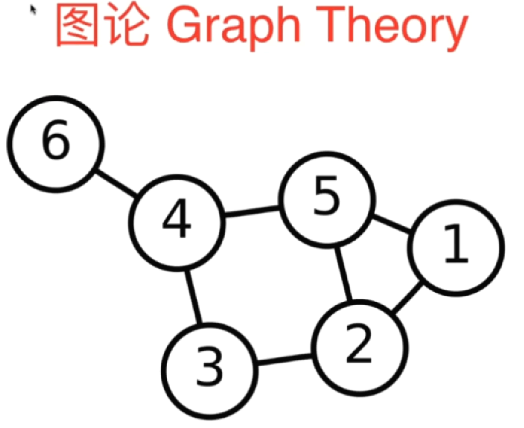
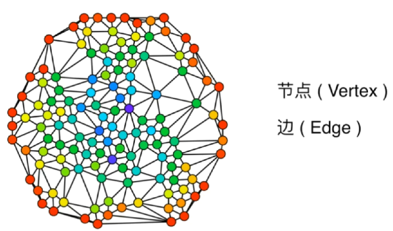
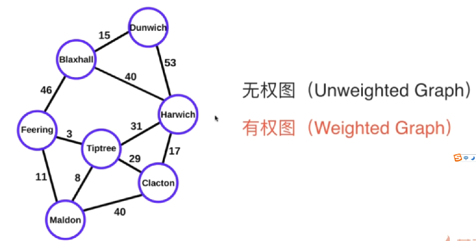
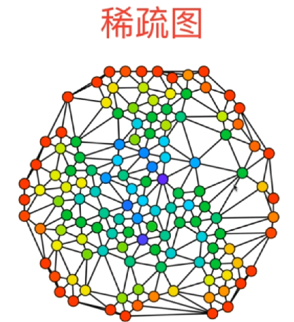
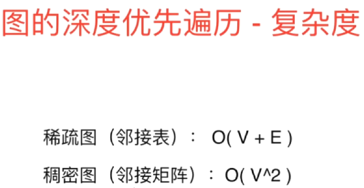
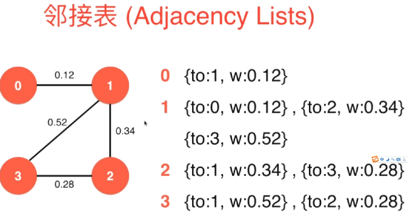

# 图论 Graph Theory

**图论**是对图的研究，图是用来模拟物体之间两两关系的数学结构。图由顶点、节点或由边、弧或线连接的点组成。

一个图可能是无向的，这意味着与每条边相关的两个顶点之间没有区别，或者它的边可能从一个顶点指向另一个顶点;参见图(离散数学)了解更多详细的定义，以及通常考虑的图类型的其他变化。

在最普遍的意义上的术语,图是一个有序对G = (V, E)由一组顶点V或节点或边缘点的一组E或弧行,这是2-element V的子集(即一条边与两个顶点相关联,这协会的无序对由两个顶点)。

在一个更广义的概念中，V是一个集合，它与每条边与两个顶点的关联的关联关系。

在另一个广义的概念中，E是一个由无序的(不一定是不同的)顶点组成的多对集合。

V和E通常被认为是有限的，对于无限图，许多众所周知的结果都是不正确的(或者是相当不同的)，因为许多参数在无限情况下失败了。

图的顺序是|V|，它的顶点数。

图的大小是|E|，它的边的数目。

一个顶点的度或价是连接到它的边的数量，其中连接一个顶点到它自身的边(循环)被计数两次。

在计算机科学中，图被用来表示通信网络、数据组织、计算设备、计算流程等。例如，一个网站的链接结构可以用一个有向图表示，其中顶点表示网页，有向边表示从一个页面到另一个页面的链接。

类似的方法可以应用到社交媒体、旅游、生物、计算机芯片设计和许多其他领域。因此，开发处理图形的算法是计算机科学的主要兴趣所在。

## 图的简单分类

一个简单的自动机

无向图可以看成是一种特殊的有向图

## 图的连通性

## 简单图

## 邻接矩阵（Adjacency Matrix）

邻接[矩阵](https://baike.baidu.com/item/矩阵)（Adjacency Matrix）是表示顶点之间相邻关系的矩阵。设G=(V,E)是一个图，其中V={v1,v2,…,vn} [1] 。G的邻接矩阵是一个具有下列性质的n阶方阵：

①对 **无向图** 而言，邻接矩阵一定是对称的，而且主对角线一定为零（在此仅讨论无向简单图），副对角线不一定为0，**有向图** 则不一定如此。

②在无向图中，任一顶点i的度为第i列（或第i行）所有非零元素的个数，在有向图中顶点i的出度为第i行所有非零元素的个数，而入度为第i列所有非零元素的个数。

③用邻接矩阵法表示图共需要n^2个空间，由于无向图的邻接矩阵一定具有[对称关系](https://baike.baidu.com/item/对称关系)，所以扣除对角线为零外，仅需要存储上三角形或下三角形的数据即可，因此仅需要n（n-1）/2个空间。

​    **邻接矩阵适合表示一个稠密的图（Dense Graph）,边相对较多**

邻接矩阵表示无向图

   

邻接矩阵表示有向图

## 邻接表（Adjacency Lists）

**邻接表适合表示稀疏的图（Sparse Graph），边相对较少**

单纯从边的多少来判断它是一个稀疏图还是稠密图有点抽象，
如果一个节点和它连接的边远远小于能够与它连接的边的个数，就是稀疏图
稠密图和完全图，完全图就是只所有节点都和其他节点都相互连接

图的邻接表存储方法跟树的孩子链表示法相类似，是一种顺序分配和链式分配相结合的[存储结构](https://baike.baidu.com/item/存储结构)。如这个表头结点所对应的顶点存在相邻顶点，则把相邻顶点依次存放于表头结点所指向的单向链表中。如词条概念图所示，表结点存放的是邻接顶点在数组中的索引。对于无向图来说，使用邻接表进行存储也会出现数据冗余，表头结点A所指链表中存在一个指向C的表结点的同时，表头结点C所指链表也会存在一个指向A的表结点。 [1] 

邻接表是图的一种最主要存储结构,用来描述图上的每一个点。对图的每个顶点建立一个容器（n个顶点建立n个容器），第i个容器中的结点包含顶点Vi的所有邻接顶点。实际上我们常用的邻接矩阵就是一种未离散化每个点的边集的邻接表。

在[有向图](https://baike.baidu.com/item/有向图)中，描述每个点向别的节点连的边（点a->点b这种情况）。

在[无向图](https://baike.baidu.com/item/无向图)中，描述每个点所有的边(点a-点b这种情况)

与邻接表相对应的存图方式叫做边集表，这种方法用一个容器存储所有的边。

工业上有很多非常好的图库的实现,例如C++的boost graph库.如果可以，尽量用这些库，这样可以大大提高你的效率。

邻接表表示无向图

邻接表表示有向图

## 遍历邻边

## 图的遍历

### 深度优先遍历

所谓深度优先，就是从一个点开始，不断的往下试，直到试不下去为止。但是图和树不一样，树因为有根和叶，所以从根玩下走，一定有走不通的时候，但是图不一样，图可能存在上面中的环结构。所以这里对于图，我们就需要记录图中的每一个点是否被遍历过了。如果被遍历过了，我们在后面的遍历中就不需要继续走了。

遍历过程描述：

首先我们从0开始遍历，从左侧邻接表中可以看到，和0相邻的第一个节点是1，所以我们遍历到1

0 - 1

然后看1，和1相邻的只有0，但是0我们已经遍历过了，所以1没有没有遍历过的点，退回到0

然后继续，和0相邻的下一个点是2，我们就遍历到了2，

0 - 1 -2

然后看2，和2相邻的点只有0，零遍历过了，退回到0,继续遍历，和0相邻的下一个点是5, 5没有遍历过，

0 - 1 - 2 - 5

然后看5，和5相邻的 第一个点是0，不遍历，然后继续看还有没有和5相邻的点，有，下一个相邻的是 3, 3没有遍历过

0 - 1 - 2 - 5 - 3

然后继续，看3，和3向邻的第一个点是4,4没有遍历过

0 -1 - 2 - 5 - 3 - 4

然后看4， 和4 相邻的第一个点是3,3遍历过了，跳过，继续看还有没有和4相邻的点，有，5，但是5也遍历过了，继续找，找到6,6没有遍历过

0 -1 - 2 - 5 - 3 - 4 - 6

然后看 6 ，和6相邻的第一点是 0 ，0 遍历过了，继续找，4,4也遍历过了，继续找。没有了，那就回退到4, 看和4相邻的点中还有没有没遍历过的，没有，那就继续回退到3，看和3相邻的还有没有没遍历过的，没有，那就继续回退到5，看和5相邻的点有没有没有遍历过的，没有，继续回退到2，看2有没相邻的点没有被遍历过的，没有，继续回退，回退到1，没有，回退到0.看有没有。没有。至此，一个从 0 开始的深度优先遍历过程就完成了

至此一个连通图一次深度优先就遍历完所有节点了。这种深度优先遍历还有一个作用是求一个图的**连通分量**（如下就是有3个连通分量）

无向图 G 的一个极大连通子图称为 G 的一个连通分量（或连通分支）。连通图只有一个连通分量，即其自身；非连通的无向图有多个连通分量。连通分量与连通分量之间没有任何边相连。深度优先遍历可以用来求连通分量。因为一次深度优先只能遍历一个连通，遍历完整个连通，继续随机选择下一个没有遍历过的点，进行深度优先遍历，如此继续，直到整个图中不存在没有遍历过的点，那么我们就可以确定整个图遍历结束，遍历了几次深度优先，就说明有几个连通分量

#### 获得两点间的一条路径

回顾上面的深度优先遍历，其实我们在遍历的过程中也形成了上图中红线表示的一条一条的路径。如果我们想获得两点之间的一条路径，其实在遍历过程中文我们都可以通过这个红色的线条找到。比如：

0 - 2 ： 0 2

0 - 5 ： 0 5

5 - 6 ：5 3 4 6

可以看到我们采用深度优先的遍历并不一定能找到最短路径（对于无权图的最短路径问题，下面会进行探讨）本节的目的就是通过深度优先的算法获得一条路径。

我们要做的就是在遍历的过程中存储这条路径，怎么做？很简单，我们只需要在遍历到一个节点的时候，存储我们是从哪个节点遍历到这个节点的即可

根据我们图的实现方式的不同，我们深度优先遍历的复杂度也会有所不同。

如果我们的图是使用邻接表实现的，那么他的时间复杂度就是O(V+E)，通常情况下E会比V大，所以一帮也会说它是O(E)这个级别的。如果是使用邻接矩阵实现的话，那么它的时间复杂度就是O(V^2)这个级别的。

对于邻接矩阵他的时间复杂度为什么是O(V^2)，是因为当我们要想获得一个节点他的所有相邻的节点的时候，我们需要将这个图中所有的节点都扫一遍，而在邻接表的实现中，对于每一个节点我们首先要访问，而每一个节点他所有相邻的节点就构成了了这张图中总共的边数，也就是说我们将所有的边都访问了一次，没有进行其他多于的访问。

也正是因为如此，如果我们的是一个稀疏图的话，通常是使用邻接表这样的表达方式他的效率会高一些

#### 广度优先遍历

对于广度优先遍历，我们需要有一个队列进行辅助遍历。

对于上面这个图，我们使用广度优先遍历的方式，进行遍历的过程描述

首先在遍历之前，我们要将**0**这个初始节点推入到我们的辅助队列**q**中，之后开始我们的遍历过程。

> 辅助队列：q ：0
>
> 遍历结果队列：

在遍历过程中，我们每次都将辅助队列首的元素取出来作为我们的遍历对象。所以这里我们将 **0**取出来进行遍历，这里也就相当于我们遍历了 0 这个节点

> 辅助队列：q ：
>
> 遍历结果队列：0

之后我们要做的就是 将 0 这个节点他所有相邻的节点进行遍历，如果他这些相邻的节点还没有加入过队列（这里加入过队列是指加入到辅助队列和遍历结果队列这两个任意一个），就将这个节点加入到 辅助队列q里

> 辅助队列：q ：1  2  5  6
>
> 遍历结果队列：0

这个时候1， 2， 5， 6这4个和 0 相邻的未遍历过的节点都加入到了这个辅助队列中，然后下一步依旧是取辅助队列中的首个元素，加入到遍历结果队列，作为遍历对象对其进行相邻未加入过的节点进行遍历。

> 辅助队列：q ：2   5  6
>
> 遍历结果队列：0  1

然后1的遍历结果就是没有为添加过队列的节点，那就继续去辅助队列取首个元素 2 ，将2作为遍历对象对其进行遍历。

> 辅助队列：q ：5  6
>
> 遍历结果队列：0  1  2

2的遍历结果和1也是一样的，没有未加入过队列的节点，继续取辅助队列中的下一个首元素 5 ，对5进行遍历， 0加入过了，3没有， 4也没有。把3， 4加入到辅助队列

> 辅助队列：q ：6  3  4
>
> 遍历结果队列：0  1  2  5

然后5遍历完，继续取下一个辅助队列的元素 6，将其作为遍历对象，6的相邻元素 0 已经加入过队列了，跳过，然后是4, 4虽然没在遍历结果队列中，但是4也加入过队列（辅助队列），所以4也不能算，跳过。那至此，6的相邻节点就没有没加入过队列的节点了。（所以这我们在进行编码实现的时候要主要，我们在进行visited标记的时候，应该是对加入过队列进行标记，而不是是否遍历过进行标记，这里要重点注意，因为它只要加入到辅助队列了，早晚都要被处理到）

> 辅助队列：q ：3  4
>
> 遍历结果队列：0  1  2  5  6

然后继续取辅助队列中的首个元素 3，遍历3的相邻节点，发现 4 在队列中，跳过，然后是 5,5遍历过，也跳过。

> 辅助队列：q ：4
>
> 遍历结果队列：0  1  2  5  6  3

然后继续取辅助队列中的首个元素 4,遍历4中的相邻节点，3， 5， 6都已经遍历过了，跳过

> 辅助队列：q ：
>
> 遍历结果队列：0  1  2  5  6  3  4

然后继续取辅助队列中的首元素，发现没有，至此一个广度优先遍历就结束了。遍历结果就是 **0  1  2  5  6  3  4**

可以感受一下这个整个广度优先遍历的过程，对于这张图而言，实际上是以距离我们遍历的起始点 0 的距离为顺序进行遍历的。首先0这个节点自己到自己的距离最短，所以0优先被遍历到，之后0所有相邻的节点都被推了进去，也就是 1 2 5 6这4个节点。他们距离0的距离都是1。接下来我们在遍历5的时候将3， 4这两个节点进行了遍历，而3 4这两个节点他们距离0的距离是2。所以从这个角度看，广度优先遍历又被称为层序的优先遍历。就是从遍历的起始点开始，一层一层的往下遍历，先遍历到的点距离起始点会近一些，而后遍历到的点会距离起始点会远一些。但是这里也需要注意，所谓的先后也是存在并列关系的，比如1， 和 6，它们距离0的距离都是1，所以更严谨的说法就是先遍历到的点距离起始点的距离一定是小于等于后遍历到的点

我们在程序中遍历的时候，其实也可以记录这个距离。当我们记录这个距离之后，我们就求出了在这个无权图中，每一个节点距离我们起始节点它的最短距离。不仅如此，如果我们像深度优先遍历一样，使用一个from数组来记录每一个节点是从哪一个节点遍历过来的，我们还能将最短距离背后的这个最短路径求出来。其实这也是图使用广度优先遍历最重要的一个应用。

这个作用于有向图和无向图的无权图。对于有权图，后面会探讨。

---

# 带权图（Weighted Graph）

## 邻接矩阵表示一个有权图

对于邻接矩阵，之前我们表示无权图的时候，矩阵的值是使用0-1表示节点之间是否存在边，现在只需要将这个这些边改为保存权值就可以了

## 邻接表表示一个有权图

对于邻接表来说，会有所不同，因为之前我们用邻接表存的是节点到与它相邻的节点的索引，但是现在因为有了权值，所以此时我们每个节点后面应该存储两个信息，一个是与它相邻的节点索引to，一个是到该节点边的权重w。这样一表达，我们很容易看出来，这里我们不能用一个简单的数据类型。为此我们应该给他封装成一个类，这里就叫他 Edge （边）。

那这里如果我们的邻接表这样存的话，那么为了保证邻接表和邻接矩阵这二者具有统一的接口，为此最好的情况就是，邻接矩阵中`a[i][j]`中每一个元素的位置我们都给他存为一个 Edge 。也就是我们邻接矩阵中，每一个边用一个类Edge来表达，对于没有边的 0 来说，就可以用NULL来表达