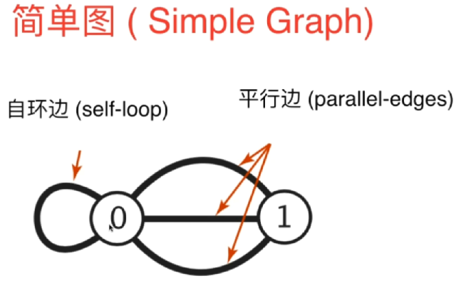

# 图论 Graph Theory

**图论**是对图的研究，图是用来模拟物体之间两两关系的数学结构。图由顶点、节点或由边、弧或线连接的点组成。

一个图可能是无向的，这意味着与每条边相关的两个顶点之间没有区别，或者它的边可能从一个顶点指向另一个顶点;参见图(离散数学)了解更多详细的定义，以及通常考虑的图类型的其他变化。

在最普遍的意义上的术语,图是一个有序对G = (V, E)由一组顶点V或节点或边缘点的一组E或弧行,这是2-element V的子集(即一条边与两个顶点相关联,这协会的无序对由两个顶点)。

在一个更广义的概念中，V是一个集合，它与每条边与两个顶点的关联的关联关系。

在另一个广义的概念中，E是一个由无序的(不一定是不同的)顶点组成的多对集合。

V和E通常被认为是有限的，对于无限图，许多众所周知的结果都是不正确的(或者是相当不同的)，因为许多参数在无限情况下失败了。

图的顺序是|V|，它的顶点数。

图的大小是|E|，它的边的数目。

一个顶点的度或价是连接到它的边的数量，其中连接一个顶点到它自身的边(循环)被计数两次。

在计算机科学中，图被用来表示通信网络、数据组织、计算设备、计算流程等。例如，一个网站的链接结构可以用一个有向图表示，其中顶点表示网页，有向边表示从一个页面到另一个页面的链接。

类似的方法可以应用到社交媒体、旅游、生物、计算机芯片设计和许多其他领域。因此，开发处理图形的算法是计算机科学的主要兴趣所在。

## 图的简单分类

一个简单的自动机

无向图可以看成是一种特殊的有向图

## 图的连通性

## 简单图

## 邻接矩阵（Adjacency Matrix）

​    邻接矩阵适合表示一个稠密的图（Dense Graph）,边相对较多
​    

## 邻接表（Adjacency Lists）

邻接表适合表示稀疏的图（Sparse Graph），边相对较少

单纯从边的多少来判断它是一个稀疏图还是稠密图有点抽象，
如果一个节点和它连接的边远远小于能够与它连接的边的个数，就是稀疏图
稠密图和完全图，完全图就是只所有节点都和其他节点都相互连接

## 遍历邻边

