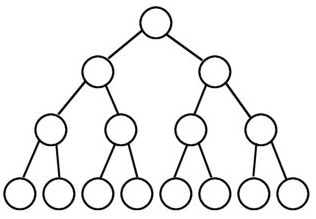
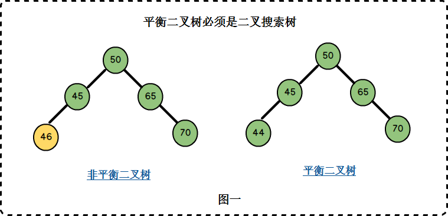

# 满二叉树、完全二叉树、平衡二叉树、最优二叉树

一、满二叉树

　　一棵二叉树的结点要么是叶子结点，要么它有两个子结点（如果一个二叉树的层数为K，且结点总数是(2^k) -1，则它就是满二叉树。）

 

 

二、完全二叉树

　　若设二叉树的深度为k，除第 k 层外，其它各层 (1～k-1) 的结点数都达到最大个数，第k 层所有的结点都**连续集中在最左边**，这就是完全二叉树。

 

 

三、平衡二叉树

　　它或者是一颗空树，或它的左子树和右子树的深度之差(平衡因子)的绝对值不超过1，且它的左子树和右子树都是一颗平衡二叉树。

 

 

四、最优二叉树（哈夫曼树）

　　树的带权路径长度达到最小，称这样的二叉树为最优二叉树，也称为哈夫曼树(Huffman Tree)。哈夫曼树是带权路径长度最短的树，权值较大的结点离根较近。