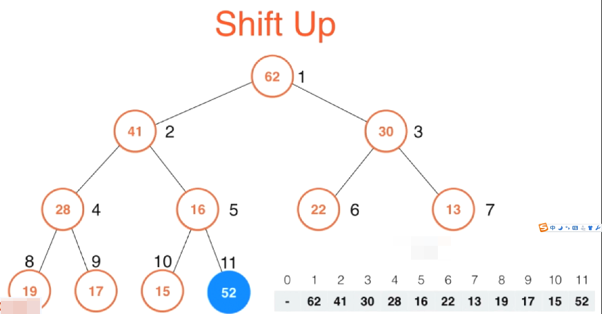

# 堆排序 Heap Sort

## 堆和优先队列 Heap and Priority Queue

### 优先队列(priority queue)

普通的队列是一种先进先出的数据结构，元素在队列尾追加，而从队列头删除。在优先队列中，元素被赋予优先级。当访问元素时，具有最高优先级的元素最先删除。优先队列具有最高级先出 （first in, largest out）的行为特征。通常采用堆数据结构来实现。


优先队列这种概念在计算机中被大量的使用，最典型的应用救世主哎操作系统中执行任务，众所周知我们的操作系统要同时执行多个任务，可是实际上操作系统是将cpu的指向周期划成时间片，在每个时间片里只能执行一个任务，究竟要执行哪个任务呢？答案就是每一个任务都有一个优先级，操作系统会动态的每一次选择优先级最高任务进行执行。如我我们想要动态的选择优先级最高的任务去执行，我们就需要使用优先队列。也就是说操作系统中每一个任务都进这个优先队列，入户由优先队列动态的调度哪一个任务优先执行。

这里要注意，上述描述中有一个非常重要的关键字：动态。我们可以想象，如果我们的任务永远都是固定的话，那么我们完全可以把这些任务排一次序，然后按优先级高低依次进行任务执行。可是实际上，单我们使用优先队列的时候，情况通常都会非常复杂


比如在这个图例中，这个蓝色的大圆圈就是一个任务处理中心，可以把它想象成cpu，由它来处理所有的请求。而红色的圆圈是一个一个的请求。单我们选择执行了某一个请求之后，下一步可能不是简单的去继续执行其他的请求，因为与此同时又可能会来很多新的任务。当然真正的操作系统情况会更加复杂。不但会来新的任务，旧的任务的优先级本身也可能会发生改变。因此在这种情况下，一次性的将所有任务进行排序，然后依次执行是不现实的。如果我们真要使用排序的方式来解决这个问题的话，那么很有可能就会是每一次运行完了某一个任务之后，都要对剩下的任务进行一次新的排序，这样做耗时又是巨大的。

这种模型不仅仅适用于操作系统，在我们的生活中，到处都存在这样的模型。

之前我们都在强调，使用有线队列非常适合处理这种数据是动态的情况，可是实际上在一些静态的问题求解上，优先队列也是非常有优势的。比如说，现在有100w个元素，我想在这100w个元素中选出前100名。把这个问题抽象一下就是有N个元素，我想在这N个元素中选出前M个名。怎么做？首先一个最基本的解法就是对这N个元素进行排序，然后取前M个元素。这样时间复杂度就是O(n log n)。但是如果我们使用了优先队列的话，我们可以把这个算法的时间复杂度降低到O(N log M)这个级别。在这个例子中，如果N是100w，M是100的话，这样的一个优化将使得我们的算法块10几倍。当然，如果我们的N更大的话，这个优化的性能优势将会更加明显。


那么优先队列是如何将O(N log N)优化到O(N log M)的呢？这就涉及到优先队列的实现问题了。

### 优先队列主要操作

首先对于队列来说，他的主要操作就是两个，一个是入队，一个出队。优先队列也不例外，从我们用户的角度来看，优先队列最大的特点就是出队的时候，是取出优先级最高的元素。


那么如何实现一个优先队列呢？实际上我们使用之前的顺序的数据结构（也就是用数组这样的数据结构）就完全可以实现一个优先队列，在这里有两个思路，第一个思路我们使用一个普通的数组，入队非常简单，我们使用O(1)的时间直接把一个数据扔到数组末尾就好了。在出队的时候，我为了取得优先级最高的数据，就需要扫描一遍整个数组，然后拿出优先级最高的那个元素出队。

当然也许还有人会想到，我使用一个顺序的数组，也就是不断维护这个数组的有序性，这样一来，我的元素入队的时候，就需要使用O(n)的时间，来找到入队元素合适的插入顺序。一旦我们维护了整个数组它是有序的，那么出队就非常简单了，我们只需将队列头部那个优先级最高的元素出队就好了。但是使用这样的数组实现优先队列都是有局限性的。

我们使用堆这种数据结构来实现优先队列话，就能很好的平衡入队和出队的时间复杂度。使用这种数据结构我们能将入队和出队的时间效率都变成O(lg n)这个级别的。虽然我们可以看到这个数据结构在入队是慢于普通数组，出队是慢于顺序数组，可是平均来讲，使用堆这种数据结构来维持一个优先队列来完成一个系统任务，它所需要的时间效率要大大的低于使用数组来进行实现。

对于极端的情况，单我们总共有N个请求，对于普通数组或者顺序数组，最差的情况的时间复杂度是O(n^2)这个级别的。而我们使用堆这种数据结构，他的时间复杂度则可以稳定在O(n log n)这个级别。

## 堆的基本存储

通过上面的介绍，我们知道，要在堆中实现插入和删除操作，都是log n级别的，通过这点，我们不难知道，堆一定相应的是一个树形的数据结构。最为经典的一个对的树形结构实现叫做 二叉堆（Binary Heap）,相对应的它长得就像一个二叉树一样。所谓的二叉树就是每一个节点可以有两个子节点。

### 概念及其介绍

堆(Heap)是计算机科学中一类特殊的数据结构的统称。

堆通常是一个可以被看做一棵完全二叉树的数组对象。

堆满足下列性质：

- 堆中某个节点的值总是不大于或不小于其父节点的值。
- 堆总是一棵完全二叉树

### 堆的结构图示

上面说到堆是一个二叉树，那这个二叉树有什么特点呢？

特点1：在这个人二叉树上，任何一个节点，都不大于他的父亲节点


除此之外，它还要满足一个性质，那就是它必须是一颗完全的二叉树。所谓完全二叉树就是指，首先这是一棵二叉树，对于这棵二叉树，除了最后一层节点之外，其他层节点个数必须是最大值。我们知道，对于一棵二叉树来说，第一层最多只能有一个节点，第二层有两个节点，第三层最多有4个节点，以此类推。在最后一层，虽然他的节点个数可以不是一个最大值，但是所有的节点都必须集中在左侧。就和下面这个图示一样，这个二叉树最后一层有3个节点，这3个节点全都集中在了左侧。满足这样性质的二叉树就叫完全二叉树。

> 说父节点的值大于子节点的值，这个说法不意味着层数越高，他的值就一定越大


我们的堆这种结构还必须是一个完全二叉树，当满足了这两个性质之后，我们就构建了一个堆。特别说一点，这样的堆我们管他叫做最大堆，之所以叫它最大堆，是因为树顶的位置总是保存着这棵树中最大的元素。

以此类推我们可以得出最小堆的概念，那就是对于任意一个节点来说，他的值都不小于其父节点的值，越在上面的元素相应的也就越小。

**总结：**

堆是一种经过排序的 完全二叉树 ，其中任一非终端节点的数据值均不大于（或不小于）其左子节点和右子节点的值。

最大堆和最小堆是 二叉堆 的两种形式。

最大堆：根结点的键值是所有堆结点键值中最大者。

最小堆：根结点的键值是所有堆结点键值中最小者。

而最大-最小堆集结了最大堆和最小堆的优点，这也是其名字的由来。

最大-最小堆是最大层和最小层交替出现的 二叉树 ，即最大层结点的儿子属于最小层，最小层结点的儿子属于最大层。

以最大（小）层结点为根结点的子树保有最大（小）堆性质：根结点的键值为该子树结点键值中最大（小）项。

## 堆的实现

堆在计算机中有一个非常经典的实现方式，那就是使用数组来存储一个二叉堆。**我们之所以可以使用数组来存储一个二叉堆，正是因为堆是一棵完全二叉树**。我们可以尝试给这个二叉树自上到下，自左到右的给每一个节点标记一个序列号，第一个顶点节点标记1，下面一层2， 3，再下面一层4， 5， 6， 7。以此类推，相当于是依照层序，自上到下，之后再在每一层自左到右的标记上序列号。这样标上以后，我们就不难看出来，对于每一个节点来说，它的左节点的序列号都是父节点的二倍。1号的左节点是2，2号的左节点是4，4号的左节点是8，3号的左节点是6, 5号的左节点是10。而对于右节点他的序列号就是自身节点序列号的2倍+1, 1的右节点是3, 3的右节点是7，2号的右节点是5等等等等。。


当然我们也可以将根节点从0开始标记，这都是可以的，只不过节点标记的计算方式会稍微有所改变。但是对于堆来说，最经典的一个就是根节点从1开始标记这种方式。这样一来我们就可以将所有的数据存在数组中，对应的我们刚刚标记的这个索引就是数组的索引。在这里要注意，因为我们的堆是从1开始标记，所以这里0号索引是不使用的。


有了这样一个数组之后，我们就可以很轻松的用这样一个公式，找到数组中每一个索引中的元素它相应的左孩子和右孩子的节点。比如对于i索引的节点，我们只需要找`2*i`和`2*i+1`索引对应的节点就是其左孩子和右孩子。同理对于每一个元素而言，我们也可以很轻松的找到它的父节点的元素，我们只需要使用`i/2`就是i索引的父节点所在的索引。（这里这个除法是使用的计算机的除法，如果除不开就会取正）

### Shift Up

如何向一个最大堆中添加一个新的元素？这涉及到堆中的一个核心操作，我们通常管他叫做Shift Up.



如上所示是一个已经存在的堆，蓝色元素表示我们要往这个最大堆中添加的新元素。如果有一个元素比如上面的52要加入这个最大最，通过上面的介绍，我们也已经知道，这个堆我们使用了一个数组进行表示，所以相应的在这个最大堆中添加一个新的元素，也就相当于在这个数组的末尾添加一个元素。所以可以看到此时52就添加到了索引为11的位置。这样一来这个样子的堆就不满足最大堆的定义了。因为对于52这个节点来说，他的父节点16这个值，比52还小，违背了堆的定义。所以下面就需要进行一系列操作来维护堆的定义。

怎么做呢？很简单，因为在我们加入这个新元素之前，整个树是一个最大堆，所以问题肯定出在了我们新加入的这个元素上，我们需要做的就是将我们新加入的这个元素调整到一个合适的位置，使得整个二叉树依然保持最大堆的性质。

怎么调整这个位置呢？也很简单，只需要看我们新加入的这个元素，和他的父节点比，是不是比我们新加入的这个元素小？比如这里16比52小，违背了最大堆的定义，所以将16和52进行交换。交换完成之后，在这个字树部分就满足了最大堆的定义。


然后下一步，我们新的这个52的位置有可能还是会和他的上面父节点不满足最大堆的定义，所以我们下一步要做的就是看看52现在的父节点是否比52还要小，在这里他的父节点41比52还要小，所以他们又要交换一下位置。现在我们的二叉树就变成了这个样子。交换完成之后，这部分子树就满足了最大堆的定义。


然后交换完成之后，52新的位置有可能还会和其父节点不满足最大堆的性质，所以我们还得继续比较一下。发现此时52比其父节点62小，那么此时52就不用再挪动位置了。

经过这样的变动，我们就依旧维持了最大堆的定义。可以看到52从最下面逐步上升的过程就是我们说的Shift Up的过程。通过这样一个方式，我们成功的向最大堆中添加了一个新的元素。

**c++代码实现(堆打印代码略)**

```c++
template<typename Item>
class MaxHeap
{
    
private:
    Item* data;     // 存储堆中的数据的数组
    int count;      // 存储堆中有多少个元素
    int capacity;   // 数组大小（堆中元素的容量上限）
    
    
    // 将K这个索引的位置的元素尝试着向上移动来维持堆的定义
    void shiftUp(int k)
    {
        // 我们每一次就是要看一下索引K这个位置，他的父节点（k/2）
        // 相应的元素是不是比k这个位置的元素还要小
        // 同时有索引存在，就需要考虑越界问题，这里我们就需要保证k是大于1的
        // 也就是k的取值最多到2，k到2的时候，就和k/2 = 1的那个父节点（也就是最顶部的节点）
        // 进行最后一次比较。这轮比较完成之后，k=1已经是这个树的跟节点了，已经不需要继续再进行比较了。
        while(k > 1 && data[k/2] < data[k])
        {
            // 如果父节点的元素比k节点的元素还要小，说明此时违背了最大堆的定义。
            
            // 那么就把这个节点和其父节点进行位置交换
            swap(data[k], data[k/2]);
            // 然后更新k的值
            k /= 2;
        }
    }
    
    
public:
    // 构造函数。这个构造函数最重要的功能就是为上面存储数据的数组开辟空间
    MaxHeap(int capacity)
    {
        data = new Item[capacity+1];
        // 注意这里数组空间需要 + 1，是因为我们这个堆是从索引1开始标记，0号标记我们是不使用的
    
        count = 0;
        
        
        // 这里要注意，因为我们的这个数组值开辟了一次空间，也就是我们这个数组最多容纳 capacity
        // 这么多个元素，所以在我们的insert函数中也隐含着数组越界的问题
    }
    
    ~MaxHeap()
    {
        delete[] data;
    }
    
    // 查询堆中的元素个数
    int size()
    {
        return count;
    }
    
    // 查询是否是一个空堆
    bool isEmpty()
    {
        return count == 0;
    }
    
    // 往最大堆中添加一个新的元素
    void insert(Item item)
    {
        assert(count+1 <= capacity);
        // 对于data来说，给他的[count+1]这个位置赋值为我们要插入的这个新元素item。
        // 在这里一定要注意，我们现在这个堆，对于我们的数组来说，索引是从1开始的，
        // 所以在这个堆中一共有count个元素存在，从1一直到count这些索引的位置中，
        // 和我们平时的数组 从0开始索引到count-1是有区别的，这里一定要小心
        data[count+1] = item;
        // 我们的堆中多了一个元素，那么我们的计数器count就可以++
        count++;
        
        // 因为我们新加入的元素有可能破坏了堆的定义，所以这里调用我们提供的shiftUp方法来将这个元素向上移动来保持堆的定义
        shiftUp(count);
        
    }
};
```

测试堆的生成和打印

```c++
	MaxHeap<int> mh = MaxHeap<int>(100);
    
    srand(time(NULL));
    
    for(int i = 0; i < 15; i++)
    {
        mh.insert(rand()%100);
    }
    
    mh.testPrint();
```


以上就是如何向最大堆中新增一个元素（shift up），下面继续介绍如何从堆中取出一个元素，也就是我们之前介绍的优先队列里的出队操作。

### Shift Down

假设当前这个二叉树是我们当前堆的形态，如果我们要想从堆中取出一个元素，这里要注意一个点，从堆中取出一个元素，只能取出根节点的元素。对于最大堆来说，相当于就是取出优先级最大的那个元素。


那现在我们整个堆中相当于少了一个元素，怎么填补整个元素呢？

答案很简单，我们只需要将堆中最后一个元素放到我们整个堆中的第一个元素的位置就好了。这依然是依据堆是一个完全二叉树这样一个性质，把在最后一个元素放上去以后，整个堆依然保持着是一个完全二叉树。

在我们上面的实现中，我们知道，在我们的堆中有一个count的成员变量来描述单前堆中有多少个元素。将堆中最后一个元素放上去之后，这个时候count就相应的减1。这样一来我们这个例子中索引为11的那个位置的元素16其实可以不动。我们在之后的操作中都将以count为界，所以11的这个元素也就不会被访问到。


这样我们就从堆中拿出了一个元素，并且保证这它依然是一个完全二叉树。但是这时候也可以看到，这棵完全二叉树并不是一个最大堆，这是因为我们从最下面取出一个元素放在了最上面，势必现在根节点的这个元素要比的它子节点还要小。所以我们下面要做的事情就是调整元素的位置。使他保持最大堆的性质。

这个调整的过程就是将此时根节点的位置的元素一步一步的向下挪，最中找到它合适的位置。这也就是为什么这步操作叫做shift down。

在这个例子中，我们要将16向下挪，但是这个时候，16既可以向左，也可以向右。究竟向哪个方向呢？答案就是左右两个孩子分别比较一下，谁大就跟谁换。在这个例子里，52比30还要大，所以就和52换，因为这样换完以后，才能保证这个换上来的52比16和30都要大，这样维持了最大堆的性质。


这样交换完之后，堆就变成了这个样子，然后继续比较16的两个左右孩子，谁大，41比28大，那么16就和41进行交换。交换完成之后我们的堆就变成了这个样子。


之后16继续和它的孩子们进行比较，这里注意，此时的16只有左孩子，所以这个时候我们就拿16和左孩子15进行一次比较就可以了。发现16比15大了，所以就不需要发生交换。

到此为止，shift down的操作就已经完成了，此时我们的堆成功的推出了一个元素（62），之后经过shift down的操作，继续维持了最大堆的性质

c++代码实现

```c++
private:
	void shiftDown(int k)
    {
        // 我们什么时候应该继续进行shiftDown操作呢？
        // 首先k这个索引所在的节点应该有孩子。怎么判断有孩子？在一个完全二叉树中，只要他有左孩子，那么我就能确定它有孩子
        // 这是因为在一个完全二叉树中它不可能只有右孩子没有左孩子
        while(2*k <= count)
        {
            // 在这种情况下，我们要做的事情就是比较它的两个左右孩子，谁大和谁换。
            // 这个时候要注意，有可能这个节点没有右孩子。所以这里需要把这个边界情况考虑上
            
            // 为此我这里设置一个新的变量索引为j，j初始化成 2*k,这个j表示扫描意思呢？
            // 表示在此轮循环中，data[k]这哥元素应该喝data[j]这个位置元素交换
            // 因为它有左孩子，所以就有可能是和左孩子交换位置，这个就是初始化的值为 2*k
            int j = 2*k;
            
            // 之后我们就判断一下它有没有右孩子，他的右孩子表示成 j+1 就可以了
            // 如果j+1<=count，说明它有右孩子，然后在右孩子存在的基础上比较两个左右孩子的大小
            if(j+1 <= count && data[j+1] > data[j])
            {
                // 如果右孩子比左孩子大，那么这里就把j更新成j+1.
                // 因为j是要进行交换的索引，注意这里谁大谁就是要交换的值
                j = j+1;
            }
            // 继续判断，单前k节点是否比他要进行交换的子节点小，小就交换
            if(data[k] < data[j])
            {
                swap(data[k], data[j]);
                // 交换完成之后，我们k这个索引就变到了j这个位置
                k = j;
            } else {
                break;
            }
        }
    }

public:
	// 将堆中的最大值取出来。
    Item  extractMax()
    {
        // 首先我们要从堆中取出一个最大值，第一步就是保证我们的堆不为空
        assert(count>0);
        
        Item ret = data[1];
        
        // 将堆顶元素取出后，首先先将堆中最后一个元素放在堆顶位置
        swap(data[1], data[count]);
        // 交换完成之后，count--，表示最后这个元素（已经取出来的这个元素）我们再也不进行考虑了
        count--;
        
        // 然后要做的事情就是调用我们的shiftDown这个函数，想办法将这第一个元素向下挪，放在它合适的位置
        // 维持我们最大堆的性质。
        shiftDown(1);
        
        return ret;
    }

```

依次将堆中的元素从大到小取出来。


从这个测试用例我们也可以很容易感知到，我们可以使用堆来实现一个排序过程。

### 堆排序1

利用最大堆实现的第一个堆排序算法

```c++
#ifndef HEAP_SORT_1_H
#define HEAP_SORT_1_H

#include <iostream>
#include "Heap.h"

using namespace std;

// 第一个基于堆的排序算法
template<typename T>
void heapSort1(T arr[], int n)
{
    // 首先在这个排序算法中，先实例化一个最大堆。存放的就是T类型的数据
    MaxHeap<T> maxheap = MaxHeap<T>(n);
    
    // 遍历依次将传入的待排序的数组中的元素放入我们的最大堆中
    for(int i = 0; i < n; i++)
    {
        maxheap.insert(arr[i]);
    }
    
    // 接下来我们只需要不停地调用maxheap的extractMax就能将这些以从大到小的顺序取出来了
    // 但是如果我们希望排序结果是从小到大，为此，我们可以反向的来遍历一下这个n个数据，
    // 将maxheap中从extractMax返回的元素反向的返回到arr中就完成了从小到大的排序。
    for(int i = n-1; i>=0; i--)
    {
        arr[i] = maxheap.extractMax();
    }
}

#endif
```

将我们的堆排序和快速排序和归并排序做一个比较测试，测试结果如下


从测试结果上看，我们的第一个堆排序对比快速排序和归并排序，基本上每一个测试用例都会慢一些，但是他的速度其实也是可以让我们接受的。

让这100w的数据堆排序也能在很短的时间内排序完成，是因为堆排序它也是一个O(n long n)级别的排序算法。简单分析一下，上面我们的堆排序中，有两重循环，每重循环都要对n个元素进行遍历。每一次遍历，无论是 insert操作（shift up)还是extractMax操作（shift down)他的时间复杂度都是log n级别的，这是因为他们背后的两个主要操作shif up和shift down，不论是从下向上还是从上向下去找元素的合适位置，都是和层序相关的，所以它是log n级别。

## Heapify

那这里可不可能对我们上面的堆排序进行优化，让他更快些呢？

我们现在是将这个数组中的所有元素使用最大堆提供的插入函数挨个放入堆中，事实上，将整个数组构建成一个堆这个过程有一个更好的方式，

给定一个数组，我们让这个数组的排列形成一个堆的形状，我们管这个过程叫做Heapify


假设我有这样一个数组，我们就可以根据之前的堆的定义，将这个数组构建成一棵完全二叉树，当然现在的这个完全二叉树还不是一个最大堆。因为他并不满足对于所有的节点，他的父节点都比自身要大这样一个性质。

不过应该很容易观察到这点，对于这样一个完全二叉树来说，所有的叶子节点（也就是没有孩子的节点），他们本身就是一个最大堆，在这个例子里，这些蓝色的节点我们就可以将其看做是5个最大堆，每个堆中的元素只有一个。

这里要注意一个性质，对于完全二叉树来说，第一个非叶子节点的索引一定是这棵完全二叉树的元素个数/2。在这里就是（10 / 2 = 5），也就是说5就是那个第一个非叶子节点索引。这里还是要提醒一下，我们现在的这个规则依然是从索引1开始计算得到的规则。

我们继续来看Heapify这个过程，我们下面从后向前考察每一个不是叶子节点的节点，对于我们这个例子，第一个要考察的就是22这个元素，现在已22为根的这个子树不满足堆的性质。那么我们怎么让他满足堆的性质呢？其实很简单，我们只要这个元素的位置上执行我们之前堆中的Shift Down这个操作即可。换句话说，22在这里，只要和它的子节点做一次比较，发现它比62小，将它和子节点62进行一次交换即可。此时我们这棵树就变成了这个样子


在我们这个例子中，索引5为根所在的这棵子树就也满足了堆的性质。接下来我们来考察13这个元素，依然是对他执行Shift Down操作，比较它的两个子节点，41比30要大，并且比13也要大，所以将13和41交换位置。这样一来，索引4为根的这个子树就也满足了堆的性质。


在下面我们考察19这个元素，也就是索引3所在的元素，对19这个元素执行Shift Down操作，在这里比较它的左右两个孩子16和28，18比28小，所以他们两交换位置，这样一来索引3所在的位置为根的子树也满足了堆的性质。


接下来我们来看索引2，也就是17。17它的两个孩子都比他要大，而且右孩子62大于左孩子41，所以17和62交接位子，然后继续看单前17和它的孩子22做比较，22大于17，交换位置。至此，索引2所在的节点为根的子树也满足了堆的性质。


最后看索引1所在的正真的根15这个节点。依旧进行Shift Down操作，操作完结果如下


我们通过这样一个过程，就完成了将一个数组重新整成了一个堆这样的一个过程。