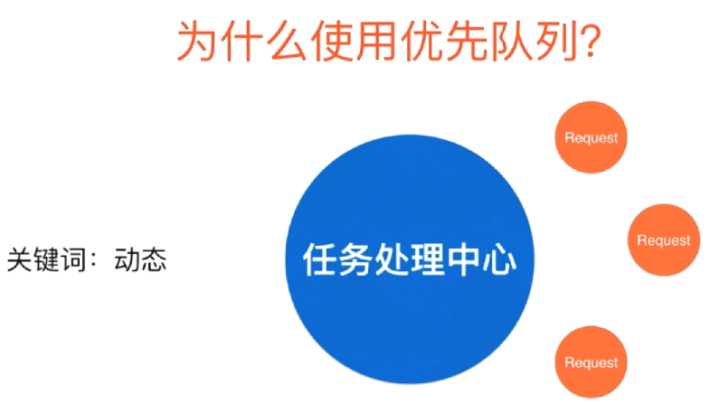

# 堆排序 Heap Sort

## 堆和优先队列 Heap and Priority Queue

### 优先队列(priority queue)

普通的队列是一种先进先出的数据结构，元素在队列尾追加，而从队列头删除。在优先队列中，元素被赋予优先级。当访问元素时，具有最高优先级的元素最先删除。优先队列具有最高级先出 （first in, largest out）的行为特征。通常采用堆数据结构来实现。

优先队列这种概念在计算机中被大量的使用，最典型的应用救世主哎操作系统中执行任务，众所周知我们的操作系统要同时执行多个任务，可是实际上操作系统是将cpu的指向周期划成时间片，在每个时间片里只能执行一个任务，究竟要执行哪个任务呢？答案就是每一个任务都有一个优先级，操作系统会动态的每一次选择优先级最高任务进行执行。如我我们想要动态的选择优先级最高的任务去执行，我们就需要使用优先队列。也就是说操作系统中每一个任务都进这个优先队列，入户由优先队列动态的调度哪一个任务优先执行。

这里要注意，上述描述中有一个非常重要的关键字：动态。我们可以想象，如果我们的任务永远都是固定的话，那么我们完全可以把这些任务排一次序，然后按优先级高低依次进行任务执行。可是实际上，单我们使用优先队列的时候，情况通常都会非常复杂

比如在这个图例中，这个蓝色的大圆圈就是一个任务处理中心，可以把它想象成cpu，由它来处理所有的请求。而红色的圆圈是一个一个的请求。单我们选择执行了某一个请求之后，下一步可能不是简单的去继续执行其他的请求，因为与此同时又可能会来很多新的任务。当然真正的操作系统情况会更加复杂。不但会来新的任务，旧的任务的优先级本身也可能会发生改变。因此在这种情况下，一次性的将所有任务进行排序，然后依次执行是不现实的。如果我们真要使用排序的方式来解决这个问题的话，那么很有可能就会是每一次运行完了某一个任务之后，都要对剩下的任务进行一次新的排序，这样做耗时又是巨大的。

这种模型不仅仅适用于操作系统，在我们的生活中，到处都存在这样的模型。

之前我们都在强调，使用有线队列非常适合处理这种数据是动态的情况，可是实际上在一些静态的问题求解上，优先队列也是非常有优势的。比如说，现在有100w个元素，我想在这100w个元素中选出前100名。把这个问题抽象一下就是有N个元素，我想在这N个元素中选出前M个名。怎么做？首先一个最基本的解法就是对这N个元素进行排序，然后取前M个元素。这样时间复杂度就是O(n log n)。但是如果我们使用了优先队列的话，我们可以把这个算法的时间复杂度降低到O(N log M)这个级别。在这个例子中，如果N是100w，M是100的话，这样的一个优化将使得我们的算法块10几倍。当然，如果我们的N更大的话，这个优化的性能优势将会更加明显。

那么优先队列是如何将O(N log N)优化到O(N log M)的呢？这就涉及到优先队列的实现问题了。

### 优先队列主要操作

首先对于队列来说，他的主要操作就是两个，一个是入队，一个出队。优先队列也不例外，从我们用户的角度来看，优先队列最大的特点就是出队的时候，是取出优先级最高的元素。

那么如何实现一个优先队列呢？实际上我们使用之前的顺序的数据结构（也就是用数组这样的数据结构）就完全可以实现一个优先队列，在这里有两个思路，第一个思路我们使用一个普通的数组，入队非常简单，我们使用O(1)的时间直接把一个数据扔到数组末尾就好了。在出队的时候，我为了取得优先级最高的数据，就需要扫描一遍整个数组，然后拿出优先级最高的那个元素出队。

当然也许还有人会想到，我使用一个顺序的数组，也就是不断维护这个数组的有序性，这样一来，我的元素入队的时候，就需要使用O(n)的时间，来找到入队元素合适的插入顺序。一旦我们维护了整个数组它是有序的，那么出队就非常简单了，我们只需将队列头部那个优先级最高的元素出队就好了。但是使用这样的数组实现优先队列都是有局限性的。

我们使用堆这种数据结构来实现优先队列话，就能很好的平衡入队和出队的时间复杂度。使用这种数据结构我们能将入队和出队的时间效率都变成O(lg n)这个级别的。虽然我们可以看到这个数据结构在入队是慢于普通数组，出队是慢于顺序数组，可是平均来讲，使用堆这种数据结构来维持一个优先队列来完成一个系统任务，它所需要的时间效率要大大的低于使用数组来进行实现。

对于极端的情况，单我们总共有N个请求，对于普通数组或者顺序数组，最差的情况的时间复杂度是O(n^2)这个级别的。而我们使用堆这种数据结构，他的时间复杂度则可以稳定在O(n log n)这个级别。

## 堆的基本存储

通过上面的介绍，我们知道，要在堆中实现插入和删除操作，都是log n级别的，通过这点，我们不难知道，堆一定相应的是一个树形的数据结构。最为经典的一个对的树形结构实现叫做 二叉堆（Binary Heap）,相对应的它长得就像一个二叉树一样。所谓的二叉树就是每一个节点可以有两个子节点。

### 概念及其介绍

堆(Heap)是计算机科学中一类特殊的数据结构的统称。

堆通常是一个可以被看做一棵完全二叉树的数组对象。

堆满足下列性质：

- 堆中某个节点的值总是不大于或不小于其父节点的值。
- 堆总是一棵完全二叉树

### 堆的结构图示

