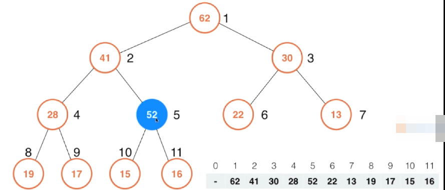

# 堆排序 Heap Sort

## 堆和优先队列 Heap and Priority Queue

### 优先队列(priority queue)

普通的队列是一种先进先出的数据结构，元素在队列尾追加，而从队列头删除。在优先队列中，元素被赋予优先级。当访问元素时，具有最高优先级的元素最先删除。优先队列具有最高级先出 （first in, largest out）的行为特征。通常采用堆数据结构来实现。

优先队列这种概念在计算机中被大量的使用，最典型的应用救世主哎操作系统中执行任务，众所周知我们的操作系统要同时执行多个任务，可是实际上操作系统是将cpu的指向周期划成时间片，在每个时间片里只能执行一个任务，究竟要执行哪个任务呢？答案就是每一个任务都有一个优先级，操作系统会动态的每一次选择优先级最高任务进行执行。如我我们想要动态的选择优先级最高的任务去执行，我们就需要使用优先队列。也就是说操作系统中每一个任务都进这个优先队列，入户由优先队列动态的调度哪一个任务优先执行。

这里要注意，上述描述中有一个非常重要的关键字：动态。我们可以想象，如果我们的任务永远都是固定的话，那么我们完全可以把这些任务排一次序，然后按优先级高低依次进行任务执行。可是实际上，单我们使用优先队列的时候，情况通常都会非常复杂

比如在这个图例中，这个蓝色的大圆圈就是一个任务处理中心，可以把它想象成cpu，由它来处理所有的请求。而红色的圆圈是一个一个的请求。单我们选择执行了某一个请求之后，下一步可能不是简单的去继续执行其他的请求，因为与此同时又可能会来很多新的任务。当然真正的操作系统情况会更加复杂。不但会来新的任务，旧的任务的优先级本身也可能会发生改变。因此在这种情况下，一次性的将所有任务进行排序，然后依次执行是不现实的。如果我们真要使用排序的方式来解决这个问题的话，那么很有可能就会是每一次运行完了某一个任务之后，都要对剩下的任务进行一次新的排序，这样做耗时又是巨大的。

这种模型不仅仅适用于操作系统，在我们的生活中，到处都存在这样的模型。

之前我们都在强调，使用有线队列非常适合处理这种数据是动态的情况，可是实际上在一些静态的问题求解上，优先队列也是非常有优势的。比如说，现在有100w个元素，我想在这100w个元素中选出前100名。把这个问题抽象一下就是有N个元素，我想在这N个元素中选出前M个名。怎么做？首先一个最基本的解法就是对这N个元素进行排序，然后取前M个元素。这样时间复杂度就是O(n log n)。但是如果我们使用了优先队列的话，我们可以把这个算法的时间复杂度降低到O(N log M)这个级别。在这个例子中，如果N是100w，M是100的话，这样的一个优化将使得我们的算法块10几倍。当然，如果我们的N更大的话，这个优化的性能优势将会更加明显。

那么优先队列是如何将O(N log N)优化到O(N log M)的呢？这就涉及到优先队列的实现问题了。

### 优先队列主要操作

首先对于队列来说，他的主要操作就是两个，一个是入队，一个出队。优先队列也不例外，从我们用户的角度来看，优先队列最大的特点就是出队的时候，是取出优先级最高的元素。

那么如何实现一个优先队列呢？实际上我们使用之前的顺序的数据结构（也就是用数组这样的数据结构）就完全可以实现一个优先队列，在这里有两个思路，第一个思路我们使用一个普通的数组，入队非常简单，我们使用O(1)的时间直接把一个数据扔到数组末尾就好了。在出队的时候，我为了取得优先级最高的数据，就需要扫描一遍整个数组，然后拿出优先级最高的那个元素出队。

当然也许还有人会想到，我使用一个顺序的数组，也就是不断维护这个数组的有序性，这样一来，我的元素入队的时候，就需要使用O(n)的时间，来找到入队元素合适的插入顺序。一旦我们维护了整个数组它是有序的，那么出队就非常简单了，我们只需将队列头部那个优先级最高的元素出队就好了。但是使用这样的数组实现优先队列都是有局限性的。

我们使用堆这种数据结构来实现优先队列话，就能很好的平衡入队和出队的时间复杂度。使用这种数据结构我们能将入队和出队的时间效率都变成O(lg n)这个级别的。虽然我们可以看到这个数据结构在入队是慢于普通数组，出队是慢于顺序数组，可是平均来讲，使用堆这种数据结构来维持一个优先队列来完成一个系统任务，它所需要的时间效率要大大的低于使用数组来进行实现。

对于极端的情况，单我们总共有N个请求，对于普通数组或者顺序数组，最差的情况的时间复杂度是O(n^2)这个级别的。而我们使用堆这种数据结构，他的时间复杂度则可以稳定在O(n log n)这个级别。

## 堆的基本存储

通过上面的介绍，我们知道，要在堆中实现插入和删除操作，都是log n级别的，通过这点，我们不难知道，堆一定相应的是一个树形的数据结构。最为经典的一个对的树形结构实现叫做 二叉堆（Binary Heap）,相对应的它长得就像一个二叉树一样。所谓的二叉树就是每一个节点可以有两个子节点。

### 概念及其介绍

堆(Heap)是计算机科学中一类特殊的数据结构的统称。

堆通常是一个可以被看做一棵完全二叉树的数组对象。

堆满足下列性质：

- 堆中某个节点的值总是不大于或不小于其父节点的值。
- 堆总是一棵完全二叉树

### 堆的结构图示

上面说到堆是一个二叉树，那这个二叉树有什么特点呢？

特点1：在这个人二叉树上，任何一个节点，都不大于他的父亲节点

除此之外，它还要满足一个性质，那就是它必须是一颗完全的二叉树。所谓完全二叉树就是指，首先这是一棵二叉树，对于这棵二叉树，除了最后一层节点之外，其他层节点个数必须是最大值。我们知道，对于一棵二叉树来说，第一层最多只能有一个节点，第二层有两个节点，第三层最多有4个节点，以此类推。在最后一层，虽然他的节点个数可以不是一个最大值，但是所有的节点都必须集中在左侧。就和下面这个图示一样，这个二叉树最后一层有3个节点，这3个节点全都集中在了左侧。满足这样性质的二叉树就叫完全二叉树。

> 说父节点的值大于子节点的值，这个说法不意味着层数越高，他的值就一定越大

我们的堆这种结构还必须是一个完全二叉树，当满足了这两个性质之后，我们就构建了一个堆。特别说一点，这样的堆我们管他叫做最大堆，之所以叫它最大堆，是因为树顶的位置总是保存着这棵树中最大的元素。

以此类推我们可以得出最小堆的概念，那就是对于任意一个节点来说，他的值都不小于其父节点的值，越在上面的元素相应的也就越小。

**总结：**

堆是一种经过排序的 完全二叉树 ，其中任一非终端节点的数据值均不大于（或不小于）其左子节点和右子节点的值。

最大堆和最小堆是 二叉堆 的两种形式。

最大堆：根结点的键值是所有堆结点键值中最大者。

最小堆：根结点的键值是所有堆结点键值中最小者。

而最大-最小堆集结了最大堆和最小堆的优点，这也是其名字的由来。

最大-最小堆是最大层和最小层交替出现的 二叉树 ，即最大层结点的儿子属于最小层，最小层结点的儿子属于最大层。

以最大（小）层结点为根结点的子树保有最大（小）堆性质：根结点的键值为该子树结点键值中最大（小）项。

## 堆的实现

堆在计算机中有一个非常经典的实现方式，那就是使用数组来存储一个二叉堆。**我们之所以可以使用数组来存储一个二叉堆，正是因为堆是一棵完全二叉树**。我们可以尝试给这个二叉树自上到下，自左到右的给每一个节点标记一个序列号，第一个顶点节点标记1，下面一层2， 3，再下面一层4， 5， 6， 7。以此类推，相当于是依照层序，自上到下，之后再在每一层自左到右的标记上序列号。这样标上以后，我们就不难看出来，对于每一个节点来说，它的左节点的序列号都是父节点的二倍。1号的左节点是2，2号的左节点是4，4号的左节点是8，3号的左节点是6, 5号的左节点是10。而对于右节点他的序列号就是自身节点序列号的2倍+1, 1的右节点是3, 3的右节点是7，2号的右节点是5等等等等。。

当然我们也可以将根节点从0开始标记，这都是可以的，只不过节点标记的计算方式会稍微有所改变。但是对于堆来说，最经典的一个就是根节点从1开始标记这种方式。这样一来我们就可以将所有的数据存在数组中，对应的我们刚刚标记的这个索引就是数组的索引。在这里要注意，因为我们的堆是从1开始标记，所以这里0号索引是不使用的。

有了这样一个数组之后，我们就可以很轻松的用这样一个公式，找到数组中每一个索引中的元素它相应的左孩子和右孩子的节点。比如对于i索引的节点，我们只需要找`2*i`和`2*i+1`索引对应的节点就是其左孩子和右孩子。同理对于每一个元素而言，我们也可以很轻松的找到它的父节点的元素，我们只需要使用`i/2`就是i索引的父节点所在的索引。（这里这个除法是使用的计算机的除法，如果除不开就会取正）

### Shift Up

如何向一个最大堆中添加一个新的元素？这涉及到堆中的一个核心操作，我们通常管他叫做Shift Up.

如上所示是一个已经存在的堆，蓝色元素表示我们要往这个最大堆中添加的新元素。如果有一个元素比如上面的52要加入这个最大最，通过上面的介绍，我们也已经知道，这个堆我们使用了一个数组进行表示，所以相应的在这个最大堆中添加一个新的元素，也就相当于在这个数组的末尾添加一个元素。所以可以看到此时52就添加到了索引为11的位置。这样一来这个样子的堆就不满足最大堆的定义了。因为对于52这个节点来说，他的父节点16这个值，比52还小，违背了堆的定义。所以下面就需要进行一系列操作来维护堆的定义。

怎么做呢？很简单，因为在我们加入这个新元素之前，整个树是一个最大堆，所以问题肯定出在了我们新加入的这个元素上，我们需要做的就是将我们新加入的这个元素调整到一个合适的位置，使得整个二叉树依然保持最大堆的性质。

怎么调整这个位置呢？也很简单，只需要看我们新加入的这个元素，和他的父节点比，是不是比我们新加入的这个元素小？比如这里16比52小，违背了最大堆的定义，所以将16和52进行交换。交换完成之后，在这个字树部分就满足了最大堆的定义。

然后下一步，我们新的这个52的位置有可能还是会和他的上面父节点不满足最大堆的定义，所以我们下一步要做的就是看看52现在的父节点是否比52还要小，在这里他的父节点41比52还要小，所以他们又要交换一下位置。现在我们的二叉树就变成了这个样子。交换完成之后，这部分子树就满足了最大堆的定义。

然后交换完成之后，52新的位置有可能还会和其父节点不满足最大堆的性质，所以我们还得继续比较一下。发现此时52比其父节点62小，那么此时52就不用再挪动位置了。

经过这样的变动，我们就依旧维持了最大堆的定义。可以看到52从最下面逐步上升的过程就是我们说的Shift Up的过程。通过这样一个方式，我们成功的向最大堆中添加了一个新的元素。