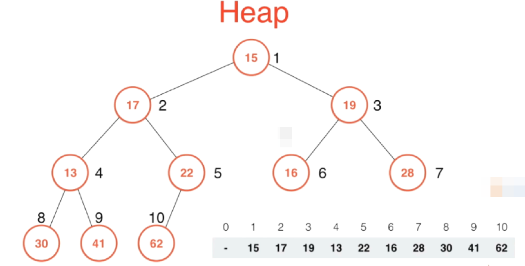
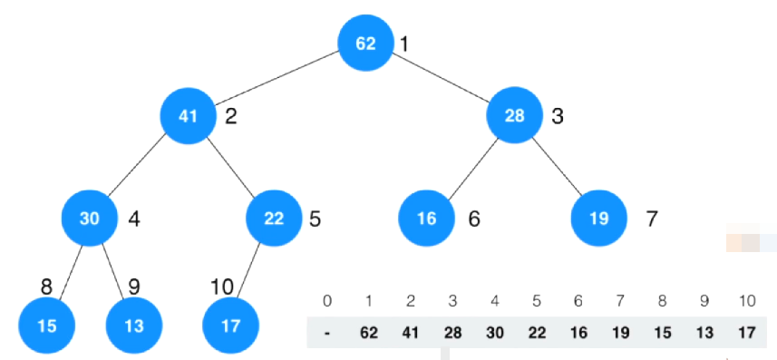
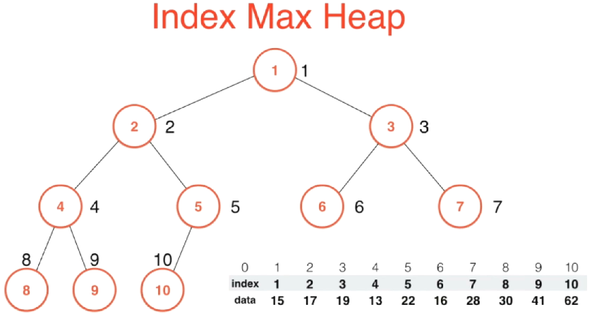
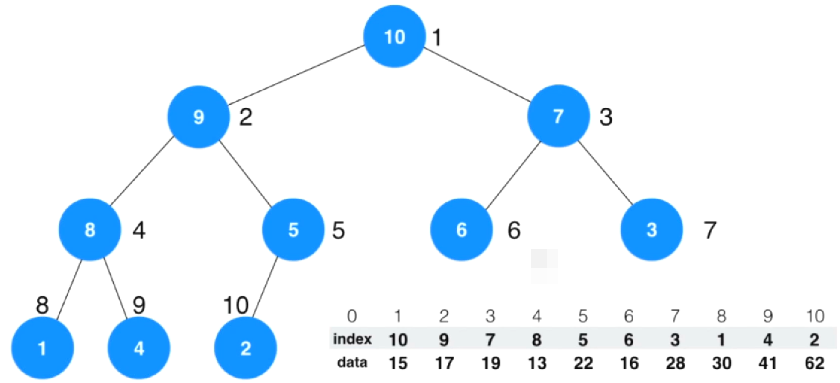

# 索引堆 Index Heap

新来看一下之前的普通的堆有什么问题，然后引出为什么要引入索引堆这种新的数据结构



首先，我们给定一个数组，然后要将这个数组Heapify（数组建堆），最后构建完成之后，结果就是如下所示。



对比Heapify前后，发现对于这个数组而言，数组中的元素发生了改变。正是因为这些元素位置的改变，才使得我们能够将现在的这个数组看做是一个堆。可是在我们构建堆的过程中，改变元素的位置会有一些局限性。

首先第一个局限性是，如果我们的元素是非常复杂的对象结构的话，最典型的例子就是比如说我们的元素是字符串的话，那么交换这些元素本身就需要耗费大量的机器性能。（比如我们每个元素都是一篇有10W字的文章的话，那么交换这些巨型字符串对象，会产生大量的性能消耗），不过这种性能消耗还是可以使用技术手段来进行解决的。

另外一个问题相对的就更加致命，由于我们整个元素在这个数组中的位置发生了改变，使得当我们的堆建成以后，很难在索引到它，当我们难以索引到它的时候，我们就很难去该变它。举个例子：比如我们数组中这些元素表示的是一个一个的系统任务，可能在初始的时候，数组的索引表示的是系统进程的id号。可是当我们把这个系统任务数组构建成堆以后，这些任务索引和系统任务之间就不再产生关联了。那如果这个时候，有这么一个需求，那就是我想将原来进程id（索引）为6的这个进程他的优先级提一下，该怎么做呢？这个操作就会变得非常的困难。在以前的数组中，我们可以使用O（1）的性能效率直接将这个任务通过索引提取出来，但是由于我们把它组建成堆以后，元素位置发生了改变，任务和索引之间不在有关联关系。当然也许有人会说，那把这些元素加一个字段表示进程id就好了，那这样是可以解决问题，可是这样做了之后，我们要想拿到某个进程id的任务，就得把这个数组遍历一遍，这样也是低效率的。

为此我们就需要引入索引堆这个概念

## 索引堆概念



具体什么是索引堆呢？这里依旧以最大索引堆为例

对于索引堆来说，我们将数据和索引这两部分分开存储，而真正表征堆的这个数组是由这个索引构建成的。如上这个数组在图示中构建成的一个二叉树，这个二叉树每一个节点上所存储的是这节点对应的索引号，单我们将这个数组构建成一个堆之后，这个数组就相应的变成了下图这个样子。从图中可以看到，对于data这个域来说，他的内容没有发生改变，而真正改变的是index这个域，这个index数组（索引数组）发生了改变，形成了一个堆。这个堆怎么解读呢？首先看堆顶的元素，index值为10，表示的就是data域中数组索引为10的元素（这里就是62）所在的节点。这样一来我们可以观察到索引堆的两个好处，第一就是构建堆的过程只是索引值发生交换，索引就是一个非常简单的int型，如果他的data是非常复杂的对象类型的话，那么我们交换的时候只交换索引效率是非常高的。第二点也是很重要的一点，如果我们现在想堆这个堆中的某个数据进行操作，我们就可以直接很容易的去索引这个相应的索引号的data数据去进行操作。



这里也可以很容易的和之前的堆作比较，建立一个堆的过程其实和之前是差不多的，只不过我们在比较的时候是比较索引号对应的data里的元素进行比较，然后交换的时候是使用索引进行交换。

**简单总结**

索引堆是对堆这个数据结构的优化。

索引堆使用了一个新的 int 类型的数组，用于存放索引信息。

相较于堆，优点如下：

- 优化了交换元素的消耗。
- 加入的数据位置固定，方便寻找。

如果堆中存储的元素较大，那么进行交换就要消耗大量的时间，这个时候可以用索引堆的数据结构进行替代，堆中存储的是数组的索引，我们相应操作的是索引。

### 最大索引堆实现

```c++
#ifndef INDEX_MAX_HEAP_H
#define INDEX_MAX_HEAP_H

#include <iostream>
#include <cassert>
#include <ctime>
#include <cmath>
#include <algorithm>

using namespace std;


// 索引最大堆

template<typename Item>
class IndexMaxHeap
{
    
private:
    Item* data;
    int* indexes;   // 存储索引堆中的索引
    int count;
    int capacity;
    
    // 将K这个索引的位置的元素尝试着向上移动来维持堆的定义
    void shiftUp(int k)
    {
        // 我们每一次就是要看一下索引K这个位置，他的父节点（k/2）
        // 相应的元素是不是比k这个位置的元素还要小
        // 同时有索引存在，就需要考虑越界问题，这里我们就需要保证k是大于1的
        // 也就是k的取值最多到2，k到2的时候，就和k/2 = 1的那个父节点（也就是最顶部的节点）
        // 进行最后一次比较。这轮比较完成之后，k=1已经是这个树的跟节点了，已经不需要继续再进行比较了。
        
        // 这里要注意，首先我们比较的依旧是data里的数据，但是这个时候因为是索引堆，堆数组中存放的是data数据对应的索引
        // 所以这个时候我们就需要通过k这个堆节点索引去index里找到那个真正的data元素的索引（这里有点绕，需要好好理解）
        // 所以这里就是为什么我们要拿到data数据需要套一层indexes这个数组
        while (k > 1 && data[indexes[k / 2]] < data[indexes[k]])
        {
            // 如果父节点的元素比k节点的元素还要小，说明此时违背了最大堆的定义。
    
            // 那么就把这个节点和其父节点进行位置交换
            // 注意这里进行交换的时候，不是交换data数组里的数据，（因为本身索引堆就是为了避免直接操作data数据）
            // 这里交换的是交换data的索引数据（本身我们索引堆维护的也是这个索引数组）
            swap(indexes[k], indexes[k / 2]);
            // 然后更新k的值
            k /= 2;
        }
    }

  void shiftDown(int k)
  {
    // 我们什么时候应该继续进行shiftDown操作呢？
    // 首先k这个索引所在的节点应该有孩子。怎么判断有孩子？在一个完全二叉树中，只要他有左孩子，那么我就能确定它有孩子
    // 这是因为在一个完全二叉树中它不可能只有右孩子没有左孩子
    while (2 * k <= count)
    {
      // 在这种情况下，我们要做的事情就是比较它的两个左右孩子，谁大和谁换。
      // 这个时候要注意，有可能这个节点没有右孩子。所以这里需要把这个边界情况考虑上

      // 为此我这里设置一个新的变量索引为j，j初始化成 2*k,这个j表示扫描意思呢？
      // 表示在此轮循环中，data[k]这哥元素应该喝data[j]这个位置元素交换
      // 因为它有左孩子，所以就有可能是和左孩子交换位置，这个就是初始化的值为 2*k
      int j = 2 * k;

      // 之后我们就判断一下它有没有右孩子，他的右孩子表示成 j+1 就可以了
      // 如果j+1<=count，说明它有右孩子，然后在右孩子存在的基础上比较两个左右孩子的大小
    //   同样的，我们对data的任何操作都不能直接通过之前的一层索引直接指向data元素
    // 都需要通过indexes的间接索引去获取这个元素的索引，然后才能根据这个索引去拿到data元素
      if (j + 1 <= count && data[indexes[j + 1]] > data[indexes[j]])
      {
        // 如果右孩子比左孩子大，那么这里就把j更新成j+1.
        // 因为j是要进行交换的索引，注意这里谁大谁就是要交换的值
        j = j + 1;
      }
      // 继续判断，单前k节点是否比他要进行交换的子节点小，小就交换
      if (data[indexes[k]] < data[indexes[j]])
      {
        // 因为索引堆维护的是索引数组，所以这里交换的就是索引的值
        swap(indexes[k], indexes[j]);
        // 交换完成之后，我们k这个索引就变到了j这个位置
        k = j;
      }
      else
      {
        break;
      }
    }
  }

public:
  // 构造函数。这个构造函数最重要的功能就是为上面存储数据的数组开辟空间
  IndexMaxHeap(int capacity)
  {
    data = new Item[capacity + 1];
    // 注意这里数组空间需要 + 1，是因为我们这个堆是从索引1开始标记，0号标记我们是不使用的
    
    indexes = new int[capacity+1];
    
    count = 0;

    // 这里要注意，因为我们的这个数组值开辟了一次空间，也就是我们这个数组最多容纳 capacity
    // 这么多个元素，所以在我们的insert函数中也隐含着数组越界的问题
    this->capacity = capacity;
  }

  // 构造函数，该构造函数我们传入一个数组参数arr和数组元素个数n
  IndexMaxHeap(Item *arr, int n)
  {
    // 这个构造函数，首先依旧是需要对data这个数组指针开空间
    data = new Item[n + 1];
    capacity = n;
    for (int i = 0; i < n; i++)
    {
      // 注意这里，因为我们data是从1开始的，所以在赋值的时候需要i+1，跳过第0个元素
      data[i + 1] = arr[i];
    }
    // 数据遍历赋值完毕之后，我们的堆数组中就有n个元素了
    count = n;

    // 之后就开始我们的 Heapify过程了
    // 从count/2开始（也就是完全二叉树的第一个非叶子节点索引，以后没次从该索引-1都是非叶子节点）
    for (int i = count / 2; i >= 1; i--)
    {
      // 然后每次对这个i索引的节点进行shiftDown操作
      shiftDown(i);
    }

    // 执行完上面这次循环之后，我们的data这个数组就被建成了一个最大堆
  }

  ~MaxHeap()
  {
    delete[] data;
    delete[] indexes;
  }

  // 查询堆中的元素个数
  int size()
  {
    return count;
  }

  // 查询是否是一个空堆
  bool isEmpty()
  {
    return count == 0;
  }

  // 往索引最大堆中添加一个新的元素
    // 这里因为是一个索引堆，所以在往一个索引堆中插入元素的时候，还需要同时指定该元素的索引
    // 同时这里需要注意，因为这里我们的索引堆依旧是从1开始的，但是索引对于外部用户来说，依旧是正常的从0开始的
    // 所以我们需要在索引堆的内部来处理这个差异
  void insert(int i, Item item)
  {

    assert(count + 1 <= capacity);
    assert(i+1 >= 1 && i+1 <= capacity);
    
    // 检测完索引越界后，将i+1，让他从0开始的索引变成从1开始
    i+=1;
    
    // 然后我们就可以插入这个元素了
    // 对于索引堆来说，这里的data就是存的索引i对应的那个用户指定的元素值
    data[i] = item;
    // 然后相应的 indexes[count+1]的位置添加上传入的这个新的索引i
    indexes[count+1] = i;
    // 我们的堆中多了一个元素，那么我们的计数器count就可以++
    count++;

    // 因为我们新加入的元素有可能破坏了堆的定义，所以这里调用我们提供的shiftUp方法来将这个元素向上移动来保持堆的定义
    shiftUp(count);
  }

  // 将堆中的最大值取出来。
  Item extractMax()
  {
    // 首先我们要从堆中取出一个最大值，第一步就是保证我们的堆不为空
    assert(count > 0);

    // 注意此时堆顶的元素不是data[1]，而是data[indexes[1]]
    Item ret = data[indexes[1]];

    // 将堆顶元素取出后，首先先将堆中最后一个元素放在堆顶位置
    // 注意，同样的，交换的时候也是交换的indexes这个索引数组中的元素
    swap(indexes[1], indexes[count]);
    // 交换完成之后，count--，表示最后这个元素（已经取出来的这个元素）我们再也不进行考虑了
    count--;

    // 然后要做的事情就是调用我们的shiftDown这个函数，想办法将这第一个元素向下挪，放在它合适的位置
    // 维持我们最大堆的性质。
    shiftDown(1);

    return ret;
  }
  
  // 返回堆中最大元素的索引（因为获得了这个索引，就可以直接在data中找到这个元素）
  int extractMaxIndex()
  {
    // 首先我们要从堆中取出一个最大值，第一步就是保证我们的堆不为空
    assert(count > 0);

    // 注意此时堆顶的元素不是data[1]，而是data[indexes[1]]
    // 对应的，如果只是需要最大元素的索引值，那就是 indexes[1]
    // 因为我们希望用户使用的索引是正常的从0开始的索引，所以这里需要将得到的索引值-1
    // 将我们类里从1开始的索引转为从0开始的索引
    int ret = indexes[1] - 1;

    // 将堆顶元素取出后，首先先将堆中最后一个元素放在堆顶位置
    // 注意，同样的，交换的时候也是交换的indexes这个索引数组中的元素
    swap(indexes[1], indexes[count]);
    // 交换完成之后，count--，表示最后这个元素（已经取出来的这个元素）我们再也不进行考虑了
    count--;

    // 然后要做的事情就是调用我们的shiftDown这个函数，想办法将这第一个元素向下挪，放在它合适的位置
    // 维持我们最大堆的性质。
    shiftDown(1);

    return ret;
  }
  
    //   同样，因为我们这个是一个最大索引堆，所以用户就还能得到一个很方便的操作
    // 通过给定一个索引值i，去找到对应的数组元素
    Item getItem(int i)
    {
        assert(i+1 <= capacity);
        // 同样，对于用户来说它使用的索引是从0开始的，但是我们类里的是从1开始的
        // 所以这里要+1
        return data[i];
    }
    
    // 最后一个操作
    // 外部用户希望将索引为i的这个内容，修改成一个新的item
    // 注意这个时候，不仅仅是修改data值这么简单那，还需要维护我们的最大索引堆的定义
    void change(int i, Item newItem)
    {
        // 外部用户从0开始索引，在堆内部是从1开始，所以这里+1改为从1开始索引
        i+=1;
        
        data[i] = newItem;
        
        // 这么维护改变data值后索引堆的定义？
        // 很简单，我们只需要对data[i]这个元素的索引进行一下shiftUp和shiftDown操作
        // （也就是尝试堆这个索引进行一下向上挪和向下挪的操作）
        // 但是这里注意，如果我们需要正确的进行shiftUP和shiftDown操作，我们就需要找到正确的
        // data[i]这个i节点所在索引堆indexes中的索引值
        // 也就是找到 indexes[j] = i; 那么j就是data[i]在索引堆中的位置
        // 找到这个j之后，就可以很简单的指向shiftUp(j)和shiftDown(j)
        
        // 那怎么找到这个j呢？最简单的方法就是for循环遍历一遍indexes数组
        for(int j = 1; j<= count; j++)
        {
            if(indexes[j] == i)
            {
                shiftDown(j);
                shiftUp(j);
                return;
            }
        }
        // 这样一来我们就将i这个索引的data修改为了新的item，同时维护了我们索引堆的性质
        
        
    }


};

#endif
```

这里分析一下这个 change 的时间复杂度，首先我们需要将indexes遍历一遍，这个时间复杂度是O(n)，然后下面的shiftDown和shiftUp 操作是O(log n)，所以这里这个函数的时间复杂度他最差是n + log n级别的，也就是一个O(n)级别的函数

这里需要注意一个点，我们堆这种数据结构，之前的插入操作和删除操作都是O(log n)级别的，使得它的性能优势非常明显，现在我们修改一个元素它的时间复杂度变成了O(n)，那么对于用户来讲，在外部操作的时候，进行n个堆操作，在最坏的情况下，总的时间就会变成O(n^2)这个级别的，这对于堆来说是不可以接受的。

那么change这个函数是否可以进行优化呢？接下来我就将完成这个问题的解决，彻底完成最大索引堆的编写