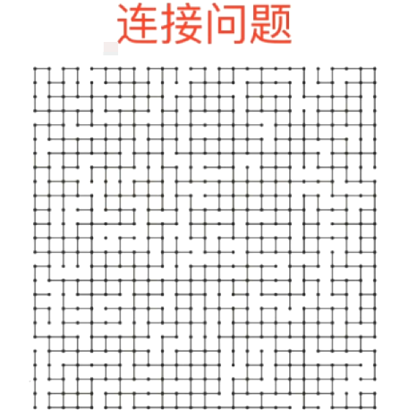

# 并查集Union Find

### 概念及其介绍

并查集是一种树型的数据结构，用于处理一些不相交集合的合并及查询问题。

并查集的思想是用一个数组表示了整片森林（parent），树的根节点唯一标识了一个集合，我们只要找到了某个元素的的树根，就能确定它在哪个集合里。

### 适用说明

并查集用在一些有 **N** 个元素的集合应用问题中，我们通常是在开始时让每个元素构成一个单元素的集合，然后按一定顺序将属于同一组的元素所在的集合合并，其间要反复查找一个元素在哪个集合中。这个过程看似并不复杂，但数据量极大，若用其他的数据结构来描述的话，往往在空间上过大，计算机无法承受，也无法在短时间内计算出结果，所以只能用并查集来处理。

### 连接问题 Connectivity Problem

并查集可以非常高效的回答一类称之为连接问题的问题。



首先我们来可视化的看这么一个问题，在这个图上有若干个点，点与点之间他们有可能相连，如果在图中任意指定两个点，问这两个点之间是否是相连的？相信人眼只是通过看这个图，一些点是否相连是很难看出来的，在这种时候就需要使用计算机，可是计算机如何高效的回答这个问题呢？答案就是使用并查集这种数据结构。

连接问题在实际生活中有着非常重要的作用，它最重要的一个作用就是可以判断网络中节点间的连接状态。这里这个网络不是具体指现实生活中的上网浏览的网络，而是泛指一个抽象的概念，指代用户之间形成的网络。比如好友关系网络，人际关系网络。一个大型数据库中，有很多的电影，书籍，音乐等等，这些多媒体之间也能形成网络。

并查集还有另外一个很重要的作用，就是可以实现数学中的集合类。并查集这个并，就是实现一个并集的意思，如果我们使用数学的集合的思路，来解决问题，经常使用并集这样的操作，同时需要查询元素在集合中的状态的话，并查集也是一个非常好的选择。

## 并查集

首先我们来看并查集支持什么样的操作。对于一组数据来说，并查集主要支持两个操作：(这两个操作也就是并查集名字的由来)

> union(p, q);		将p和q两个元素合并在一起，也就是所谓的连接起来。

> find(p);		也就是查的意思。我们利用find来查p这个元素是在哪个组中。

有了上面这两个操作，也就能轻易的回答这样一个问题：

> isConnected(p, q);	传入p，q这两个元素，来看p， q是否是连接的。


对于这样的一个需求，我们最简单的一个数据表示方式就是使用一个数组就好了。数组的索引用来表示元素，0-9一共表示10个元素，那么我们怎么来表示这些元素之间的连接关系呢？我们可以给每一个元素附上一个值，如上图 **0-4** 下面都是 **0**，**5-9** 下面都是 **1**，表示 **0、1、2、3、4** 这五个元素是相连接的，**5、6、7、8、9** 这五个元素是相连的


使用这种方式再举个例子，再如上图 **0、2、4、6、8** 下面都是 **0** 这个集合，表示 **0、2、4、6、8** 这五个元素是相连接的，**1、3、5、7、9** 下面都是 **1** 这个集合，表示 **0，1、3、5、7、9** 这五个元素是相连的。


在这样的一个表示下，我们如何找到每一个元素它所属的这个组别的id号呢？对于每一个id来讲，我们直接访问它对应的这个id值就好了。也正因为如此，这样的一个实现，也被叫做Quick Find，也就是实现Find这个操作是非常快的（直接数组索引拿值），只需要使用O(1)的时间复杂度就够了。


quickFind这种情况下，实现find操作很容易，但是我们要如何实现Union这个操作呢？比如现在我们想把元素1，和元素2并在一起，那么接下来我们要做的事情就是遍历一遍id，使得元素1对应的id是1，元素2对应的id是0，这个时候，我们要么把数组中所有id为1的元素的id都改为0，要么把所有id为0的元素的id都改为1。这样一来，这两个元素才真正的并在一起。在我们这个例子中，我们任意选择一个奇数或者任意选择一个偶数，把他们连在一起，那么所有的元素也就跟着联在了一起，他们的id号就变成一样的了。通过这个例子，我们也能感受到，我们的union(并)这个操作，他的时间复杂度是O(n)级别的。

```c++
class UnionFind
{

private:
  int* id;    // 对于这个并查集，它用于表示数据的方式，是使用一个数组
  int count;  // 当前这个UnionFind有多少个元素

public:
  // 该构造函数需要用户传入一个n，表示单前这个并查集有多少元素
  UnionFind(int n)
  {
    count = n;
    id = new int[n];

    // 在初始情况下，每一个元素都是自己一个独立的组
    // 所以这里初始化的时候，让id的每一个元素都等于i，换句话说，没有任何两个值他们的id是相同的，也就是初始的时候没有任何两个元素连接在一起
    for(int i = 0; i<n; i++)
      {
        id[i] = i;
      }
  }

  ~UnionFind()
  {
    delete[] id;
  }

public:
  int find(int p)
  {
    assert(p>=0 && p<count);
    return id[p];
  }

  bool isConnected(int p, int q)
  {
    return find(p) == find(q);
  }

  void unionElements(int p, int q)
  {
    assert(p >= 0 && p < count);
    assert(q >= 0 && q < count);
    // 首先用find（o）来找到p相对应的id，用find（q）来找到q的id
    int pID = find(p);
    int qID = find(q);
    if(pID==qID)
    {
      // 说明这两个元素已经是相连的了
      return;
    }

      // 这里我们从头到尾扫描了一遍整个数组，所以他的时间复杂度是O(n)级别的
    for(int i = 0; i < count; i++)
      {
        if(id[i] == pID)
        {
          id[i] = qID;
        }
      }
    
  }


};
```

然后测试现在实现的这个版本的并查集操作10000个元素的速率。（因为这里测试用例是做了并和查这两个操作，所以测试结果答应20000ops。


然后测试10w的数据量，发现立马飙升到6s左右。这个效率其实也是不可以接受的


由于Union这个操作在我们现在这个实现中，他的时间复杂度是O(n)级别的，所以我们执行n个O(n)级别的操作，这个时间复杂度就变成了O(n^2)这个级别。

并查集还有没有优化空间呢？答案肯定是有的，接下来就介绍一种新的，非常巧妙的来表达这些数据之间连接关系的方式，进而大大的优化我们数据之间的 并 和 查 的时间性能。

## 并查集的另外一种实现思路

在上面我们实现了一种并查集，Quick Find，它查找的速度非常的快，但是对于并操作却效率很慢。这里介绍一种新的并查集的实现思路，而这种实现思路通常是并查集的常规实现思路。

我们将每一个元素都看做是一个节点，不过这个节点和我们之前提到的树中的节点稍微有些不同。我们之前提到树这种数据结构，所有的节点都会有指针指向自己的孩子，但是对于并查集来说，我们设计了一个指针，让它指向了它的父亲，所以在一个并查集中，就有可能存在这样的一个情况，3这个元素有一个指针指向了2，这代表的就是2和3他们是连接在一起的。当然，对于2来说，如果它本身已经是根了的话，它这个指针只需要指向它自己就好了。


在这种情况下，比如说我们有一个元素1，它想要和元素2或者3连接，怎么做？要做的事情很简单，就是将1和这个元素它的这个指向父亲的指针指向2 3这棵树的根节点，也就是指向2就可以了


当然，我们在并查集中可能还会有这样一个情况，就是我们已经有一个集合了，比如这里的5,6,7这3个元素是一个集合，现在我们想让5这个元素和2这个元素连接在一起，我们只需要让5这个指针指向2，这样一来，在这个页面中，所有的元素就全部都连接在一起了。


当然，如果我们想让7和3连接在一起，那么最终所形成的树依然是这个样子，这是因为7所在的这棵树他的根是5，3所在的这棵树，它的 根是2，两个节点连接，我们做的事将这两个节点所在树的根连接在一起，所以对于7和3，我们依然是将5和2连接在一起。


这里保持一个粗浅的印象，就是我们在实现并查集的时候，让每一个节点有一个指向父亲的节点就好了。我们采用这种结构就能实现Quick Union ，使得并这个操作非常的快。在数据表示上，虽然之前一直提使用指针，但是由于每一个元素只需要单独存一个变量，存父亲具体是哪一个元素，所以在这种情况下，我们依然可以使用数组来表示。这个数组我们就可以使用parent，parent[i]就表示i这个元素它所指向的父亲节点（元素）是谁。在初始化的时候，每一个的父亲元素都指向自己，所以在初始化的时候父亲parent[i] == i，

比如现在有如下10个元素，我们要对这10个元素做一系列的并（Union）操作。这10个元素之间，初始化的时候，互相谁和谁都没有连接起来，所以每一个元素它相对应的parent存储的就是它自己。


现在要进行如下一系列操作：Union 4,3


Union 3,8, 这个时候只需要将3这个指向自己的指针指向8，在这里注意，这个过程中，4这个元素也跟着指过来了，这个时候4个parent依旧是3，构成了这样一个链条


Union 6, 5 


Union 9, 4 我们要将9和4合并在一起，这个过程需要注意，我们肯定是需要将9这个指针指向4这个节点所对应的根节点上去。从图中可以很容易的看出来，4的根节点是8，但是从数组角度来看，其实也很容易。首先parent[4] = 3, 然后继续parent[3] = 8, 然后继续parent[8] = 8发现8的父亲节点就是它自己，那么此时就确定8是我们要找的根节点。所以我们只需要将9这个元素的parent指向8就好了。parent[9] = 8; 此时我们要问4和9是连接在一起的码？从图中可以很轻松的看出来，他们是连接在一起的，但是从数组的角度，我们就得到找到4的根节点是8，然后9的根节点也是8,8 等于 8，所以判断出他们是连接在一起的。


相信有些人在union 9 ，4 的时候会把9直接指向4，这样也是可以的，但是会有一个问题就是这颗树的高度就会变得很高，我们在查找的时候，向上回溯到根就会变得很慢，所以我们在做连接的时候，保证的是两个元素它的根进行互相连接。这也是一种优化。所以我们在进行后续union的时候，需要注意，都要回溯到合并节点的根进行合并操作。

union 2,1


Union 5, 0


union 7, 2


union 6, 2 我们找到6的根是0，找到2的根是1，我们只需要将其中一个的根指向另外一个根即可。


如下便是通过上述一堆并操作（union)之后得到的并查集


这便是我们使用一个指向其父亲节点的树来表示并查集。在这样的情况下，并操作和查操作相对应的都会快一些。我们的检查操作，只需要将任何一个元素，查到根就可以了。合并操作只需要找到合并元素的两个根，将其中一个根合并到另外一个根上即可。由于整体是一个树形的结构，所以查找的效率是和树的高度相关的，一般来说，树的高度往往都会远远小于我们整个并查集中的节点数，这也保证了我们并查集的速度会更快一些。

```c++
class UnionFind
{

private:
  int* parent;
  int count;

public:
  UnionFind(int n)
  {
    parent = new int[n];
    count = n;
    for(int i = 0; i < count; i++)
      {
        parent[i] = i;
      }
  }

  ~UnionFind()
  {
    delete[] parent;
  }

public:
  int find(int p)
  {
    assert(p >= 0 && p < count);
    // find操作就是不断的通过p索引追溯他的父亲节点，知道他的父亲节点等于自身
    while(parent[p] != p)
      {
        p = parent[p];
      }

    return p;
  }

  bool isConnected(int p, int q)
  {
    return find(p) == find(q);
  }

  void unionElements(int p, int q)
  {
    
    int pRoot = find(p);
    int qRoot = find(q);
    if(pRoot != qRoot)
    {
      parent[pRoot] = qRoot;
    }
  }
};
```


同样的测试用例，再来测试比对一下这两个并查集的性能如何


从测试结果上看，显然第二种并查集的性能要优于第一个版本，但是以我们的经验来说，对于10w这个量级的数据，达到了秒级的时间，性能依旧是不够看的。

现在我们已经使用了指向父亲的节点的方式来构建一棵树来表示我们的并查集，结果却还是不尽如人意，我们还能怎么优化呢？

### 并查集的优化


现在我们要将元素9合和4进行合并，这个过程就是找到9的根，找到4的根，然后将9的根指向4的根。


这里没什么问题，但是回忆下我们的代码，我们要是稍微变动一下，Union 4, 9。从逻辑上来说，把4和9合并和把9和4合并他们两应该是一样的，但是我们现在的代码去稍微有些不同，这是因为我们代码里的实现总是将第一个元素的根合并给第二个元素的根，在这种情况下，union4,9就变成了下面这个样子，


虽然这样合并来说，怎么合并都是没有问题的，但是可以看到，对于这棵树来说，他的高度就增加了，我们在查找4或者3的时候，就需要回溯更多次，从而花费更多的查找时间。

怎么解决这个问题呢？答案也非常简单，只需要在进行Union合并的时候，我们不应该固定的将第一个元素的根指向第二个元素的根，而是在合并之前，先进行一次比较。我们可以先存储一下，对于每一个集合，在这个集合里它有多少个元素，在具体的进行union操作的时候，永远将元素少的那个集合的根指向集合元素多的那个集合的根。换句话说，在这个例子中，我们合并4和9,发现9的元素少，只有一个，而4所在的集合有3个，那么我们就应该将9指向4的根节点8。这样一来，将会更高概率的形成一棵层数较低的树。

```C++
class UnionFind
{

private:
  int* parent;
  int count;
// 记录对于每一节点以他为根的那个集合的节点个数
  int* sz;  // sz[i]就表示以i为根的集合中元素个数

public:
  UnionFind(int n)
  {
    parent = new int[n];
    sz = new int[n];
    count = n;
    for(int i = 0; i < count; i++)
      {
        parent[i] = i;
        sz[i] = 1;
      }
  }

  ~UnionFind()
  {
    delete[] parent;
    delete[] sz;
  }

public:
  int find(int p)
  {
    assert(p >= 0 && p < count);
    // find操作就是不断的通过p索引追溯他的父亲节点，知道他的父亲节点等于自身
    while(parent[p] != p)
      {
        p = parent[p];
      }

    return p;
  }

  bool isConnected(int p, int q)
  {
    return find(p) == find(q);
  }

  void unionElements(int p, int q)
  {
    
    int pRoot = find(p);
    int qRoot = find(q);
    if(pRoot != qRoot)
    {
      if(sz[pRoot] < sz[qRoot])
      {
        parent[pRoot] = qRoot;
        sz[qRoot]+=sz[pRoot];
      }
      else
      {
        parent[qRoot] = pRoot;
        sz[pRoot]+=sz[qRoot];
      }
    }
  }
};
```


从这个测试结果可以看到，这步优化效果是非常好的，提升了近百倍的效率

通常来说，我们实现并查集，实现这个UF3版本的就足够了，不过还是会有极端的测试用例。会让我们的UF3相对应的也慢些

### 基于rank的优化

上面介绍的在并查集合并之前，先比较两个集合他们元素的多少，然后将元素少的集合的根指向元素多的集合的根上，用来在大多数情况下都能让我们所生成的树的高度更少，从而使得查询时间更短。但是并不是所有的情况都是这个样子的。


来看这个例子，在这个例子中，我们现在想将4和2这两个元素进行连接，可以看到4所在的集合节点数为3,  2所在的集合节点数为6，所以按照上面的实现，应该是将4的根节点8指向2的根节点7，变成下面这个样子。这里注意，这两个集合（树）一个层数为2，一个层数为3，这样一合并之后，这棵树层数就变成了4。


可是这里很明显的，如果我们换一个方向，将7指向8，那么结果又会有所不同。此时合并之后，这棵树的层数就变成了3。比我们刚才那样做层数要少。


上面两个例子就说明了，我们单纯依靠集合的size(节点数的多少)来判断由谁指向谁并不是完全准确的，更准确的方式应该是我们根据这两个集合所表示的树他们的层数来具体的判断谁连接谁。

通常我们在并查集中，使用rank这样一个数组来表示。这也就是非常经典的并查集中基于rank的优化。我们设立一个数组rank，rank[i]表示以i为根节点的树的高度

```c++
class UnionFind
{

private:
  int* parent;
  int count;
// 记录对于每一节点以他为根的那个集合的层数
  int* rank;  // rank[i]就表示以i为根的集合中树的层数

public:
  UnionFind(int n)
  {
    parent = new int[n];
    rank = new int[n];
    count = n;
    for(int i = 0; i < count; i++)
      {
        parent[i] = i;
        rank[i] = 1;
      }
  }

  ~UnionFind()
  {
    delete[] parent;
    delete[] rank;
  }

public:
  int find(int p)
  {
    assert(p >= 0 && p < count);
    // find操作就是不断的通过p索引追溯他的父亲节点，知道他的父亲节点等于自身
    while(parent[p] != p)
      {
        p = parent[p];
      }

    return p;
  }

  bool isConnected(int p, int q)
  {
    return find(p) == find(q);
  }

  void unionElements(int p, int q)
  {
    
    int pRoot = find(p);
    int qRoot = find(q);
    if(pRoot != qRoot)
    {
      if(rank[pRoot] < rank[qRoot])
      {
        parent[pRoot] = qRoot;
      }
      else if(rank[pRoot] > rank[qRoot])
      {
        parent[qRoot] = pRoot;
      }
      else  // rank[pRoot] == rank[qRoot]
      {
        // 在这种情况下，谁指向谁并不重要，重要的是要根据指向情况，维护rank
        parent[pRoot] = qRoot;
        rank[qRoot]+=1;
      }
      
    }
  }
};
```


测试10w数据


测试百万数据（因为第一第二太慢了，这里就只测试UF3和UF4）


从测试结果上看，虽然UF4使用rank来判断谁指向谁是有一点性能提升，但是这个提升对比之前size（UF3）并不明显。，这是因为需要使用rank才能确定谁指向谁的场景特别少，不是很多见。甚至在某些情况下，rank还会比size慢一点，这是因为rank里的判断更多了，这些多出来的判断hi消耗额外的一些性能，不过即使慢一点，他的速度也是非常快的，并且能够克服一些极端的情况。

所以总结下来，实现并查集的时候，使用rank数组，来决定在合并的时候，谁指向谁。