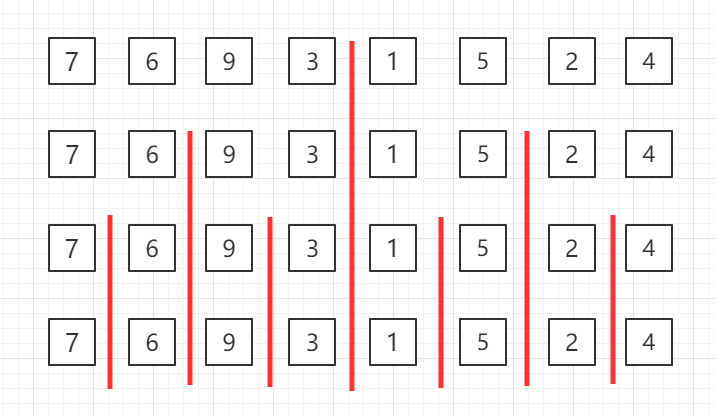

# O(n*log n)的排序算法

## 归并算法Merge Sort

归并排序（Merge sort）是建立在归并操作上的一种有效、稳定的排序算法，该算法是采用分治法(Divide and Conquer）的一个非常典型的应用。将已有序的子序列合并，得到完全有序的序列；即先使每个子序列有序，再使子序列段间有序。若将两个有序表合并成一个有序表，称为二路归并。

### 适用说明

当有 n 个记录时，需进行 logn 轮归并排序，每一轮归并，其比较次数不超过 n，元素移动次数都是 n，因此，归并排序的时间复杂度为 O(nlogn)。归并排序时需要和待排序记录个数相等的存储空间，所以空间复杂度为 O(n)。

归并排序适用于数据量大，并且对稳定性有要求的场景。

实际上这也是 n*log n这样一个算法的来源，通常就是通过一个二分法，达到一个log n这样一个层级，之后每一个层级用O(n)级别的算法来做事情。

### 过程图示

归并排序是递归算法的一个实例，这个算法中基本的操作是合并两个已排序的数组，取两个输入数组 A 和 B，一个输出数组 C，以及三个计数器 i、j、k，它们初始位置置于对应数组的开始端。

A[i] 和 B[j] 中较小者拷贝到 C 中的下一个位置，相关计数器向前推进一步。

当两个输入数组有一个用完时候，则将另外一个数组中剩余部分拷贝到 C 中。

对于归并过程，这里展示一个另外的图辅助理解

比如有这样一个数组，他的左半部分已经排好序，右半部分也已经排好序，那么应该如何将这两个部分归并成一个排好序的数组呢？

对于归并排序，我们不能像之前的插入排序一样，直接在原数组中通过交换位置来完成排序过程。这里我们开辟一个同样大小的临时空间，来辅助我们完成这个归并过程。有了这个临时空间，我们的归并过程确实变得简单了起来，但是这也是归并算法的一个缺点，它确实可以将算法复杂度降低到 O(n*log n)这个级别，但是它比之前我们提到的插入排序和选择排序等，多使用了存储空间（O(n)的额外的空间）。

那怎么归并呢？这里就需要使用3个索引来对数组进行追踪。蓝色的箭头表示我们最终在归并的过程中要追踪的位置，两个红色的箭头分别指向这两个已经排好序的数组单前我们要考虑的元素。

比如这里2和1，谁应该放在最终的数组（蓝色箭头指向的那个数组），1比2小，所以1就应该放在蓝色箭头指向的位置，然后蓝色箭头后移，来考虑下一个位置应该放谁，同时原来1所在的那个红色箭头也后移，也就是原来1所在的数组也可以考虑下一个元素了。所以下一步我们就该考虑2 和 4这两个元素了

然后这里2更小，所以2放入到蓝色箭头指向的位置，原来2的红色箭头后移，判断3和4。

以此类推...

如何结束归并？当这两半有序数组的箭头指向只要有任意一个指向超出了数组长度（这里数组长度是指着有序的一半的数组长度），那么就把另外一个数组里剩下的元素全都拷贝到剩下的最终数组中就可以。

我们可以看到，在这个算法中我们使用了3个索引位置，对于这3个索引位置，我们必须定义清楚，保证无误，这样才能保证我们在写程序的时候不会出问题

比如这里，我将下面两个有序数组，指引单前需要考虑的元素位置的索引定义为 i 和 j。将上面这个归并的最终数组中的这个索引叫做 k 。注意这个定义，i和j指向的是当前正在考虑的元素，而k指向的是这两个元素相比较之后，最终应该放到的这个归并数组的位置。要注意，这里k的定义，不表示归并结束后，已经放置的最后一个元素的位置，而表示下一个需要放置的位置。在写程序的时候，我们就需要维护这个i,j ,k的定义，维持我们的这些变量，在算法运行的过程中用于满足我们的定义，是写出一个正确算法的基础。

---

自顶向下的归并排序，递归分组图示：

对第三行两个一组的数据进行归并排序

对第二行四个一组的数据进行归并排序

整体进行归并排序

