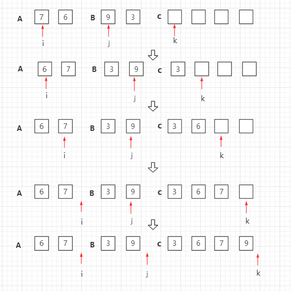
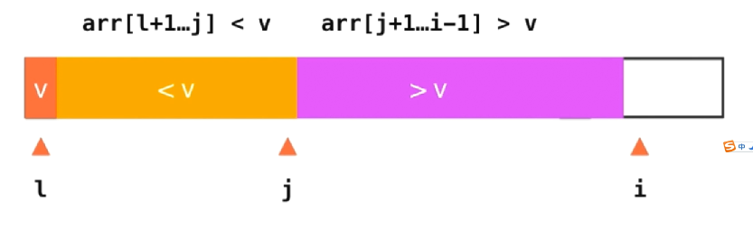
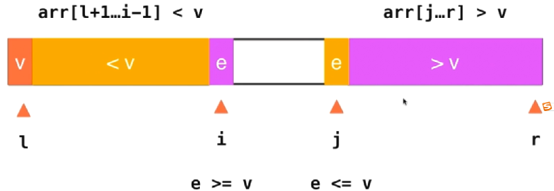

# O(n*log n)的排序算法


## 归并算法Merge Sort

归并排序（Merge sort）是建立在归并操作上的一种有效、稳定的排序算法，该算法是采用分治法(Divide and Conquer）的一个非常典型的应用。将已有序的子序列合并，得到完全有序的序列；即先使每个子序列有序，再使子序列段间有序。若将两个有序表合并成一个有序表，称为二路归并。

### 适用说明

当有 n 个记录时，需进行 logn 轮归并排序，每一轮归并，其比较次数不超过 n，元素移动次数都是 n，因此，归并排序的时间复杂度为 O(nlogn)。归并排序时需要和待排序记录个数相等的存储空间，所以空间复杂度为 O(n)。

归并排序适用于数据量大，并且对稳定性有要求的场景。

实际上这也是 n*log n这样一个算法的来源，通常就是通过一个二分法，达到一个log n这样一个层级，之后每一个层级用O(n)级别的算法来做事情。

### 过程图示

归并排序是递归算法的一个实例，这个算法中基本的操作是合并两个已排序的数组，取两个输入数组 A 和 B，一个输出数组 C，以及三个计数器 i、j、k，它们初始位置置于对应数组的开始端。

A[i] 和 B[j] 中较小者拷贝到 C 中的下一个位置，相关计数器向前推进一步。

当两个输入数组有一个用完时候，则将另外一个数组中剩余部分拷贝到 C 中。



对于归并过程，这里展示一个另外的图辅助理解


比如有这样一个数组，他的左半部分已经排好序，右半部分也已经排好序，那么应该如何将这两个部分归并成一个排好序的数组呢？

对于归并排序，我们不能像之前的插入排序一样，直接在原数组中通过交换位置来完成排序过程。这里我们开辟一个同样大小的临时空间，来辅助我们完成这个归并过程。有了这个临时空间，我们的归并过程确实变得简单了起来，但是这也是归并算法的一个缺点，它确实可以将算法复杂度降低到 O(n*log n)这个级别，但是它比之前我们提到的插入排序和选择排序等，多使用了存储空间（O(n)的额外的空间）。

那怎么归并呢？这里就需要使用3个索引来对数组进行追踪。蓝色的箭头表示我们最终在归并的过程中要追踪的位置，两个红色的箭头分别指向这两个已经排好序的数组单前我们要考虑的元素。


比如这里2和1，谁应该放在最终的数组（蓝色箭头指向的那个数组），1比2小，所以1就应该放在蓝色箭头指向的位置，然后蓝色箭头后移，来考虑下一个位置应该放谁，同时原来1所在的那个红色箭头也后移，也就是原来1所在的数组也可以考虑下一个元素了。所以下一步我们就该考虑2 和 4这两个元素了


然后这里2更小，所以2放入到蓝色箭头指向的位置，原来2的红色箭头后移，判断3和4。


以此类推...

如何结束归并？当这两半有序数组的箭头指向只要有任意一个指向超出了数组长度（这里数组长度是指着有序的一半的数组长度），那么就把另外一个数组里剩下的元素全都拷贝到剩下的最终数组中就可以。

我们可以看到，在这个算法中我们使用了3个索引位置，对于这3个索引位置，我们必须定义清楚，保证无误，这样才能保证我们在写程序的时候不会出问题


比如这里，我将下面两个有序数组，指引单前需要考虑的元素位置的索引定义为 i 和 j。将上面这个归并的最终数组中的这个索引叫做 k 。注意这个定义，i和j指向的是当前正在考虑的元素，而k指向的是这两个元素相比较之后，最终应该放到的这个归并数组的位置。要注意，这里k的定义，不表示归并结束后，已经放置的最后一个元素的位置，而表示下一个需要放置的位置。在写程序的时候，我们就需要维护这个i,j ,k的定义，维持我们的这些变量，在算法运行的过程中用于满足我们的定义，是写出一个正确算法的基础。

---

自顶向下的归并排序，递归分组图示：


对第三行两个一组的数据进行归并排序


对第二行四个一组的数据进行归并排序


整体进行归并排序


### 归并排序c++实现

```c++
// 将arr[l..mid]和arr[mid...r]这两部分进行归并
template<typename T>
void __merge(T arr[], int l, int mid, int r)
{
    // 对于这个归并。我们首先需要开辟一个临时的空间
    // 这个空间需要多大呢？
    // 需要r-l+1,是因为我们这里l和r都是闭空间，所以需要+1
    // 其实很好理解，比如l=0, r=3; [0, 3]是一个4个元素的数组大小，3-0+1 = 4
    T aux[r-l+1];
    
    // 将我们要处理的这个arr数组中的元素全都复制到我们的辅助数组aux中
    for(int i = l; i<= r; i++)
    {
        // 在具体赋值的时候，要注意，我们的aux这个空间是从0开始的，
        // 但是我们的这arr这个空间是从l开始的，他们之间有一个l的偏移量
        // 所以我们赋值的时候应该是将arr的第i个元素赋值给aux的第i-l个元素
        aux[i-l] = arr[i];
    }
    
    // 设置两个索引指向这两个已经排好序的这两个子数组（左右两边）
    int i = l, j = mid+1;
    
    // 使用一个新的索引k来进行遍历，来决定arr[k]的位置究竟应该是谁
    for(int k = l; k <= r; k++)
    {
        // i,j数组越界情况考虑
        // 我们能访问i-l和j-l的前提是i和j这两个索引还在这两个数组相应的位置里面（i还在左边数组里，j还在右边数组里）
        
        // 但是很有可能我们算法运行到一定的时候，对于i这个索引来说，它已经超出了它的范围，也就是i已经大于mid
        // 在这种情况如果我们的k还没有遍历完，就说明j索引所指的这数组中的元素（右边这个数组中的元素）
        // 还没有归并完全，这个时候我们的arr[k]就应该取的是aux[j-l]相应的位置的元素值
        if(i>mid)
        {
            // 其实说白了就是左边归并完了，右边还有值没归并，那么就直接将右边的值挨个放入arr[k]中
            arr[k] = aux[j-l];
            j++;
        }
        else if(j>r)
        {
            // 同样对于j越界，也是一样的，右边归并完了，但是左边还有值没有归并完，那就直接将左边挨个放入arr[k]中
            arr[k] = aux[i-l];
            i++;
        }
        // 如果这两个条件都不满足，才说明这个时候i和j都是有效的，这个时候才进行左右比对归并
        // 所以要先判断索引的合法性，才能放心的比较两个索引的值
        
        // 注意这里，也是同样的，因为有aux和arr之间有一个l的偏移，所以不能直接用aux[i]和aux[j]进行比较
        // 而是应该减去这个偏移
        else if(aux[i-l] < aux[j-l])
        {
            // 如果小于，那么显然arr[k]这个位置应该存放的就是aux[i-l]相应的这个元素
            arr[k] = aux[i-l];
            // 随后i往后走一个位置
            i++;
        }
        else
        {
            // 否者的话，arr[k]这个位置就应该存放aux[j-l]
            arr[k] = aux[j-l];
            // 同样j++
            j++;
        }
    }
}

// 递归使用归并排序，对arr[l, ...r]的范围进行排序
template<typename T>
void __mergeSort(T arr[], int l, int r)
{
    // 对于一个递归函数来说，我们首先要处理的就是递归到底的情况。
    // 很容易想到，当l<r的时候，我们要处理的这部分，就至少由两个元素，左边一个，右边一个
    // 这个时候我们还是需要进行一次排序
    // 但是当l>=r的时候，就表示我们只有一个元素，甚至一个元素都没有，l>r是不可能发生的情况
    // （也就是代表我们当前要处理的数据集为空）
    if(l>=r)
    {
        return;
    }
    
    // 否者的话我们就进行一次归并排序
    // 首先计算这个区间他的中点位置在哪？
    int mid = (l+r)/2;  
    // 注意这里有个隐含的潜在bug，就是当这个数据集非常大的时候（l和r都是非常大的int），这里l+r很可能会溢出int类型
    
    // 下面就可以对分开的左右两个部分分别进行归并排序
    __mergeSort(arr, l, mid);
    __mergeSort(arr, mid+1, r);
    
    // 这两部分都归并排序好之后，就要使用merge将归并排序好的这两个部分
    // 从l-mid,在从mid-r这两部分进行一个merge操作
    __merge(arr, l, mid, r);
    
    // 这次merge完成之后我们就完成了整个归并排序的过程
}

template<typename T>
void megeSort(T arr[], int n)
{
    // 在具体的实现中，归并排序的本质是一次递归的排序的过程，
    // 在这个过程中我们需要依次的对这个数组的不同部分继续进行一个归并排序
    // 为此我们这里会作为一个子函数。
    
    // 他的参数就是我们传递进来的这个数组以及单前要处理的数组的起始位置，以及结束位置
    __mergeSort(arr, 0, n-1);
    
    // 注意，因为我们这个数组范围区间定义是一个前闭后闭的区间，也就是__mergeSort这个函数
    // 中，参数r的定义，这里我们定义为最后一个元素的位置，而不是最后一个元素后一个的位置。
    // 为此，我们这里掉用的就是n-1
    // 这个定义非常重要，在写算法的，这些细微的边界问题，很有可能会直接决定我们算法的准确信
}
```

测试归并排序和插入排序的性能比较

```c++
	int n = 50000;
    std::cout << "测试随机数组排序，数组大小 = " << n << ", 随机范围 [0, " << n << "]" << std::endl;

    int* arr1 = SortTestHelper::gennerateRandomArray(n, 0, n);
    int* arr2 = SortTestHelper::copyIntArray(arr1, n);
    
    SortTestHelper::testSort("插入排序（Insertion Sort） ", InsertionSort, arr1, n);
    SortTestHelper::testSort("归并排序（Merge Sort） ", megeSort, arr2, n);
    
    delete[] arr1;
    delete[] arr2;
```


测试近乎有序的数组排序

```c++
	int swapTime = 10;
    
    std::cout << "测试近乎有序的数组排序，数组大小 = " << n << ", 乱序数: " << swapTime << std::endl;

    int* arr3 = SortTestHelper::gennerateNearlyOrderArray(n, swapTime);
    int* arr4 = SortTestHelper::copyIntArray(arr3, n);
    
    SortTestHelper::testSort("插入排序（Insertion Sort） ", InsertionSort, arr3, n);
    SortTestHelper::testSort("归并排序（Merge Sort） ", megeSort, arr4, n);
    // 测试近乎有序��数组排序，数组大小 = 50000, 乱序数: 10
    // 插入排序（Insertion Sort）  : 0.001073 s 
    // 归并排序（Merge Sort）  : 0.005798 s
```


### 归并排序算法优化

#### 优化1

以上我们基本实现了归并排序算法，接下来我将对归并排序算法进行优化。

首先我们从上面的测试比较中看出来，在处理近乎有序的数组排序的时候，归并排序的性能并没有插入排序快。

那归并排序有没有可能对这种极端的情况（有序数组进行排序）进行优化呢？是可以的。

先看这部分代码

```c++
template<typename T>
void __mergeSort(T arr[], int l, int r)
{
    if(l>=r)
    {
        return;
    }
    int mid = (l+r)/2;  
    // 下面就可以对分开的左右两个部分分别进行归并排序
    __mergeSort(arr, l, mid);
    __mergeSort(arr, mid+1, r);
    
    // 注意看这里
    
    __merge(arr, l, mid, r);
    
    // 这次merge完成之后我们就完成了整个归并排序的过程
}
```

在我们对数组的左右两边进行递归的归并排序之后，不管三七二十一，直接下一句操作就是将这左右两边的数组进行merge合并操作。但是这个时候其实如果左边的最大值小于等于右边的最小值（也就是 arr[mid] <= arr[mid+1]），那么就说明这个arr数组已经是有序的了。就不再需要进行merge操作了。

改进后的代码

```c++
template<typename T>
void __mergeSort(T arr[], int l, int r)
{
    if(l>=r)
    {
        return;
    }

    int mid = (l+r)/2;  

    __mergeSort(arr, l, mid);
    __mergeSort(arr, mid+1, r);

    // 代码优化：
    // 在我们对数组的左右两边进行递归的归并排序之后，不管三七二十一，
    // 直接下一句操作就是将这左右两边的数组进行merge合并操作。
    // 但是这个时候其实如果左边的最大值小于等于右边的最小值（也就是 arr[mid] <= arr[mid+1]），
    // 那么就说明这个arr数组已经是有序的了。就不再需要进行merge操作了。
    
    if(arr[mid] > arr[mid+1])
    {
        __merge(arr, l, mid, r);
    }
}
```

改进后代码测试


可以很直观的看到，这样一个小小的改进，直接将有序性强的数组归并排序的性能提升到和插入排序近乎相等。虽然归并排序还是会比插入排序慢一些，这是因为归并排序无法退化成一个O(n)的算法。它还是需要对log(n)这么多层进行递归，只不过每次递归的过程马上就会发现不需要进行merge计算。这样一来我们的归并排序算法在近乎于有序的数组中，时间效率也是可以令人满意的。

注意这里多了一层if语句判断，在有序数组中会有很大的性能提升，但是在有些情况下，比如完全无序的数组，这个多出来的if语句也许会成为性能障碍，因为if语句判断本身也是需要耗费性能的。但是总体影响不大。所以如果处理的数据会有出现近乎有序的情况，那么还是建议加上这层if优化。

#### 优化2（对于小数组使用插入排序法进行优化）

以上是归并算法的第一个优化，除此之外，对于近乎所有的高级排序算法，都存在一种优化情况，那就在于递归到底的情况。现在我们的递归情况是递归到只有在一个元素的时候返回回去，但是在元素量非常小的时候，我们可以转而使用插入排序来提高排序性能。这是基于两个原因，一方面当我们的元素数据非常小的时候，整个数组近乎有序的概率就会比较大，此时插入排序有优势。另外一方面，虽然插入排序最差的时间复杂度是O(n^2)级别的，归并排序是O(n log n)级别的，但是我们要知道，对n^2也好，n log n也好，前面是有一个常数系数的，对于这个系数而言，插入排序是要比归并排序小的，换句话说，当n小到一定程度的时候，插入排序是要比归并排序快的。

为此对于我们的递归终止代码，我们就可以进行这样的修改

```c++
	// 这里 r-1 = 15就表示有16个元素及其以下的时候使用插入排序
    if(r-l <= 15)
    {
        InsertionSort(arr, l, r);
        return;
    }
```


从测试结果上看，这里虽然不是指数级的优化，但是整体上还是对我们的归并算法起到了一定的优化作用

### 自底向上的归并排序

之前我们实现的归并排序算法是自顶向下的归并排序。但是在理解了归并排序之后，我们也完全可以实现自底向上的归并排序。

比如我们现在有这么一个数组，那么我们就可以从左到右依次将这个数组划分为两个两个的小段，然后来进行归并排序的过程。


在归并排序完成之后，我们再4个元素一个小段的来进行划分，然后继续进行归并排序


最后8个元素进行排序结束


在这样一个实现中，我们并不需要递归，只需要迭代就可以完成归并排序了。

```c++
// 将arr[l..mid]和arr[mid...r]这两部分进行归并
template<typename T>
void __merge(T arr[], int l, int mid, int r)
{
    // 对于这个归并。我们首先需要开辟一个临时的空间
    // 这个空间需要多大呢？
    // 需要r-l+1,是因为我们这里l和r都是闭空间，所以需要+1
    // 其实很好理解，比如l=0, r=3; [0, 3]是一个4个元素的数组大小，3-0+1 = 4
    T aux[r-l+1];
    
    // 将我们要处理的这个arr数组中的元素全都复制到我们的辅助数组aux中
    for(int i = l; i<= r; i++)
    {
        // 在具体赋值的时候，要注意，我们的aux这个空间是从0开始的，
        // 但是我们的这arr这个空间是从l开始的，他们之间有一个l的偏移量
        // 所以我们赋值的时候应该是将arr的第i个元素赋值给aux的第i-l个元素
        aux[i-l] = arr[i];
    }
    
    // 设置两个索引指向这两个已经排好序的这两个子数组（左右两边）
    int i = l, j = mid+1;
    
    // 使用一个新的索引k来进行遍历，来决定arr[k]的位置究竟应该是谁
    for(int k = l; k <= r; k++)
    {
        // i,j数组越界情况考虑
        // 我们能访问i-l和j-l的前提是i和j这两个索引还在这两个数组相应的位置里面（i还在左边数组里，j还在右边数组里）
        
        // 但是很有可能我们算法运行到一定的时候，对于i这个索引来说，它已经超出了它的范围，也就是i已经大于mid
        // 在这种情况如果我们的k还没有遍历完，就说明j索引所指的这数组中的元素（右边这个数组中的元素）
        // 还没有归并完全，这个时候我们的arr[k]就应该取的是aux[j-l]相应的位置的元素值
        if(i>mid)
        {
            // 其实说白了就是左边归并完了，右边还有值没归并，那么就直接将右边的值挨个放入arr[k]中
            arr[k] = aux[j-l];
            j++;
        }
        else if(j>r)
        {
            // 同样对于j越界，也是一样的，右边归并完了，但是左边还有值没有归并完，那就直接将左边挨个放入arr[k]中
            arr[k] = aux[i-l];
            i++;
        }
        // 如果这两个条件都不满足，才说明这个时候i和j都是有效的，这个时候才进行左右比对归并
        // 所以要先判断索引的合法性，才能放心的比较两个索引的值
        
        // 注意这里，也是同样的，因为有aux和arr之间有一个l的偏移，所以不能直接用aux[i]和aux[j]进行比较
        // 而是应该减去这个偏移
        else if(aux[i-l] < aux[j-l])
        {
            // 如果小于，那么显然arr[k]这个位置应该存放的就是aux[i-l]相应的这个元素
            arr[k] = aux[i-l];
            // 随后i往后走一个位置
            i++;
        }
        else
        {
            // 否者的话，arr[k]这个位置就应该存放aux[j-l]
            arr[k] = aux[j-l];
            // 同样j++
            j++;
        }
    }
}

// 以下是自底向上的归并排序实现

template<typename T>
void mergeSortBU(T arr[], int n)
{
    // 首先需要一轮循环，这轮循环是对进行merge的元素个数进行遍历
    // 这里归并排序每次开始只看一个元素，然后2个，然后4个，然后8个，每次翻一倍
    for(int sz = 1; sz <= n; sz*=2)
    {
        // 下面我们的第二轮循环，就是具体每一轮在归并的过程中，起始的元素位置
        // 这个位置我们从0开始，每次i位置的平移应该是2个sz这个位置
        // 也就是说，在第一轮我们将对从 [0, sz-1], [sz, 2sz-1]这两部分进行一次归并
        // 第二轮我们将对 [2sz, 3sz-1],[3sz, 4sz-1]这两部分进行一次归并
        // ...
        for(int i = 0; i + sz < n; i+=sz+sz)
        {
            // 数组边界问题处理
            // 首先对于归并过程来说，我们要对至少两个部分进行归并，否者整个归并是没有意义的
            // 因为我们的归并过程就是要将两个已经有序的数组给合并成一个有序数组
            
            // 上面for里的 i + sz < n; 保证了i+sz-1不会再数组arr里越界
            
            // 另外在数组的末尾的部分，有可能不足size那么多个元素，换句话说 i+2*sz-1 这个有可能会越界
            // 为此我们去 i+2*sz-1 和 n-1他们之间的最小值，也就是说，当i+2*sz-1比n-1还要大（数组越界）的时候
            // 我们就取n-1
            // 可以想象，我们这个mege函数在遍历到数组靠近后面的时候，第二部分可能不足size那么大小
            // 但是没有关系，我们之前实现的__mege函数在这种情况下依旧能够正常运行
            
            // 对arr[i, i+sz-1]和arr[i+sz, i+2sz-1]这两部分进行归并
            __merge(arr, i, i+sz-1, min(i+2*sz-1, n-1));
            
        }
    }
}
```


##### 性能测试


可以看到，这种自底向上的归并排序，性能上虽然和之前使用递归实现的归并差不多，但是较真来说，其实自底向上这种性能并没有之前的递归实现的自顶向下的归并性能好。

自底向上的这种归并排序，它有一个很重要的作用，如果我们注意看这个代码就会发现，这个排序过程中，没有使用数组的一个非常重要的特性，就是通过索引直接获取元素，也正因为如此，这样一个自底向上的一个归并排序算法排序，可以非常好的使用nlogn的时间对链表进行排序。

---

## 快速排序Quick Sort


我们知道，归并排序是不管数组的内容是什么，直接将整个数组一分为二之后进行排序归并。而快速排序则是每次从当前考虑的数组中选择一个元素，以这个元素为基点。

算法步骤：

1 从数列中挑出一个元素，称为 "基准"（pivot），

2 重新排序数列，所有元素比基准值小的摆放在基准前面，所有元素比基准值大的摆在基准的后面（相同的数可以到任一边）。在这个分区退出之后，该基准就处于数列的中间位置。这个称为分区（partition）操作。

3 递归地（recursive）把小于基准值元素的子数列和大于基准值元素的子数列排序。


比如在我这个数组中选择4为基点。之后想办法把4这个元素挪到它在排好序之后应该存在的位置。


4存在这个位置就使得整个数组有了一个性质，那就是4之前的元素都是小于4的，4之后的元素都是大于4的。之后我们要做的事情就是对小于4的这部分子数组和对大于4的这部分子数组分别继续使用快速排序的思想进行排序。逐步递归下去完成整个排序过程。

所以可以看到，对于快速排序算法来说，如果把选定的元素放在它正确的位置就显得很重要。而这个过程也正是快速排序的核心。通常我们管这个子过程叫 Partition ，也就是把整个数组分成两个部分。在这个过程中，我们一般都是将整个数组的第一个元素作为分界的标志点。对于这个数组，我管他叫做 l ,也就是left。


之后我们逐步遍历右边所有没有被访问过的元素。在遍历的过程中，我们将逐渐的整理整个数组，一部分是小于v这个元素的，一部分是大于v这个元素的。当然，在这个过程中我们就需要记录哪里是大于v和小于v的分界点，这里就使用 j 来记录这个位置。单前访问的元素管他叫做 i 。这样一来，我们整个数组从[l+1, j] 前闭后闭这整个区间的元素就都是小于v的。而从[j+1, i-1]这个闭区间的元素都是大于v的。


接下来我们讨论 i 这个位置如何来决定单前的元素，到底要怎样变化才能使得我们整个数组继续保持这样的一个性质。

我们分两种情况来讨论，如果单前的这个元素e，他是比v还要大的，那么这种情况非常简单，他就直接放在大于v这一部分的后面 。此时这数组就变成了这个样子。然后我们马上去讨论下一个元素，也就是i++


但是如果我们当前讨论的这个元素e，它是必v要小的，那么这里就会稍微麻烦点，我们要把当前这个元素e放到小于v，也就是橙色这部分。这里我们只需要把当前橙色部分，也就是j所指的元素 和 蓝色部分也就是当前考察的元素e也就是i这个位置，这两个位置的元素进行一下交换，


可以看到有一个大于v的元素放到了现在i所在的位置，而我们单前所考察的这个小于v的元素被放到了j的后面。


这种情况下我们的j就需要++。也就相当于我们的橙色部分的元素多了一个。经过这样的改变之后，我们在进行i++,继续考察下一个元素



可以想象，在使用这个方式对我们的数组进行遍历，遍历完之后，就变成了这个样子。我们整个数组被分为了3个部分，第一个元素是v，然后橙色部分是小于v，紫色部分是大于v


最后我们要做的事情就是将 l 这个位置和 j 这个位置进行一下交换。可以看到此时我们的数组就被分为了我们设想的那样，被分为了小于v和大于v的两个部分。而v这个元素就被放在了它应该在的位置，而此时指向v的索引就是 j  .


有了这个基础我们就能写出我们的第一版的快速排序。

#### 代码实现

```c++
#ifndef QUICKSORT_H
#define QUICKSORT_H

#include <iostream>

using namespace std;

// 对arr[l, r]部分进行partition操作
// 注意这里返回值是int类型，返回的是索引值p，
// 这个p满足什么条件呢？运行完这个函数后，使得arr[p]前半部分全都小于arr[p]
// p索引后半部分全都大于arr[p];
// 使得arr[l, p-1] < arr[p] < arr[p+1, r]
template<typename T>
int __partition(T arr[], int l, int r)
{
    // 首先我们在快速排序中需要一个标准，我管这个标准叫做v
    // 这里这个比较标准我们这里就先简单的取要考察的这个数组的第一个元素
    T v = arr[l];
    
    // 接下来要做的就是逐步从l+1开始遍历整个数组
    // 让这整个数组从l+1之后分成两个部分
    // arr[l+1, j] < v < arr[j+1, i)
    // 这里为什么i是开区间呢？因为i这个位置就是我们单前正在考察的元素
    int j = l;
    for(int i = l+1; i<=r; i++)
    {
       
        if(arr[i] < v)
        {
            // 当i位置当前考察的元素位置小于我们的标准比较值v
            // 那么就将arr[j+1]的元素和arr[i]位置的元素进行位置交换
            swap(arr[j+1], arr[i]);
            // 交换完成 后j++，也就是我们将一个小于v的值交换到j这边的区间，让j区间扩充了一个元素
            j++;
            
            // 整个这个交换过程就是将第一个大于v的这个元素和单前正在考察的这个元素arr[i]进行了一次交换
            // 比如这里开始进来的时候，l=0,那么j = 0; i=1, j+1 = 1
            // 如果这个时候这个arr[i]小于v, 那么这里就要交换，这里交换arr[j+1]和arr[i]
            // 其实就将l后面的第一个元素arr[l+1]和arr[l+1]交换（自己交换自己）
            // 这是对于l=0的第一次交换，那么在这之后，j++了，i++了，在下一次的循环过程中，j就指向了那个交换过来的比v小的那个元素上，
            // 这其实也就是保证了j指向的元素永远都是比v小的 arr【l,j】 < V
            // 如果这个时候arr[i]还是小于v，那么一样的, arr[j+1]和arr[i]，继续自己交换自己，
            // 如果这个时候arr[i]大于了v，那么这个时候，j就不动，（因为j始终保证的j及其前面的都是小于v的）
            // 这个时候就不需要做交换，继续i++.，也就是arr[j+1, i)的元素都是遍历过，且大于v的，i是指向正在考察的元素，所以是开区间，
            // 这个元素还在进行比较，大小还不确定所以不能纳入任何一个区间
            // 那如果是这样的话，也就是j后面的元素（右边）扩从了一个元素（因为右边保存的是比V大的元素）
            // 然后继续遍历，这个时候，如果arr[i]小于这个V，那么就把j+1这个元素（j+1这个元素是大于V的，而arr[i]我们比较出来是小于v的)
            // 所以把小的放在左边，大的交换过来放在arr[i]的位置，同时j++,保证j始终指向左边小于v的最后一个元素
            
            
            //当然，上面的代码，如果熟悉了快速排序之后，可以改写成这个样子
            // swap(arr[++j], arr[i]);
            // 这个代码就是说，我们即交换了arr[j+1]，同时索引j又做了++更新
            // 这里为了清晰可见，就不采用这种写法了
        }
    }
    // 最后再遍历完之后，我们要做的事情就是将l这个位置的元素和j这个位置的元素进行一次交换
    // 这里为啥可以交换呢？
    // 因为上面我们分析了，j指向的那个元素永远都是小于v的那部分数组的最后一个元素位置，
    // 而我们的 V 取的位置就是数组的起始位置l，所以j这个小于V的元素可以放在左边，然后V和arr[j]
    // 交换，无非就是将数V这个中位数放在了它正确的位置，也就是交换之后，V前面的元素都是小于V的
    // v后面的元素都是大于v的
    swap(arr[l], arr[j]);
    
    // 此时我们的partion工作（找到v这个元素应该在的索引j）就完成了，直接返回j
    // j就是这里我们定义的这个索引p，它让整个数组左边arr[l, j]都是小于arr[j]，
    // 数组右边，arr[j+1, r]都是大于arr[j]
    return j;
    
}


// 对arr[l, r]部分进行快速排序
template<typename T>
void __quickSort(T arr[], int l, int r)
{
    // 因为是递归函数，所以首先对递归到底的情况进行处理（递归终止函数）
    if(l>=r)
    {
        return;
    }
    
    // 下面开始快速排序
    // 首先我们需要调用一个叫做__partition的子函数对arr从l到r进行一个partition的操作
    // 这个partition的操作返回一个索引值
    int p = __partition(arr, l, r);
    // 当这个partition操作返回成功后,我们只需要很简单的继续递归调用__quickSort()
    // 对p左右两边继续递归调用__quickSort进行排序
    // 即arr[l, p-1]和arr[p+1, r]
    __quickSort(arr, l, p-1);
    __quickSort(arr, p+1, r);
}


// 快速排序算法
template<typename T>
void quickSort(T arr[], int n)
{
    // 快速排序也是需要使用递归的方式来进行排序
    __quickSort(arr, 0, n-1);
}

#endif
```

测试100w大小的随机数组排序。


从测试结果来看，我们的快速排序性能上已经和优化过的归并排序性能差不多了，但是事实上对于快速排序来说，还有继续优化的空间。下面就来详细探讨一下。

### 快速排序算法优化1

第一个优化就是我们之前提到的，对于大多数高级排序算法来说，都可以在递归底层的时候采用插入排序算法来进行替代优化。

```c++
// 对arr[l, r]部分进行快速排序
template<typename T>
void __quickSort(T arr[], int l, int r)
{
    // 因为是递归函数，所以首先对递归到底的情况进行处理（递归终止函数）
    // if(l>=r)
    // {
    //     return;
    // }
    // 算法优化，在递归底层采用插入排序进行替代优化
    if(r-l <= 15)
    {
        insertionSort(arr, l, r);
        return;
    }
    
    // 下面开始快速排序
    // 首先我们需要调用一个叫做__partition的子函数对arr从l到r进行一个partition的操作
    // 这个partition的操作返回一个索引值
    int p = __partition(arr, l, r);
    // 当这个partition操作返回成功后,我们只需要很简单的继续递归调用__quickSort()
    // 对p左右两边继续递归调用__quickSort进行排序
    // 即arr[l, p-1]和arr[p+1, r]
    __quickSort(arr, l, p-1);
    __quickSort(arr, p+1, r);
}
```

从测试结果来看，性能确实比之前没有优化过的提高了一些。


当然，这个优化其实并不是快速排序的一个重要优化，接下来要介绍的会是快速排序算法中一个非常重要的优化问题。

### 快速排序算法优化2

首先我们添加一个测试用例，测试的就是近乎有序的数组，这同样是100w大小的数组，其中只有100组数据时乱序的

```c++
std::cout << "-------------------------------------------------------------------------" << std::endl;
    int swapTime2 = 100;
    std::cout << "测试近乎有序的数组排序：数组大小 " << m << ", 乱序数：" << swapTime2 << std::endl;
    int* arrbw3 = SortTestHelper::gennerateNearlyOrderArray(m, swapTime2);
    int* arrbw4 = SortTestHelper::copyIntArray(arrbw3, m);
    
    SortTestHelper::testSort("归并排序（Merge Sort）", megeSort, arrbw3, m);
    SortTestHelper::testSort("快速排序（Quick Sort）", quickSort, arrbw4, m);
    
    std::cout << "-------------------------------------------------------------------------" << std::endl;
    
```

然后注意看测试结果


可以看到，对于这个近乎于有序的数组，归并排序很快的就完成了排序，但是快速排序却花了近42s的时间，对于这种近乎有序的排序，快速排序算法是不可接受的。

在近乎有序的数组排序中，我们现在实现的快速排序比归并排序慢了太多。这是为什么呢？

我们之前介绍过，归并排序它之所以是nlogn级别的排序算法，就是因为在每次排序的时候，我们都将原来的数组一分为二。进一步将每个子数组再一分为二，以此类推。那么他的整个层数是log n层。这样一来我们整个算法就是nlogn级别的。


事实上，我们上面讲的快速排序算法也是不断将整个数组一分为二的过程。只不过整个分法不一样，对于快速排序算法来说，我们是需要找到一个标定点，将这个标定点左边和右边两个部分分别进行排序。

这样一来快速排序和归并排序就会存在一个非常大的不同，归并排序能够保证每次将整个数组平均的一分为二，但是对于快速排序来说，我们却没有这个保证，换句话说，分出来的两个子数组可能是一大一小的。那么我们进一步去分的话，依然可能会存在这样一个情况。面对这样一个情况，我们就可以想象，快速排序在调用递归的时候，生成的递归树他的平衡度就要比归并排序要差。并且我们并不能完全保证这棵树他的高度就是logn。它很有可能还要比logn还要高。


很有可能最差的情况就是我们之前测试的，单我们整个数组近乎有序的情况。我们来看，如果我们这整个数组完全有序的情况下，会发生什么？可以想象，我们每次都使用最左边的这个元素作为标定点，当整个数组完全有序的时候，没有任何元素小于我们找到的这个标定点，也就是所有元素都要大于它，那么生成的这个棵树左边就没有任何东西，我们只有右边的这一部分，对于右边的这一部分，我们找的标定点又是他最左边的这个元素，在数组有序的情况下，最左侧的这个元素又是最小的元素，于是又出现了左边这棵子树没有任何元素，只有右边的元素。以此类推，可以想到在这种情况下，我们整棵递归树他的高度将会是n，这棵递归树同时可以被看做是一个链表，整个树的高度是n，而每个层级我们又要遍历整个层级，他的层级处理复杂度又是O(n)，所以整个最差的这种情况下，此时的快速排序算法的算法复杂度就退化为了一个O(n^2)级别的算法。这也就是我们之前实验的，为什么在近乎有序的情况下，我们的快速排序算法性能这么糟糕。


这么改进这种情况，其实很简单，之前我们是固定选用数组最左侧的元素作为标定元素，然而我们希望的是，尽可能的去选择数组中间的那个元素作为标定元素。我们不能快速的准确定位那个中间元素怎么办？其实很简单，只要我们随机选择一个元素就好了，当我们随机选择一个元素作为我们的标定元素的时候，我们可以用数学方法证明出来他的时间复杂度期望值是O(n log n)，注意这里是说期望值，而不是一定每一次都是nlogn。在这种情况下我们可以想象，这个时候这种算法它退化成O(n^2）的几率是特别特别低的。

__partition这个分区函数里做如下简单的改进

```c++
#ifndef QUICKSORT_H
#define QUICKSORT_H

#include <iostream>
#include "InsertionSort.h"

using namespace std;

// 对arr[l, r]部分进行partition操作
template<typename T>
int __partition(T arr[], int l, int r)
{
    // 首先我们在快速排序中需要一个标准，我管这个标准叫做v
    // 这里这个比较标准我们这里就先简单的取要考察的这个数组的第一个元素
    // T v = arr[l];
    
    // 算法优化2
    // 上面我们每次标记点的元素都是选择数组中第一个元素，现在做优化，将这个标记点用一个随机选择的元素
    // 我们随机的这个元素要在l和r之间，首先就需要随机化一个数，rand() 然后除以这个范围（r-l+1），然后加上l这个偏移量
    // 这样一来我们就随机化生成一个[l,r]前闭后闭区间的一个索引范围的元素
    // arr[rand()%(r-l+1) +l];
    // 现在我需要将这个元素作为我们的标定元素v，其实很简单，将这个元素和我们最左边这个元素进行一下交换就好了
    swap(arr[l], arr[rand()%(r-l+1) +l]);
    
    T v = arr[l];   // 然后继续走这行代码，取最左边这个元素，其实也就是我们上面交换过来设定的这个随机索引的元素
    
    int j = l;
    for(int i = l+1; i<=r; i++)
    {
       
        if(arr[i] < v)
        {
            swap(arr[j+1], arr[i]);
            j++;
            
        }
    }
    swap(arr[l], arr[j]);
    
    return j;
    
}


// 对arr[l, r]部分进行快速排序
template<typename T>
void __quickSort(T arr[], int l, int r)
{
    if(r-l <= 15)
    {
        insertionSort(arr, l, r);
        return;
    }
    
    int p = __partition(arr, l, r);
    __quickSort(arr, l, p-1);
    __quickSort(arr, p+1, r);
}


// 快速排序算法
template<typename T>
void quickSort(T arr[], int n)
{
    // 算法优化2
    // 在开始排序之前，我们调用srand函数设置一下随机种子
    // 因为我们在此之后需要使用随机化的方式来设置我们的标定元素
    srand(time(NULL));
    
    // 快速排序也是需要使用递归的方式来进行排序
    __quickSort(arr, 0, n-1);
}

#endif
    
```

代码改进后的测试结果


在这里相当于我们是编写了一个随机算法，所谓的随机算法就是，我不能百分百的包装我写的这个随机算法一定非常快或者一定是正确的，但是我可以保证我这个算法在99.9999..%的情况下都可以非常快并且非常准确的情况下得到正确的结果。可以想象，此时我们这个快速排序算法在最坏的情况下，他的时间复杂度依旧是O(n^2)，但是退化到o(n^2)这个级别的时间复杂度的概率是及其及其低的，近乎于0。对于我们使用这样一个随机化的方法，快速排序他的时间复杂度的期望值就变成了O(n log n) 。【这个数学证明很复杂，这里略】

不过，我们目前的快速排序算法依旧有问题，下面会继续进行分析。

### 快速排序优化3

首先我们再来测试一组新的测试用例，可以看到这个测试用例依旧是100w的数据量，但是他里面只有0-10的整数，也就是说，存在大量的重复的数据，某种程度上也可以说，这个数据也是一个近乎有序的数组。

```c++
std::cout << "测试有大量重复数据的数组排序：数组大小 " << m << std::endl;
    int* arrbw5 = SortTestHelper::gennerateRandomArray(m, 0, 10);
    int* arrbw6 = SortTestHelper::copyIntArray(arrbw5, m);
    
    SortTestHelper::testSort("归并排序（Merge Sort）", megeSort, arrbw5, m);
    SortTestHelper::testSort("快速排序（Quick Sort）", quickSort, arrbw6, m);
    
    std::cout << "-------------------------------------------------------------------------" << std::endl;
    
```

可以看到归并排序很快就得到了结果，但是快速排序却迟迟没有结果出现，直到运算了100s之后才出结果。


从这个结果很快就可以感知到，我们的这个快速排序算法又退化到了 O(n^2)的级别。这又是为什么呢？

可以看到，下面这个图就是我们现在的代码面对每一个元素e要执行的操作，我们要看这个元素e是大于v还是小于v。然后将它分别放在不同的位置，这样将整个数组分别分成两个部分，递归下去进行快速排序。这里我们需要注意，在值钱啊我们的讨论中没有讨论如果这个e == v的情况，事实上可以想到我们的代码里，如果e是小于v的话，是把e放到橙色的部分，也就是说，我们的代码隐含着的就是，大于等于v的部分都放在了紫色的部分。


当然我们也可以通过改代码，很轻易的把if单前元素小于等于v的话，给他放在橙色的部分。从这里可以看出来，不管是把小于等于v的部分放在橙色部分，还是把大于等于v的部分放在紫色部分，当我们整个数组中包含有大量的重复键值的时候，我们的partition操作都非常的有可能把整个数组分成极度不平衡的两部分。这是因为对于每个键值而言，重复的元素太多，我们选的键值稍微有一点不平衡的话，就回照成两部分的差距非常大。即使我们的v选在了一个平衡的位置，但是由于等于v的这个元素也非常的多，一样会导致我们整个数组被分成了一个及其不平衡的两个部分。在这种情况下我们的快速排序就会退化成一个O(n^2)级别的排序算法。


如何解决这个问题呢？

在这里先提供一个解决方案，我们换一个思路来写我们的这个partition程序。我们新的思路是这样的，之前我们是将小于v和大于v的这两部分全都放在了数组的一头，然后i从左到右直至遍历完我们的整个数组。现在我们将小于v和大于v这两个部分放在数组的量端，当然这样做的话，我们就需要一个新的索引 j 来记录大于v这一段下一个要扫描的元素的位置


当扫描到这个地步，我们下一步要做什么呢？首先我们从 i 这个位置开始向后扫描，当我们面对的元素任然是小于v的时候，我们就继续向后扫描，直到我们遇到的这个元素他是大于等于v的，i 这个索引就停止


同样对于 j 也是一样的，我们从 j 向前开始扫描，如果扫描到的元素是大于v的话，就继续 j--，看前一个元素。直到我们喷到一个e，这个e 小于等于v。这个时候，我们的 j  就停止。


这样，从这里就可以看出来，我们图中蓝色的部分，就应该分别归并到橙色（小于v）和紫色（大于v）的部分。也就是此时我们的数组应该是如下的这样一个形态。



而 i 和 j 这两个位置的元素交换一下位置就可以了。


此时我们橙色的部分就都是小于v的元素，而紫色的部分都是大于v的元素。而后我们 i 这个索引继续向后（i++)查看他的下一个元素，而 j 这个索引继续向前（j--）查看他的前一个元素。直到我们 i 和 j 这两个索引重合，就代表我们这个数组arr遍历完毕了。


通过我们上面说的这些逻辑分析，其实我们也能感知到，橙色的部分表示的小于等于v的元素，而紫色的部分表示的大于等于v的元素。


这里需要注意，这种partition的方式所分成的两个部分和之前最大的区别就是在于把等于v的这个元素，分散到了左右两部分。换句话说，如果我们 i 和 j 这两个索引指向的都是等于v的元素，在我们这个逻辑里，两个元素任然要交换一下位置。这样进行下来，就不会存在大量等于v的元素都集中在橙色部分或者都集中在紫色部分一部分的情况。也正因为如此，这样partition的结果，当面临大量的重复键值的元素的情况，也能很好的将他们近乎平分开来。

接下来就根据这个思路实现一下代码，来测试其性能。

```c++
// 对arr[l, r]部分进行partition操作
// 返回p，使得arr[l, p-1] < arr[p] < arr[p+1, r]
template<typename T>
int __partition2(T arr[], int l, int r)
{
    // 一样的，在开始的时候，将这个[l, r]范围里的一个随机元素和数组的第一个元素进行一下交换
    swap(arr[l], arr[rand()%(r-l+1) + l]);
    
    // 之后就可以放心的用我们新的这个开头元素作为标定点
    T v = arr[l];
    
    
    // 首先我们需要做两个临界点  i,j
    // arr[l+1, i） <= v， arr(j, r] >= v
    // i表示的是从l+1到i这个前闭后开的区间元素都是小于等于v的
    // j表示从 j 到 r 这个前开后闭的区间元素都是大于等于v的
    // 这个时候，就能想到，i的初始就是l+1，然后j的初始值就是r
    int i = l+1, j = r;
    // 之后就可以开始我们的循环了
    while(true)
    {
        while(i <= r && arr[i]<v){
            // 如果arr[i]比v还要小，那么我们就可以放心的i++
            // 继续让i往下遍历
            // 同样只要存在索引，就需要判断索引是否下标越界
            i++;
        }
        
        // 同样对于j来说也是一样的
        while(j>=l+1 && arr[j]>v)
        {
            // 对于j来说，他的越界情况是j >= l+1，因为l最左边是保存着我们的标定点的，这个位置是被占了的
            // j是到达不了那个地方的
            j--;
        }
        
        // 这个时候，我们先来判断一下循环是否结束
        // 也就是说，通过这两次遍历之后，我们突然发现i比j还要大了，其实也就是说明我们整个循环已经遍历结束了
        if(i>j)
        {
            break;
        }
        // 否者的话，我们就能放心的交换这两个元素
        // 程序运行到这里，就说明i找到了左边 >= v的元素
        // j找到了右边 <= v 的元素
        // 这个时候只需要对i和j这连个位置的元素交换一下位置就可以
        swap(arr[i], arr[j]);
        // swap完之后我们 继续i往后走，j往前走
        i++;
        j--;
    }
    
    // 自此，我们就扫描完了整个数组arr，并且保证了在数组中arr[l+1, i） <= v， arr(j, r] >= v
    // 现在要做的就是将v这个元素放在我们整理完的这个数组它合适的位置
    // 首先，上面while循环结束，i这个索引所处的位置是 从前向后看是第一个大于等于v的元素的位置
    // 而j这个索引所处的位置，从后向前看，最后一个小于等于v的元素的位置
    // 注意上面这里的秒数，其实也就是说，遍历结束，i指向的位置已经指到大于等于v那部分区间去了
    // 而j这个索引所指向的位置已经指向小于等于v那部分区间去了 
    // 很好理解，因为上面while循环跳出的条件就是 if(i>j)
    // 然后我们标定点v是在小于等于v这一段
    // 所以这里，j才是我们v这个元素应该存放的位置，将arr[l]和arr[j]进行一下位置交换
    swap(arr[l], arr[j]);
    
    // 此时我们j索引所指的位置就是partition所应该返回的 那个标定点应该所处的p的位置
    return j;
}


// 对arr[l, r]部分进行快速排序
template<typename T>
void __quickSort2(T arr[], int l, int r)
{
    if(r-l <= 15)
    {
        insertionSort(arr, l, r);
        return;
    }
    
    int p = __partition2(arr, l, r);
    __quickSort2(arr, l, p-1);
    __quickSort2(arr, p+1, r);
}


// 快速排序算法 2
template<typename T>
void quickSort2(T arr[], int n)
{
    srand(time(NULL));
    
    __quickSort2(arr, 0, n-1);
}

```

100w数据测试性能比对


从测试结果上看，我们新写的快速排序算法，对于有大量重复数据的数组，他的排序性能也是非常好的。这是因为我们使用了新的partition，阻断了quick sort在这种情况下退化成O(N^2)级别的算法。

接下来我继续对quick sort进行改进，让它在有很多重复数据的情况下，排序性能更高