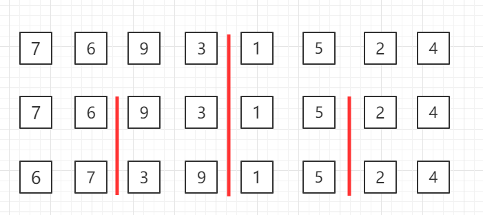
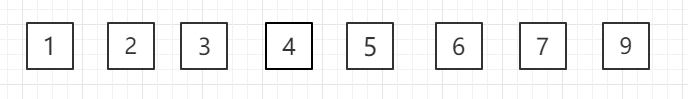

# O(n*log n)的排序算法


## 归并算法Merge Sort

归并排序（Merge sort）是建立在归并操作上的一种有效、稳定的排序算法，该算法是采用分治法(Divide and Conquer）的一个非常典型的应用。将已有序的子序列合并，得到完全有序的序列；即先使每个子序列有序，再使子序列段间有序。若将两个有序表合并成一个有序表，称为二路归并。

### 适用说明

当有 n 个记录时，需进行 logn 轮归并排序，每一轮归并，其比较次数不超过 n，元素移动次数都是 n，因此，归并排序的时间复杂度为 O(nlogn)。归并排序时需要和待排序记录个数相等的存储空间，所以空间复杂度为 O(n)。

归并排序适用于数据量大，并且对稳定性有要求的场景。

实际上这也是 n*log n这样一个算法的来源，通常就是通过一个二分法，达到一个log n这样一个层级，之后每一个层级用O(n)级别的算法来做事情。

### 过程图示

归并排序是递归算法的一个实例，这个算法中基本的操作是合并两个已排序的数组，取两个输入数组 A 和 B，一个输出数组 C，以及三个计数器 i、j、k，它们初始位置置于对应数组的开始端。

A[i] 和 B[j] 中较小者拷贝到 C 中的下一个位置，相关计数器向前推进一步。

当两个输入数组有一个用完时候，则将另外一个数组中剩余部分拷贝到 C 中。


对于归并过程，这里展示一个另外的图辅助理解


比如有这样一个数组，他的左半部分已经排好序，右半部分也已经排好序，那么应该如何将这两个部分归并成一个排好序的数组呢？

对于归并排序，我们不能像之前的插入排序一样，直接在原数组中通过交换位置来完成排序过程。这里我们开辟一个同样大小的临时空间，来辅助我们完成这个归并过程。有了这个临时空间，我们的归并过程确实变得简单了起来，但是这也是归并算法的一个缺点，它确实可以将算法复杂度降低到 O(n*log n)这个级别，但是它比之前我们提到的插入排序和选择排序等，多使用了存储空间（O(n)的额外的空间）。

那怎么归并呢？这里就需要使用3个索引来对数组进行追踪。蓝色的箭头表示我们最终在归并的过程中要追踪的位置，两个红色的箭头分别指向这两个已经排好序的数组单前我们要考虑的元素。


比如这里2和1，谁应该放在最终的数组（蓝色箭头指向的那个数组），1比2小，所以1就应该放在蓝色箭头指向的位置，然后蓝色箭头后移，来考虑下一个位置应该放谁，同时原来1所在的那个红色箭头也后移，也就是原来1所在的数组也可以考虑下一个元素了。所以下一步我们就该考虑2 和 4这两个元素了


然后这里2更小，所以2放入到蓝色箭头指向的位置，原来2的红色箭头后移，判断3和4。


以此类推...

如何结束归并？当这两半有序数组的箭头指向只要有任意一个指向超出了数组长度（这里数组长度是指着有序的一半的数组长度），那么就把另外一个数组里剩下的元素全都拷贝到剩下的最终数组中就可以。

我们可以看到，在这个算法中我们使用了3个索引位置，对于这3个索引位置，我们必须定义清楚，保证无误，这样才能保证我们在写程序的时候不会出问题


比如这里，我将下面两个有序数组，指引单前需要考虑的元素位置的索引定义为 i 和 j。将上面这个归并的最终数组中的这个索引叫做 k 。注意这个定义，i和j指向的是当前正在考虑的元素，而k指向的是这两个元素相比较之后，最终应该放到的这个归并数组的位置。要注意，这里k的定义，不表示归并结束后，已经放置的最后一个元素的位置，而表示下一个需要放置的位置。在写程序的时候，我们就需要维护这个i,j ,k的定义，维持我们的这些变量，在算法运行的过程中用于满足我们的定义，是写出一个正确算法的基础。

---

自顶向下的归并排序，递归分组图示：


对第三行两个一组的数据进行归并排序



对第二行四个一组的数据进行归并排序


整体进行归并排序



### 归并排序c++实现

```c++
// 将arr[l..mid]和arr[mid...r]这两部分进行归并
template<typename T>
void __merge(T arr[], int l, int mid, int r)
{
    // 对于这个归并。我们首先需要开辟一个临时的空间
    // 这个空间需要多大呢？
    // 需要r-l+1,是因为我们这里l和r都是闭空间，所以需要+1
    // 其实很好理解，比如l=0, r=3; [0, 3]是一个4个元素的数组大小，3-0+1 = 4
    T aux[r-l+1];
    
    // 将我们要处理的这个arr数组中的元素全都复制到我们的辅助数组aux中
    for(int i = l; i<= r; i++)
    {
        // 在具体赋值的时候，要注意，我们的aux这个空间是从0开始的，
        // 但是我们的这arr这个空间是从l开始的，他们之间有一个l的偏移量
        // 所以我们赋值的时候应该是将arr的第i个元素赋值给aux的第i-l个元素
        aux[i-l] = arr[i];
    }
    
    // 设置两个索引指向这两个已经排好序的这两个子数组（左右两边）
    int i = l, j = mid+1;
    
    // 使用一个新的索引k来进行遍历，来决定arr[k]的位置究竟应该是谁
    for(int k = l; k <= r; k++)
    {
        // i,j数组越界情况考虑
        // 我们能访问i-l和j-l的前提是i和j这两个索引还在这两个数组相应的位置里面（i还在左边数组里，j还在右边数组里）
        
        // 但是很有可能我们算法运行到一定的时候，对于i这个索引来说，它已经超出了它的范围，也就是i已经大于mid
        // 在这种情况如果我们的k还没有遍历完，就说明j索引所指的这数组中的元素（右边这个数组中的元素）
        // 还没有归并完全，这个时候我们的arr[k]就应该取的是aux[j-l]相应的位置的元素值
        if(i>mid)
        {
            // 其实说白了就是左边归并完了，右边还有值没归并，那么就直接将右边的值挨个放入arr[k]中
            arr[k] = aux[j-l];
            j++;
        }
        else if(j>r)
        {
            // 同样对于j越界，也是一样的，右边归并完了，但是左边还有值没有归并完，那就直接将左边挨个放入arr[k]中
            arr[k] = aux[i-l];
            i++;
        }
        // 如果这两个条件都不满足，才说明这个时候i和j都是有效的，这个时候才进行左右比对归并
        // 所以要先判断索引的合法性，才能放心的比较两个索引的值
        
        // 注意这里，也是同样的，因为有aux和arr之间有一个l的偏移，所以不能直接用aux[i]和aux[j]进行比较
        // 而是应该减去这个偏移
        else if(aux[i-l] < aux[j-l])
        {
            // 如果小于，那么显然arr[k]这个位置应该存放的就是aux[i-l]相应的这个元素
            arr[k] = aux[i-l];
            // 随后i往后走一个位置
            i++;
        }
        else
        {
            // 否者的话，arr[k]这个位置就应该存放aux[j-l]
            arr[k] = aux[j-l];
            // 同样j++
            j++;
        }
    }
}

// 递归使用归并排序，对arr[l, ...r]的范围进行排序
template<typename T>
void __mergeSort(T arr[], int l, int r)
{
    // 对于一个递归函数来说，我们首先要处理的就是递归到底的情况。
    // 很容易想到，当l<r的时候，我们要处理的这部分，就至少由两个元素，左边一个，右边一个
    // 这个时候我们还是需要进行一次排序
    // 但是当l>=r的时候，就表示我们只有一个元素，甚至一个元素都没有，l>r是不可能发生的情况
    // （也就是代表我们当前要处理的数据集为空）
    if(l>=r)
    {
        return;
    }
    
    // 否者的话我们就进行一次归并排序
    // 首先计算这个区间他的中点位置在哪？
    int mid = (l+r)/2;  
    // 注意这里有个隐含的潜在bug，就是当这个数据集非常大的时候（l和r都是非常大的int），这里l+r很可能会溢出int类型
    
    // 下面就可以对分开的左右两个部分分别进行归并排序
    __mergeSort(arr, l, mid);
    __mergeSort(arr, mid+1, r);
    
    // 这两部分都归并排序好之后，就要使用merge将归并排序好的这两个部分
    // 从l-mid,在从mid-r这两部分进行一个merge操作
    __merge(arr, l, mid, r);
    
    // 这次merge完成之后我们就完成了整个归并排序的过程
}

template<typename T>
void megeSort(T arr[], int n)
{
    // 在具体的实现中，归并排序的本质是一次递归的排序的过程，
    // 在这个过程中我们需要依次的对这个数组的不同部分继续进行一个归并排序
    // 为此我们这里会作为一个子函数。
    
    // 他的参数就是我们传递进来的这个数组以及单前要处理的数组的起始位置，以及结束位置
    __mergeSort(arr, 0, n-1);
    
    // 注意，因为我们这个数组范围区间定义是一个前闭后闭的区间，也就是__mergeSort这个函数
    // 中，参数r的定义，这里我们定义为最后一个元素的位置，而不是最后一个元素后一个的位置。
    // 为此，我们这里掉用的就是n-1
    // 这个定义非常重要，在写算法的，这些细微的边界问题，很有可能会直接决定我们算法的准确信
}
```

测试归并排序和插入排序的性能比较

```c++
	int n = 50000;
    std::cout << "测试随机数组排序，数组大小 = " << n << ", 随机范围 [0, " << n << "]" << std::endl;

    int* arr1 = SortTestHelper::gennerateRandomArray(n, 0, n);
    int* arr2 = SortTestHelper::copyIntArray(arr1, n);
    
    SortTestHelper::testSort("插入排序（Insertion Sort） ", InsertionSort, arr1, n);
    SortTestHelper::testSort("归并排序（Merge Sort） ", megeSort, arr2, n);
    
    delete[] arr1;
    delete[] arr2;
```

