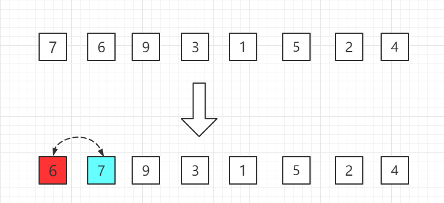
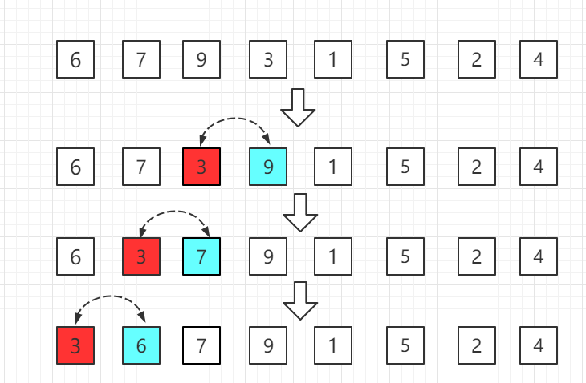

# O(n^2)的排序算法

我们知道，对于排序算法来说，最优的时间复杂度是 O(n log n)，也就是线性对数阶O(n log n)，对应的排序算法有：堆排序、**归并排序**、快速排序（最好平均）

## 选择排序Selection Sort


对于选择排序，我们首先进行第一趟排序，找到这组数据中最下的数，1，然后将1和数组的第一个元素进行交换，得到如下数组，这个时候1就是最小的数，排序位置固定了。

> 1  6  2  3  8  5  7  4

然后我们在剩下的部分找最小的数， 找到 2，将2和数组第二个元素进行交换，得到

> 1  2  6  3  8  5  7  4

然后依次进行下去，直到遍历完所有数据排序完成。


换一个图表示选择排序


## ***时间复杂度和稳定性***

选择排序的时间复杂度是：假设被排序的数列中有N个数。遍历一趟的时间复杂度是O(N)，需要遍历多少次呢？N-1次因此，选择排序的时间复杂度是 

选择排序是稳定的算法，它满足稳定算法的定义：假设在数列中存在a[i]=a[j]，若在排序之前，a[i]在a[j]前面；并且排序之后，a[i]仍然在a[j]前面。则这个排序算法是稳定的！


## 插入排序Insertion Sort

插入排序(InsertionSort)，一般也被称为直接插入排序。

对于少量元素的排序，它是一个有效的算法。插入排序是一种最简单的排序方法，它的基本思想是将一个记录插入到已经排好序的有序表中，从而一个新的、记录数增 1 的有序表

。在其实现过程使用双层循环，外层循环对除了第一个元素之外的所有元素，内层循环对当前元素前面有序表进行待插入位置查找，并进行移动。

插入排序的平均时间复杂度也是 **O(n^2)**，空间复杂度为常数阶 **O(1)**，具体时间复杂度和数组的有序性也是有关联的。

插入排序中，当待排序数组是有序时，是最优的情况，只需当前数跟前一个数比较一下就可以了，这时一共需要比较 **N-1** 次，时间复杂度为 **O(N)**。最坏的情况是待排序数组是逆序的，此时需要比较次数最多，最坏的情况是 **O(n^2)**。

### 过程图示

假设前面 **n-1**(其中 **n>=2**)个数已经是排好顺序的，现将第 **n** 个数插到前面已经排好的序列中，然后找到合适自己的位置，使得插入第n个数的这个序列也是排好顺序的。

按照此法对所有元素进行插入，直到整个序列排为有序的过程，称为插入排序。

从小到大的插入排序整个过程如图示：

**第一轮：**从第二位置的 6 开始比较，比前面 7 小，交换位置。



**第二轮：**第三位置的 9 比前一位置的 7 大，无需交换位置。


**第三轮：**第四位置的 3 比前一位置的 9 小交换位置，依次往前比较。



**第四轮：**第五位置的 1 比前一位置的 9 小，交换位置，再依次往前比较。


......

就这样依次比较到最后一个元素。

插入排序理论上比选择排序效率高的一个表现就是插入排序它是有提前结束遍历的条件的，而选择排序则没有，需要完整跑完全部数据，但是实际测试下来发现插入排序却比选择排序慢了近一倍。这又是为什么？？

```c++
int n = 100000;
    // int n = 10000;
    int *arrTest1 = SortTestHelper::gennerateRandomArray(n, 0, n);
    int *arrTest2 = SortTestHelper::copyIntArray(arrTest1, n);
    SortTestHelper::testSort("选择排序（Selection sort）", SelectionSort, arrTest1, n);
    SortTestHelper::testSort("插入排序（Selection sort）", insertionSort, arrTest2, n);
    
    // 选择排序（Selection sort） : 14.6116 s 
    // 插入排序（Selection sort） : 30.4101 s 
    
    delete[] arrTest1;
    delete[] arrTest2;
```

