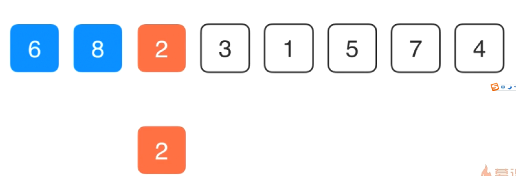

# O(n^2)的排序算法

我们知道，对于排序算法来说，最优的时间复杂度是 O(n log n)，也就是线性对数阶O(n log n)，对应的排序算法有：堆排序、**归并排序**、快速排序（最好平均）

## 选择排序Selection Sort


对于选择排序，我们首先进行第一趟排序，找到这组数据中最下的数，1，然后将1和数组的第一个元素进行交换，得到如下数组，这个时候1就是最小的数，排序位置固定了。

> 1  6  2  3  8  5  7  4

然后我们在剩下的部分找最小的数， 找到 2，将2和数组第二个元素进行交换，得到

> 1  2  6  3  8  5  7  4

然后依次进行下去，直到遍历完所有数据排序完成。


换一个图表示选择排序


## ***时间复杂度和稳定性***

选择排序的时间复杂度是：假设被排序的数列中有N个数。遍历一趟的时间复杂度是O(N)，需要遍历多少次呢？N-1次因此，选择排序的时间复杂度是 

选择排序是稳定的算法，它满足稳定算法的定义：假设在数列中存在a[i]=a[j]，若在排序之前，a[i]在a[j]前面；并且排序之后，a[i]仍然在a[j]前面。则这个排序算法是稳定的！


## 插入排序Insertion Sort

插入排序(InsertionSort)，一般也被称为直接插入排序。

对于少量元素的排序，它是一个有效的算法。插入排序是一种最简单的排序方法，它的基本思想是将一个记录插入到已经排好序的有序表中，从而一个新的、记录数增 1 的有序表

。在其实现过程使用双层循环，外层循环对除了第一个元素之外的所有元素，内层循环对当前元素前面有序表进行待插入位置查找，并进行移动。

插入排序的平均时间复杂度也是 **O(n^2)**，空间复杂度为常数阶 **O(1)**，具体时间复杂度和数组的有序性也是有关联的。

插入排序中，当待排序数组是有序时，是最优的情况，只需当前数跟前一个数比较一下就可以了，这时一共需要比较 **N-1** 次，时间复杂度为 **O(N)**。最坏的情况是待排序数组是逆序的，此时需要比较次数最多，最坏的情况是 **O(n^2)**。

### 过程图示

假设前面 **n-1**(其中 **n>=2**)个数已经是排好顺序的，现将第 **n** 个数插到前面已经排好的序列中，然后找到合适自己的位置，使得插入第n个数的这个序列也是排好顺序的。

按照此法对所有元素进行插入，直到整个序列排为有序的过程，称为插入排序。

从小到大的插入排序整个过程如图示：

**第一轮：**从第二位置的 6 开始比较，比前面 7 小，交换位置。


**第二轮：**第三位置的 9 比前一位置的 7 大，无需交换位置。


**第三轮：**第四位置的 3 比前一位置的 9 小交换位置，依次往前比较。


**第四轮：**第五位置的 1 比前一位置的 9 小，交换位置，再依次往前比较。


......

就这样依次比较到最后一个元素。

```c++
// 插入排序

template<typename T>
void insertionSort(T arr[], int n)
{
    // 注意这里，插入排序第一层遍历从1开始，为什么？
    // 因为对于插入排序来说，第0个元素我们根本可以不用考虑
    // 因为对于插入排序来说，第0个元素放在那里，它本身就已经有序了
    // 我们不再需要把它插入到前面的任何一个位置(第0个元素前面也没有位置)
    // 所以我们开始遍历的时候是直接从第二个元素(索引值为1这个元素开始考察的)
    for(int i = 1; i < n; i++)
    {
        // 然后在这个循环里我们做的事情是什么？
        // 寻找元素arr[i]合适的插入位置
        // 这个合适的插入位置是在前面
        // 所以这里这层循环我们是从这个位置向前倒。知道j>0为止
        // 注意这里是j>0而不是j>=0,为什么？
        // 因为我们这层循环是和当前元素的前一个位置元素进行比较，看看能不能放在前一个元素的位置
        // 可以想象，这个比较最后发生的位置，应该是j = 1的时候，这个时候就是位置1的元素和位置0的元素做比较
        // 看位置1能不能插入到位置0，如果能，就交换位置
        // 所以我们最多考察到j=1这个位置（也就是j>0）
        
        // for(int j = i; j > 0; j--)
        // {
        //     if(arr[j] < arr[j-1])
        //     {
        //         swap(arr[j], arr[j-1]);
        //     }
        //     // 如果在这里我们已经发现j这个位置的元素已经大于等于它前面位置的元素，
        //     // 那么就没有必要继续遍历比较下去了，j这个位置已经是合适的位置了
        //     // 这个时候直接终止这次循环就可以了
        //     else
        //     {
        //         break;
        //     }
        // }
        
        // 所以这里也可以看到插入排序理论上比选择排序效率高的一个表现就是插入排序它是有提前结束遍历的条件的
        // 而选择排序则没有，需要完整跑完全部数据
        
        // 其实这里也可以直接这样写
        for(int j = i; j>0 && arr[j] < arr[j-1]; j--)
        {
            swap(arr[j], arr[j-1]);
        }
    }
}
```


插入排序理论上比选择排序效率高的一个表现就是插入排序它是有提前结束遍历的条件的，而选择排序则没有，需要完整跑完全部数据，但是实际测试下来发现插入排序却比选择排序慢了近一倍。这又是为什么？？

```c++
int n = 100000;
    // int n = 10000;
    int *arrTest1 = SortTestHelper::gennerateRandomArray(n, 0, n);
    int *arrTest2 = SortTestHelper::copyIntArray(arrTest1, n);
    SortTestHelper::testSort("选择排序（Selection sort）", SelectionSort, arrTest1, n);
    SortTestHelper::testSort("插入排序（Selection sort）", insertionSort, arrTest2, n);
    
    // 选择排序（Selection sort） : 14.6116 s 
    // 插入排序（Selection sort） : 30.4101 s 
    
    delete[] arrTest1;
    delete[] arrTest2;
```

插入排序从代码里看到，它是可以提前终止第二层循环的，可是实际运行的时候发现，可是实际上现在这种实现插入排序性能比选择排序性能还要差。

从代码里可以看到，我们现在实现的这个版本的插入排序，它在遍历的同时也在不停的进行交换，交换这个操作是要比简单的比较这个操作还要耗时的，因为每次交换背后都有三次赋值的操作，那这里我们能不能改变插入排序的算法，让他只在内层循环中只交换一次呢？


比如单前这个数组进行排序，8第0个元素，位置不变，已经是有序的了，看6这个第二个元素，在对6进行排序的时候，我们先不贸然的直接和前面的8进行交换，而是先将这个6复制一份保存起来，然后看6这个元素是不是应该放在单前这个位置，那看他是不是适合放在单前这个位置的方法和之前插入排序是一样的，就是和它前一个值进行比较，现在6比8小，说明6不应该放在单前这个位置，而8应该放在单前这个位置。


之后再来考察6是不是应该放在前一个位置，此时6所在的位置已经是第0个位置了，所以6就应该放在这个位置。此时6, 8两个值排序完成，下面我们继续排序2，第三个位置的元素。依然是将2这个元素复制一个副本，之后来考察2是不是应该放在这个位置，2比前面的8小，所以2不应该放在这个位置，那我们把这个位置的值赋值成前一个位置的值8，

之后来考察2是不是应该放在原来8所在的位置，发现这个时候原来8所在位置的前一个位置6比2大，所以2也不该放在原来8的位置，那么将原来8所在位置的前一个位置6复制到原来8所在的位置，然后看2是不是适合放在原来6所在的位置，发现是第0个元素，那就直接放在原来6所在的位置。


同理对于后面的3也是一样，开始先拷贝一个3出来，和前一个进行比较，如果比他小，前一个的值往后拷贝，然后继续前移比较，直到前一个值比这个3小，那就将3放在这个位置上。

可以看到，这整个过程其实逻辑是和之前插入排序是一样的，只不过这里把一次又一次的交换操作变成了比较后做一次赋值。（一次交换就是3次赋值，现在把那么多次交换完全通过赋值给取代了），所以性能会更优。

```c++
// 插入排序

template<typename T>
void insertionSort(T arr[], int n)
{
    // 注意这里，插入排序第一层遍历从1开始，为什么？
    // 因为对于插入排序来说，第0个元素我们根本可以不用考虑
    // 因为对于插入排序来说，第0个元素放在那里，它本身就已经有序了
    // 我们不再需要把它插入到前面的任何一个位置(第0个元素前面也没有位置)
    // 所以我们开始遍历的时候是直接从第二个元素(索引值为1这个元素开始考察的)
    for(int i = 1; i < n; i++)
    {
        // 性能优化改进
        T e = arr[i];   // 将待排序的值先拷贝一份出来
        
        // 然后把对于j的声明放在外面来，因为在最后那次赋值的时候是需要j的
        // j实际上就是用来保存元素e应该插入的位置
        int j;
        
        // 所以在初始化的时候j = i, 也就是说元素e是不是应该放在j所在的位置。怎么看呢？
        // 首先j要大于0，其次我们要看j前一个元素是否大于待排序元素e，
        // 如果j前一个元素还要比e大，就说明我们当前j这个位置不是e应该存在的位置
        // 所以我们的循环要继续
        for(j = i; j > 0 && arr[j-1] > e; j--)
        {
            // 在循环体里面要做的事情就是把 arr[j]这位置的元素赋值成arr[j-1]这个位置的元素
            // 也就是把前一个位置的元素向后挪一下
            arr[j] = arr[j-1];
        }
        // 在这层for循环结束以后，可以看到，我们j里保存的就是e应该存放的位置
        arr[j] = e;
        
    }
}
```


可以看到代码改进之后，我们的插入排序性能就明显比选择排序的性能更优了。是因为我们的插入排序不但不再使用交换操作，更重要的是插入排序可以提前终止内层循环。

对于可以提前终止内层循环来说，是插入排序非常重要的一个性质。假设我们有个数组，他本身基本上就是有序的，在这种情况下内层循环它就可以很快的找到它应该插入的位置，此时插入排序的效率会非常的高。

```c++
int *arrTest1 = SortTestHelper::gennerateRandomArray(n, 0, 3);
```

这段测试代码中我们将这10w个数据未0-3之间，那么它必然会存在大量的重复数据（也就是大部分都是有序的数据），这个时候再来进行排序比较


对于一个近乎有序的数组来说，改进后的插入排序性能提升更为明显，其性能远远的优于选择排序

```c++
int *arrTest1 = SortTestHelper::gennerateNearlyOrderArray(n, 100);  // 近乎有序的数组（100个位置是错误的）
```


实际上插入排序处理这种近乎有序的数据，对于后续的n log n级别的排序算法来说都还要快。这也就是为什么插入排序是具有实际意义的一种重要排序算法。

在一些极端情况下，比如要排序的数组是一个完全有序的数组，这个时候插入排序将变成一个O(n)级别的排序算法，也就是在内层循环，每一次值判断一次，发现当前的位置就是合适的位置，直接就结束内层循环，进入下一次循环。这是插入排序非常重要的一个性质，也正是这个重要原因，插入排序会在更加复杂的排序算法中作为一个子过程来进行优化。