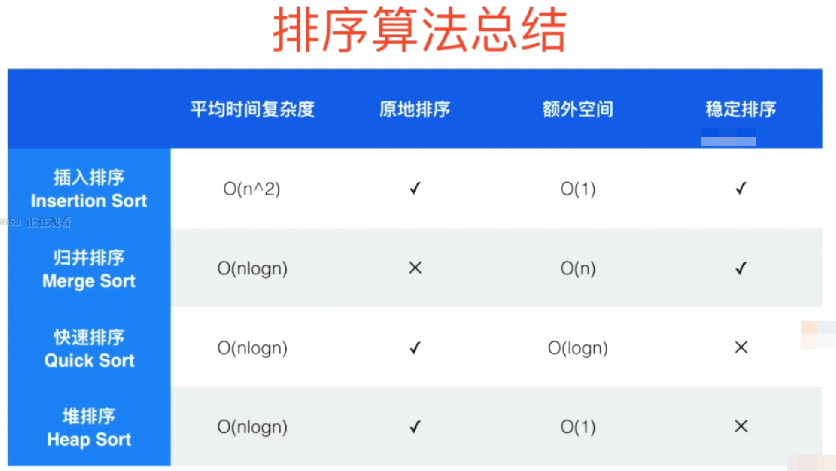
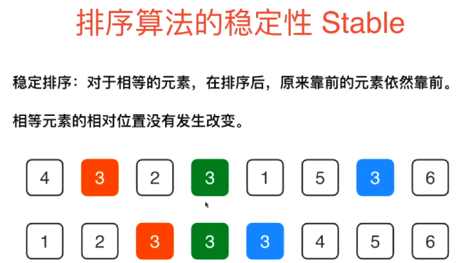
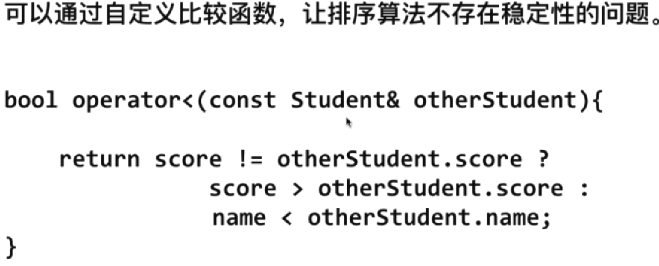

# 排序算法总结

## 排序算法的稳定性 Stable

稳定排序：对于相等的元素，在排序后，原来靠前的元素依旧靠前，相等元素的的相对位置没有发生改变

排序算法的稳定性我们可以通过自定义比较函数使得排序算法不存在稳定性问题。比如说我们现在又要使用快速排序，又要顾及排序稳定性问题，怎么做呢？

这里还是以之前学生成绩类对象的排序为例，首先我们排序的主要键值是学生的成绩，我们希望通过排序将学生按成绩高低进行排序，同时我们也希望相同成绩的学生是按照学生姓名的字典序来进行排序的。如果我们的排序算法是不稳定的话，那么就需要在比较运算符重载中加入学生字典序的比较逻辑。如下比较两个学生的时候就是先比较两个学生的成绩，然后如果成绩相同再按学生姓名进行字典序比较。

